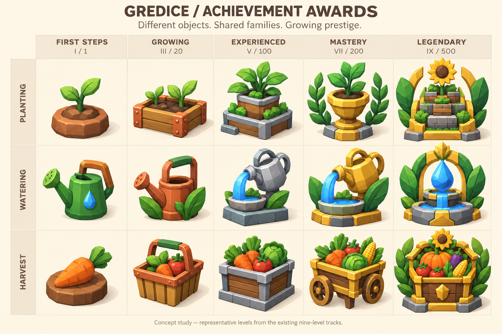

# Achievement families, levels and collectible awards

> Implementation: the artwork, family collection, and the three planned garden families are now implemented. All 47 milestones have dedicated illustrations, including diversity, seed-to-table, and the 2026 seasonal awards. Existing eligibility, approval and reward rules are unchanged. Live progress and a favorites shelf remain later phases. See [the component guide](../../packages/ui/src/AchievementAwards/README.md) for usage and validation.


Proposal · 12 September 2026 · Product and art direction, not a runtime change

Give every achievement level a distinct, collectible 3D award. A first planting should feel like a small keepsake; a 500-planting milestone should feel like a garden monument. Keep a recognizable subject within each family while changing the object's silhouette, construction and materials as its importance grows.

Use the established backpack, shopping basket and plant-status artwork as the visual reference: chunky modeled geometry, beveled edges, matte materials, warm light from the upper left, and clearly shaded side faces. The awards should belong to the same garden.



[Full 34-award production brief](award-manifest.json) · [Exact concept prompt](concept-prompt.md)

## What exists today

The initial artwork release covered **34 awards** across five categories:

| Family | Existing milestones | Awards |
| --- | --- | ---: |
| Welcome | Registration | 1 |
| Planting | 1, 10, 20, 50, 100, 150, 200, 300, 500 | 9 |
| Watering | 1, 10, 20, 50, 100, 150, 200, 300, 500 | 9 |
| Harvest | 1, 10, 20, 50, 100, 150, 200, 300, 500 | 9 |
| Community contributions | 1, 5, 10, 25, 50, 100 applied edits | 6 |

These are already separate threshold awards, but they have no explicit family/level/artwork metadata. The garden shows the same trophy emoji for every recorded award and question marks for unearned ones. Registration is auto-approved; the other definitions default to approval by an admin. Awards belong to an **account**, which can have multiple users.

The proposal preserves all 34 keys, thresholds, recorded approvals and sunflower rewards. In particular, the 1,000-sunflower welcome reward remains a starter award visually. Prestige describes accomplishment, not the currency payout. Reward balancing is a separate decision; the existing source already marks it as unfinished.

## Two parts to progression

**Level** is a milestone within an achievement family: planting I–IX, community contributions I–VI, welcome I. Not every family needs the same number of levels.

**Visual grade** is the art direction for that level. Use five grades, assigned explicitly in the definition. They guide the amount of substance and ornamentation without turning every family into the same medal.

| Visual grade | Nine-level tracks | Materials and form | At a glance |
| --- | --- | --- | --- |
| First steps / Početak | I–II: 1 and 10 | Soil, terracotta, plain wood, painted tools; one compact object | A personal keepsake |
| Growing / Napredak | III–IV: 20 and 50 | Copper details; a more developed object with a second structural element | A small crafted award |
| Experienced / Iskustvo | V–VI: 100 and 150 | Silver edging, stone or ceramic base; substantial construction | An established collection piece |
| Mastery / Majstorstvo | VII–VIII: 200 and 300 | Warm gold framing, broad leaves, a strong pedestal or larger assembly | A trophy worth displaying |
| Legendary / Legenda | IX: 500 | A unique miniature garden monument, gold structural details, a family-specific crest | An unmistakable centerpiece |

For community contributions, use grades **first steps, growing, experienced, mastery, mastery, legendary** at levels I–VI. Welcome uses first steps. The two mastery community awards still have different objects and compositions.

Keep grade as an art-system concept; the main UI shows the family, achievement title, level and actual requirement. Use a small real-text level marker such as `III / IX`. Never bake text, numbers, sunflower payouts or status labels into the image.

## Every award gets its own image

There are **34 production illustrations in the first release**, one for every existing key. Two levels must not resolve to the same finished image. Shared materials, leaves, bases and modeled parts are welcome; a recolor, a different number or an extra star alone does not make a new award.

A family retains an obvious motif: planting uses growing plants and beds; watering uses vessels, droplets and water; harvest uses produce and containers; community uses an illustrated botanical journal. Each progression changes the physical object, not just its frame.

The following is the complete proposed art inventory for the three nine-level families. Each cell represents a separate illustration; `{n}` below means the threshold in that row.

| Level / threshold | `planting_{n}` | `watering_{n}` | `harvest_{n}` |
| --- | --- | --- | --- |
| I / 1 | One sprout rooted in a small terracotta soil token | Small green watering can with a wooden handle | One carrot resting on a plain wooden token |
| II / 10 | Young plant in a sturdy terracotta nursery pot | Broader watering can standing in a simple leaf basin | Small wooden produce bowl with two distinct vegetables |
| III / 20 | Copper-trimmed miniature raised bed with two sprouts | Copper watering can with two leaves around its base | Copper-trimmed wooden produce basket |
| IV / 50 | Deeper copper-edged planter with a young flowering plant | Copper vessel pouring a short sculpted stream into a planter | A low produce crate with a substantial copper carrying frame |
| V / 100 | Silver-rimmed two-tier planter with a central leafy plant | Silver watering vessel and a blue stone basin on a plinth | Silver-trimmed harvest crate on a low stone base |
| VI / 150 | Small silver-framed greenhouse sculpture containing a plant | A wider silver leaf basin fed by a visibly different vessel | Two stacked produce crates with silver handles and larger produce |
| VII / 200 | Gold garden pedestal with a mature plant and two broad laurels | Gold watering-can fountain with leaf-shaped supports | Gold-trimmed harvest cart with two large visible wheels |
| VIII / 300 | Gold-framed terraced garden with a tall flowering centerpiece | A tall gold water tower sculpture above two leaf basins | An abundant raised harvest basket in a tall gold carrying frame |
| IX / 500 | Grand terraced garden monument with a sculpted sunflower and broad gold/green frame | Legendary garden spring: gold leaf arch around a blue droplet and tiered basin | Grand gold-and-wood bounty chest, large produce and a sunflower/laurel crest |

The theme of each object should remain obvious at 48px. The legend is more substantial because of its outline, structure and material hierarchy; it should not become a pile of tiny props.

| Existing key | Level | Proposed custom image |
| --- | --- | --- |
| `registration` | I | Small wooden garden gate with a sunflower welcome emblem; friendly and humble |
| `community_edit_1` | I | A single botanical journal page with a thick wooden pencil |
| `community_edit_5` | II | Bound green notebook with copper corners and a leaf bookmark |
| `community_edit_10` | III | Open silver-edged botanical journal showing one large illustrated leaf |
| `community_edit_25` | IV | A gold-framed open field guide resting on a small wooden book stand |
| `community_edit_50` | V | Two substantial botanical volumes with a raised gold leaf seal |
| `community_edit_100` | VI | A miniature botanical archive trophy: open book, broad leaf crown and sunflower crest |

Keep existing titles available for history and reward descriptions. Presentation titles can gain personality, but the requirement must remain explicit beneath them. For example: **Prvo sjeme**, **Mali rasadnik**, **Majstor sadnje**, **Legenda vrta**; the last two still show `200` and `500` as their requirements.

## How the collection should work

Show **one card per family**, instead of 34 repeated trophy buttons. A card contains:

- The highest approved award image, its title, and `Razina III / IX`.
- The next award as a smaller preview with a clear requirement.
- Genuine current progress, for example `27 / 50` and `Još 23 do sljedeće razine`, only when the server can supply a validated current total.
- The next level's sunflower reward, distinct from rewards already received.

Selecting the family opens its full collection: all levels with their own artwork, requirements, award state, earned/approval dates and rewards. On phones, use a compact grid or vertical list; do not squeeze nine miniature badges into one row. Keep earlier awards available after leveling up.

Known future goals are visible. Show their actual artwork with a restrained locked treatment and a separate lock indicator. Reserve mystery silhouettes and question marks for deliberately secret achievements, if such achievements are introduced later.

| State | Treatment |
| --- | --- |
| Not started / in progress | Show the next award and its requirement. Suppress progress numbers when the current total is unavailable. |
| Threshold met, pending approval | Show `Čeka potvrdu` beside that level. Keep the highest approved level as the earned family award; continue showing later progress. |
| Approved | Full-color award, earned date and persistent place in the collection. |
| Reward still processing | The approved award remains visible. Only say the sunflowers were received after reward delivery is recorded. |
| Denied | Explain that the requirement has not been confirmed and show the review state in details. Do not replace the award image with an alarming red trophy. |
| Complete | Show the final award and `Sve razine ostvarene`; remove the next-level progress bar. |
| Loading / unavailable | Preserve layout. Show loading/error information rather than resetting earned awards or inventing zero progress. |

For newly approved levels, show a short reveal with the actual award artwork. First steps need a small, warm celebration; mastery and legendary awards can have a larger reveal. Respect reduced motion. If several old milestones are awarded together, celebrate the highest and summarize the others rather than opening nine dialogs. A future trophy shelf could let people display three favorites; it is optional and does not gate the core collection.

Reuse the same award image in the garden collection, unlock notice, account profile if added, admin account history and approval rows. Admin and farm surfaces should keep their compact operational layout. Do not introduce achievements into unrelated farm task lists merely to display the artwork.

## Art delivery and visual review

The accompanying concept board illustrates **representative levels I, III, V, VII and IX**, not every production asset. It tests how far the silhouettes can develop while preserving the existing game's style. The journal and welcome awards are specified above and need their own production illustrations.

Production guidance:

- One standalone transparent image per award; consistent slightly elevated three-quarter camera and warm upper-left light.
- Broad bevels and dark side faces must communicate actual volume. Match the existing backpack and basket; avoid flat badges with gradients pretending to be 3D.
- Each award must read without its frame, tint, numerical label or animation. Compare starter and legend in monochrome silhouette as well as color.
- Start with a high-resolution square master. Export optimized WebP with true alpha, consistent visual padding and a shared optical baseline. Target roughly 512px for these larger awards; inspect final file sizes and detail before setting a budget.
- Review at 32px in an admin row, 48–64px in the collection and 160–240px in an award reveal, on both light and dark backgrounds. Major awards may fill more of the reserved area, but must not enlarge the clickable layout or obscure labels.
- Keep a generation prompt/source record and an explicit asset mapping for every key, following `packages/ui/src/GameIcons/assets/prompts.json`. A production award is never cropped out of the concept board.
- Check silhouettes in a simple contact sheet sorted by family and level. If neighboring levels differ only by color or a tiny decoration, redesign one.

## Support in the existing system

This is an additive proposal. The existing per-account/per-key award rows can already represent each level. There is no need to replace them with one mutable record that forgets earlier levels.

Extend shared definitions with explicit `familyKey`, `level`, `visualGrade` and `artworkKey`. Keep `key`, category, threshold, reward, title, description and approval policy. For example:

```ts
// Proposed additional metadata on the existing planting_20 definition.
{
    key: 'planting_20',
    familyKey: 'planting',
    level: 3,
    visualGrade: 'growing',
    artworkKey: 'planting_20',
    // Existing threshold, reward and other fields remain unchanged.
}
```

Keep the shared definitions free of image imports. Add a shared UI award component backed by a typed artwork registry, using the static-import approach already established for game icons. Every known definition must resolve to a dedicated image; a neutral fallback is for legacy/unknown records and loading failures only.

Retain the current API `achievements` array so existing consumers continue to work. A later additive `families` progress projection can return the validated current total, the counting unit, calculation time, highest approved level and next milestone. Include earned and approval timestamps when the details UI needs them; the current account endpoint does not expose those timestamps.

**Do not calculate live progress from the last award's `progressValue`.** That field is a snapshot recorded when a threshold was reached. It does not tell us that a person at level III now has 27 qualifying actions. A first artwork-only release can show the next requirement without a numeric progress bar.

Preserve current award keys and the account/key uniqueness constraint. Changing an image or title must never create a new award record or pay the same reward again. Advancing a family unlocks every newly crossed threshold under its existing approval policy, even if an earlier level is still pending. Rewards belong to individual levels; they are not multiplied by the visual grade. Account members see the same collection.

Before shipping live progress or changing eligibility, verify these existing source constraints:

- Planting currently counts `sowed` update events, while the copy describes a number of plants. Define the counting unit and verify legacy and selected multi-field planting workflows. Replayed updates, moves and repeated status changes must not manufacture additional progress.
- Watering and harvest classification currently relies on operation names, and counting walks operation-completion events. Use canonical completed-operation evidence and stable identities for progress; cancelled requests or repeated completion events must not inflate totals. Do not encourage extra watering to earn an award.
- Community contribution thresholds use applied edit requests. Retain the existing account attribution and distinct-request behavior; submitted or merely reviewed edits do not qualify.
- The scheduled evaluator is configured hourly, and community edits also have a direct evaluation path. Keep a consistent server-owned calculation and communicate freshness when necessary. Browser interactions must not grant achievements or sunflowers.
- Preserve historical records and balances when reconciling progress. Before changing granting behavior, test concurrent approval and interrupted reward delivery: the current award insert uniqueness is not by itself proof that every reward-credit retry is atomic.

The art/definition phase can proceed without a database migration. Any future persistence changes for progress projections or seasonal awards need their own design and the repository's normal storage/migration workflow.

## Later achievement families

These families are now defined and evaluated, with 13 dedicated illustrations in addition to the original 34 awards.

| Family | Levels | Qualifying evidence |
| --- | --- | --- |
| Raznolik vrt | 3, 5, 10, 15, 20 distinct plant species | Confirmed sowing history; parent plant, not plant sort |
| Od sjemena do stola | 1, 5, 10, 25, 50 completed grow-to-harvest cycles | Same canonical planting sowed and later harvested |
| Sezona za pamćenje | 2026 spring, summer, autumn | Confirmed sowing or a completed cycle in that Zagreb growing season; does not reset permanent family levels |

| Family | Production artwork progression |
| --- | --- |
| Raznolik vrt | Terracotta mixed planter; copper-cornered wooden garden; teal two-tier planter; terraced garden and trellis; botanical garden with butterfly arbor |
| Od sjemena do stola | Carrot and seedling on a wooden board; harvest serving tray; garden table and bowl; produce serving cart; garden banquet pavilion |
| Sezona za pamćenje | Spring shoots, flowers and dew; summer tomatoes, pepper and sun; autumn pumpkin, beetroot and leaves |

Each milestone has its own transparent 512px WebP. The colorful garden materials and increasing structural complexity carry the progression, with small metal accents on higher levels. Prompts, source hashes and export settings are recorded in `packages/ui/src/AchievementAwards/assets/garden-families-prompts.json`. Storybook's `NewFamilies` and `NewFamiliesDark` views compare all 13 at 32, 64 and 160 pixels.

Prefer accomplishments grounded in real garden work and learning. Avoid daily-login streaks, money-spent trophies, or plant-survival challenges that blame the customer for weather or farm execution.

## Recommended delivery sequence

1. **Approve the visual direction:** compare the representative concept board with current backpack/basket icons, then validate one family at all nine levels. Each adjacent level must be distinct.
2. **Replace generic awards:** produce all 34 individual images, add explicit metadata and a shared award component, reuse it in current garden/admin views, and add the full inventory to Storybook. Preserve earning and payouts.
3. **Introduce the family collection:** family cards, level details, known next goals, pending/approved distinctions and appropriate award reveals. Show requirements even before trustworthy live progress is available.
4. **Add server-owned progress:** reconcile counting semantics, provide the additive projection, and verify updates, backfill and reward idempotency before exposing numeric progress.
5. **Expand selectively:** new evidence-backed families, seasonal honors and an optional favorites shelf. Diversity, seed-to-table, and 2026 season awards have dedicated artwork; later years need their own follow-up. Balance new sunflower rewards separately.

Acceptance checks should cover all 47 unique key-to-image mappings, decoded assets, visual contrast/size, explicit level labels, mobile layout, keyboard access, reduced motion, pending/denied/complete/error states, an existing account with many old awards, several thresholds crossed together, and account switching. Existing thresholds, keys, history and credited rewards must remain intact.

## Source map

- Definitions, thresholds, rewards: [definitions.ts](../../packages/js/src/achievements/definitions.ts).
- Current garden presentation: [AchievementsOverview.tsx](../../packages/game/src/shared-ui/achievements/AchievementsOverview.tsx).
- Account query: [useAccountAchievements.ts](../../packages/game/src/hooks/useAccountAchievements.ts).
- Current account response: [accountsRoutes.ts](../../apps/api/app/api/[...route]/accountsRoutes.ts).
- Evaluation, approval and crediting: [achievementsRepo.ts](../../packages/storage/src/repositories/achievementsRepo.ts).
- Account/key uniqueness and stored states: [achievementsSchema.ts](../../packages/storage/src/schema/achievementsSchema.ts).
- Evaluation entry point: [achievement cron](../../apps/api/app/api/internal/cron/achievements/route.ts) and [schedule](../../apps/api/vercel.json).
- Admin consumers: [achievement approvals](../../apps/app/app/admin/achievements/page.tsx), [account history](../../apps/app/app/admin/accounts/[accountId]/AccountAchievementsCard.tsx).
- Existing art conventions: [GameIcons README](../../packages/ui/src/GameIcons/README.md).

Validation for this proposal: checked against the source files above; `git diff --check`. No application behavior, approval rules, reward balances or database state is changed by this document.
