# Advanced sowing workflow

## Status and scope

This document locks the domain contract and rollout boundary for Advanced
Sowing. It is the source of truth for the compatible storage foundation and
the default-off Garden, checkout, Admin, and Farm activation slice.

The current implementation delivers:

- add a first-class planting with field memberships;
- add spacing-range metadata and deterministic layout calculations;
- preserve existing planting events through a legacy projection;
- expose authenticated planting reads without adding internal identifiers to
  public garden responses;
- expose spacing-range and derived-layout guidance to Admin and Farm;
- accept the dedicated versioned selection only behind the default-off API
  gate, store the canonical authorization in a relation-free 1:1 cart-item
  table, and expose only a non-authoritative per-item selection summary;
- revalidate the stored authorization against the live published plant sort,
  account-owned non-sandbox target, current physical occupancy, pending cart
  footprints, and raised-bed geometry immediately before checkout, then copy
  it into the authenticated checkout-attempt snapshot without adding it to
  Stripe metadata;
- fulfill one selected cart item as one planting and its complete membership
  set atomically across euro, sunflower, and inventory checkout paths;
- expose one planting-scoped lifecycle and one assignable, completable,
  blockable, verifiable, reschedulable, and cancelable task to Admin and Farm;
- notify the garden owner exactly once when selected sowing is completed
  directly by Admin or verified after Farm submission;
- render and safely manage persisted selected plantings in Garden regardless
  of the creation flag; and
- keep new customer creation and configuration disabled by default behind both
  the Garden cohort flag and the independent API environment gate.

This code is prepared for a controlled **sowing-only** cohort but is not
live-enabled by this change. Selected-planting operations after sowing and
harvest trace are not part of that cohort: their schemas still use legacy
field or `plantPlaceEventId` identity and must gain an explicit `plantingId`
before broader lifecycle activation. Live attribute-definition writes,
catalogue readback, generated directory contracts, legacy backfill execution,
cohort selection, environment activation, and production smoke tests remain
rollout operations. Existing legacy field tasks, operations, labels, and trace
remain supported throughout the transition.

## Summary

Advanced Sowing makes a planting a logical entity rather than an attribute of
one raised-bed field. One planting can occupy one or more fields, and multiple
plantings can occupy the same field when their calculated layout keys differ.
The planting owns its plant sort, selected spacing, calculated density or
footprint, lifecycle, schedule, assignment, purchase, and task identity. Field
memberships describe where that planting is physically present.

One 2x2 planting is one purchase, one inventory unit, one lifecycle, and one
atomic farmer task. It is not four independent plants or four independently
completable field tasks.

## Actors and ownership

- **Customer:** chooses a supported plant, spacing, and available footprint in
  the Garden experience when the Advanced Sowing flag allows creation.
- **Garden app:** renders every persisted planting, but exposes Advanced Sowing
  create and configuration controls only when the customer flag is enabled.
- **Checkout and fulfillment:** preserve the authorized planting plan on the
  cart item and fulfill that exact paid plan idempotently, even if the flag is
  disabled after checkout starts.
- **Admin:** observes, assigns, reschedules, cancels, verifies, and repairs one
  logical planting without mutating unrelated co-plants.
- **Farmer:** sees one actionable task per logical planting and completes or
  blocks the whole planting atomically.
- **Storage:** owns planting identity, memberships, collision checks,
  lifecycle events, concurrency control, migration compatibility, and
  idempotency.
- **Automation and operation workers:** existing legacy work remains intact.
  Selected crop-specific work is a later activation phase and must use an
  explicit planting identity rather than infer a crop from a shared field.

## Locked domain rules

### Spacing metadata

Plant metadata may define:

- `seedingDistance`: the current optimal and default spacing in centimeters;
- `seedingDistanceMin`: an optional minimum spacing;
- `seedingDistanceMax`: an optional maximum spacing.

The default must be positive. When a minimum is present it must be positive and
must not exceed the default. When a maximum is present it must be positive and
must not be below the default. A customer-selected spacing must fall inside
the resulting inclusive range, where the effective minimum is
`minimum ?? seedingDistance` and the effective maximum is
`maximum ?? seedingDistance`. A plant without a configurable range keeps its
current default behavior and does not show a density selector.

The selected spacing is snapshotted on the planting. Later catalogue changes
do not alter an existing planting's density, footprint, labels, task copy, or
collision behavior.

### Deterministic layout calculation

A standard raised-bed field is 30 cm by 30 cm. For a selected spacing `d`:

- if `d <= 30`, the planting occupies one field,
  `plantsPerRow = floor(30 / d)`, and
  `totalPlantCount = plantsPerRow ^ 2`;
- if `d > 30`, `footprintSideFields = ceil(d / 30)`, the planting occupies a
  contiguous square of `footprintSideFields ^ 2` fields, and
  `totalPlantCount = 1` for the logical planting.

Examples:

| Selected spacing | Layout | Fields occupied | Total plant count |
| ---: | --- | ---: | ---: |
| 30 cm | 1x1 in-field | 1 | 1 |
| 15 cm | 2x2 in-field | 1 | 4 |
| 10 cm | 3x3 in-field | 1 | 9 |
| 31-60 cm | 2x2 footprint | 4 | 1 |
| 61-90 cm | 3x3 footprint | 9 | 1 |

The calculation produces a stable `layoutKey`. In-field layouts and
multi-field footprints remain unambiguous in the versioned key, for example
`v1:fields:1x1:plants:2x2` and `v1:fields:2x2:plants:1x1`. Two active plantings
may share a field when their non-null layout keys differ. A second active
membership with the same layout key conflicts. Geometry validation is still
required: a multi-field footprint must form the calculated contiguous square
inside one supported raised-bed geometry.

The current supported raised bed is three fields wide and six fields long.
Configured endpoints that derive a footprint wider or longer than that bed are
invalid for Advanced Sowing: they are not shown as a valid Farm/Admin layout
and the Garden must not silently clamp them. Catalogue preflight must report
those plants before activation so their range can be corrected or a wider bed
geometry can be implemented explicitly.

### Commercial quantity

For the first slice, one cart item and one inventory unit represent one logical
planting, regardless of calculated `totalPlantCount` or footprint size. The
commercial quantity, total plant count, and field membership count are separate
values and must never be inferred from one another.

Pricing and inventory policy can evolve later, but historical purchases must
retain the snapshot used when they were authorized. Cancellation or refund is
performed once for the logical planting, never once per membership field.

### Farmer task

A logical planting creates one farmer task. A 2x2 footprint is completed,
blocked, assigned, rescheduled, canceled, and verified atomically. Its initial
estimated duration is five minutes, including a multi-field planting. A later
duration model may use plant count or footprint size, but the first slice must
not multiply duration by membership count.

## Canonical model and identifiers

The exact table and payload names may follow repository conventions, but the
following concepts are required:

| Identifier or value | Ownership and purpose |
| --- | --- |
| `plantingId` | Stable identity for lifecycle, task, API, logging correlation, and UI keys. |
| `plantingVersionEventId` | Optimistic concurrency token for every task or lifecycle mutation. |
| `raisedBedFieldId` | Stable geometric field identity used by one membership. |
| `positionIndex` | Display and geometry input; it is not the planting identity. |
| `layoutKey` | Immutable collision key calculated from the selected spacing; null for legacy projections. |
| `selectedSpacingCm` | Immutable selected spacing; null for legacy projections. |
| `totalPlantCount` | Physical plant count for labels and task instructions; separate from purchase quantity. |
| `footprintSideFields` | Calculated square side; one for in-field layouts and legacy projections. |
| `cartItemId` | Purchase and fulfillment idempotency source for one logical planting. |
| `legacyPlantPlaceEventId` | Preserved identity for existing lifecycle and harvest-trace references. |

A planting owns one lifecycle and zero or more current field memberships. A
membership may include a row and column offset from the footprint origin so a
2x2 or larger square can be validated without relying on consecutive numeric
position indexes.

Read models must expose `plantings[]` on a field or an equivalent planting-first
projection. Existing singular field properties may remain as a compatibility
view only when exactly one compatible active planting is available. A legacy
mutation must fail closed when the target has multiple active plantings; it
must never choose the first active cycle.

## Lifecycle and transaction boundary

The logical planting, not a membership field, is the lifecycle aggregate.

```mermaid
flowchart LR
    A["Customer configures spacing and footprint"] --> B["Server validates flag, range, geometry, and layout keys"]
    B --> C["Cart stores immutable planting plan"]
    C --> D["Paid or inventory fulfillment locks planting and all fields"]
    D --> E["Planting, memberships, purchase, and initial event commit atomically"]
    E --> F["One Admin and Farm task"]
    F --> G["Farmer completes or blocks planting"]
    G --> H["Admin verifies or resolves planting"]
    H --> I["Selected sowing labels use planting identity"]
    I --> J["Later operations and harvest trace require planting identity"]
```



Lifecycle states continue to use the established planting vocabulary, including
`new`, `planned`, `blocked`, `pendingVerification`, `sowed`, later plant-health
states, and terminal removal. The version event changes whenever lifecycle,
assignment, schedule, blocker evidence, sort, or membership data affecting the
task changes.

Every create or mutation transaction must:

1. authenticate and authorize the actor;
2. validate the immutable planting plan and expected planting version;
3. acquire every footprint position advisory in ascending position order,
   then lock all existing physical field rows once by ascending field ID before
   locking the raised bed;
4. re-read current raised-bed geometry and active memberships under the locks;
5. validate the flag where applicable, spacing range, calculated footprint,
   raised-bed availability, and layout-key collisions;
6. write the planting event, memberships, purchase or inventory effect, and
   task-visible state in one database transaction;
7. enqueue downstream side effects idempotently after the canonical event is
   durable.

No partial membership set may be observable. A retry with the same cart item
or command identity must return the existing planting when the canonical plan
matches and must return a controlled conflict when it does not.

## Core workflows

### Customer creation

1. The Garden app reads the plant's current default and optional range.
2. When the flag is enabled, the customer selects an allowed spacing.
3. The app previews the deterministic density or square footprint and sends
   the selected spacing plus intended origin; the server recalculates all
   derived values.
4. The server validates geometry and every field's active layout keys.
5. The cart stores one immutable logical-planting plan.
6. Fulfillment creates one planting and all memberships atomically.

Client-calculated density, footprint, count, price, and layout key are display
hints only. The server always derives and validates them from the snapshotted
spacing and the authoritative raised-bed geometry.

### Co-planting

If a target field already contains an active planting, creation succeeds only
when every new membership has a different non-null `layoutKey`. Removing,
blocking, or changing one planting does not change another planting sharing the
same field.

A legacy active planting has null layout configuration. It is not assigned a
fabricated density from today's catalogue data. Creation into such a field
fails conservatively with `legacy_layout_unknown`; the historical planting
remains unchanged until it ends. This preserves the rule that legacy data is
never reinterpreted.

### Multi-field planting

For spacing above 30 cm, the customer selects an origin that can contain the
calculated square. The server resolves exact field memberships from geometry,
not from a numeric first-to-last range. All memberships share the same planting
identity, lifecycle, assignment, task version, purchase, and layout key.

Admin and Farm show one task with the full footprint and total plant count.
Completion, blocking, verification, cancellation, and refund affect the group
once. Partial completion is outside the first slice.

### Paid fulfillment across a flag change

The create/configuration flag is evaluated when the customer authorizes the
plan. Checkout stores that authorized plan durably. A later flag change must
not strand a paid cart item: webhook fulfillment validates and applies the
stored plan without requiring the current flag to be enabled. Plan mismatch,
unavailable geometry, or a new collision enters the controlled fulfillment
incident workflow instead of silently changing the footprint.

Cart activation uses two independent gates: the Garden presentation flag and
the fail-closed `GREDICE_ADVANCED_SOWING_ENABLED` API mutation gate. The
client request is a dedicated `{ kind: "advanced-sowing-selection", version: 1,
selectedDistanceCm }` value, separate from `additionalData`. The API must reject
client-supplied `advancedSowing` or `advancedSowingAuthorization` keys, derive
the complete plan from the current catalogue and authoritative bed target, and
persist its authorization envelope in the separate server-owned, relation-free
1:1 table keyed by `cartItemId`, never inside client-writable `additionalData`.
Cart mutation and authorization persistence, replacement, or clearing occur in
one transaction behind the checkout-item fence. Generic cart queries never
join the table. Authenticated cart responses may add only the versioned safe
selection summary needed to distinguish and remove co-plants by explicit
cart-item ID.

Checkout revalidates that explicit persisted authorization immediately before
payment opens and copies it into a distinct authenticated checkout-snapshot
field. This includes a best-effort pre-payment availability check against
active persisted plantings and every pending item in the same cart. Neither
generic cart responses nor Stripe product or session metadata contain the
authorization envelope. Paid fulfillment reads only the authenticated snapshot
field without consulting either flag or the live catalogue, then repeats the
collision check under the placement transaction's locks. A post-precheck race
therefore becomes a controlled paid-fulfillment incident and never a silently
changed plan. Before activation, audit every open cart for preexisting reserved
keys in `additionalData`; none may be promoted or treated as authorization.

## Compatibility and migration

Existing field events are append-only history and are not rewritten.

The migration or compatibility adapter creates one first-class planting for
each existing `plantPlace` cycle and one membership for its existing field.
Every legacy planting is projected as a 1x1 footprint with nullable advanced
configuration:

- `selectedSpacingCm = null`;
- `layoutKey = null`;
- density and configurable range snapshot = null;
- one existing field membership;
- the original sort, lifecycle state, assignment, purchase, dates, event IDs,
  and harvest-trace identity preserved.

Catalogue spacing is never used to reinterpret a legacy planting. In
particular, a legacy plant whose current catalogue spacing is now above 30 cm
remains a one-field planting.

Authenticated domain reads expose the event-derived `lifecycleStartedAt` and
`lifecycleStoppedAt`. Projection-row `createdAt` is only backfill or write audit
metadata and is not exposed as the crop start date. Farm and Admin catalogue
guidance for new Advanced Sowing work uses the persisted snapshot. A legacy
Farm task may show an explicitly labeled recommendation calculated from the
current catalogue spacing. That recommendation is presentation guidance only:
it does not populate the missing snapshot or change the task's persisted
footprint, collision behavior, or history. A greenhouse transplant operation
may repeat that current recommendation as the number of seedlings to move into
the field so the Farm task remains unambiguous.
Garden 3D derives instance count, density, centroid, footprint, and growth from
the planting snapshot. It currently uses the plant sort's catalogue label only
to choose the existing species mesh preset; a future requirement for immutable
historical species visuals must add a snapshotted visual-archetype key rather
than inferring any planting geometry from the catalogue.

Backfill must support dry-run reporting and assert all of the following before
activation:

- the number of projected legacy plantings equals the number of source
  `plantPlace` cycles in scope;
- every projected legacy planting has exactly one membership;
- every source cycle maps to exactly one planting and no planting maps to two
  source cycles;
- active and terminal lifecycle states are unchanged;
- assignment, schedule, sowing location, blocker, cancellation, purchase, and
  effective dates are unchanged;
- original plant-place and version event IDs remain resolvable;
- checkout cart-item purchase mappings remain one-to-one;
- every existing harvest-trace `plantPlaceEventId` resolves to the same
  lifecycle;
- all legacy advanced-configuration fields remain null and every legacy
  footprint remains 1x1;
- rerunning the backfill creates no duplicates and changes no existing
  projection;
- no source event rows are updated or deleted.

Backfill mismatch is a release blocker. Do not repair it by replaying checkout,
editing source events, or deleting history.

## Admin, Farm, operations, and labels

Operational read paths are not feature-flagged. They must be compatible before
customer creation is enabled.

- Admin and Farm key rows and mutations by `plantingId` plus the expected
  planting version.
- A multi-field planting appears once and lists its footprint; co-plants appear
  as separate planting rows even when they share a field.
- Assignment, status, blocker evidence, completion, verification, reschedule,
  and cancellation belong to the planting.
- Sowing labels use the immutable `totalPlantCount` and exact footprint rather
  than recalculating current catalogue spacing.

The first controlled cohort stops at sowing, task verification, selected
sowing labels, cancellation, and removal. It does not authorize selected
crop-specific operations or harvest trace. Before expanding that boundary:

- crop-specific operation and automation schemas must carry `plantingId`;
- image analysis and automatic plant-status proposals must target an
  unambiguous `plantingId` or skip a co-planted field with a controlled reason;
- selected harvest trace must associate work with `plantingId` rather than a
  legacy-only `plantPlaceEventId`; and
- seasonal crop automation must consume planting-scoped completion or
  verification events and target exact memberships;
- planting achievement counters must include selected verified sowing once,
  without double-counting memberships; and
- the Garden diary must project planting-scoped lifecycle and task events with
  customer-safe copy and one logical entry per planting;
- operation, image, and trace tests must cover two co-plants in one field and
  one planting spanning multiple fields.

Existing legacy operation and harvest-trace behavior remains unchanged while
this selected lifecycle phase is deferred.

Legacy field-event deletion and date editing remain available on legacy-only
positions. Once a position has an active selected membership, those history
actions become read-only in Admin and the storage mutation rejects them under
the same position lock. This prevents a terminal-event deletion or date
reordering from reactivating a legacy cycle beneath a selected planting.

## Failure modes and recovery

| Controlled reason | Condition | Expected handling |
| --- | --- | --- |
| `advanced_sowing_feature_disabled` | Customer attempts new configuration while the flag is off. | Reject before cart mutation; existing reads and tasks remain available. |
| `invalid_spacing` | Spacing is missing, non-finite, zero, or negative. | Reject validation; do not write or consume inventory. |
| `spacing_out_of_range` | Selected spacing is outside the snapshotted plant range. | Reject with the allowed range; do not silently clamp. |
| `invalid_footprint` | Submitted fields do not form the calculated square. | Recalculate server-side and reject the plan. |
| `footprint_out_of_bounds` | Calculated footprint does not fit authoritative geometry. | Ask for another origin; create nothing. |
| `layout_conflict` | An active membership already uses the same layout key in any target field. | Reject the whole planting; identify affected positions only in authorized UI. |
| `legacy_layout_unknown` | A target field contains active legacy data with null configuration. | Fail conservatively; do not infer a layout from catalogue data. |
| `legacy_selected_occupancy` | A legacy cart target overlaps an active selected planting. | Reject the cart mutation and pre-pay check; never wait for a paid fulfillment failure. |
| `plant_operation_conflict` | An unresolved crop-specific field operation and a selected planting target the same field. | Serialize both writers on the field; whichever arrives second is rejected. Physical all-field operations remain allowed. |
| `raised_bed_unavailable` | Raised bed is deleted, abandoned, moved, or otherwise unavailable. | Reject before creation or open the paid-fulfillment incident path. |
| `stale_planting_version` | Task or lifecycle changed after the client read it. | Return a refresh-required conflict; preserve evidence and other plantings. |
| `paid_plan_mismatch` | Paid metadata does not match the durable cart planting plan. | Stop fulfillment and create an operator incident; never substitute a plan. |
| `inventory_unavailable` | The one required logical-planting unit is unavailable. | Create nothing and retain consistent cart state. |
| `atomic_placement_failed` | Any write or membership validation fails inside the transaction. | Roll back planting, memberships, and inventory or purchase effects together. |
| `ambiguous_operation_target` | An operation requires one crop but only a shared field target is available. | Skip the crop mutation and require an explicit planting target. |

Retries use the same planting, cart-item, or task-command identity. Unknown
failures remain retryable only when the transaction is known to have rolled
back. An uncertain paid fulfillment first checks for the canonical planting by
cart item before attempting another creation.

## Privacy-safe observability

Metrics and product analytics use bounded properties only:

- source surface and feature-flag state;
- in-field versus footprint layout;
- spacing, density, footprint-size, co-plant-count, and latency buckets;
- lifecycle transition and actor role;
- success, retry, or one of the controlled reason codes above;
- migration scanned, projected, matched, skipped, and mismatch counts.

Do not send customer, account, user, garden, raised-bed, field, planting, cart,
or event identifiers to product analytics. Never include plant or customer
names, notes, blocker text, images or URLs, payment payloads, event payloads,
or raw errors.

Secured server logs and operator incidents may include the minimum opaque IDs
needed for correlation, along with a controlled reason code. They must not
serialize the planting plan, cart, event stream, payment object, notes, or
images. Alerts should distinguish validation conflicts, expected idempotent
replays, atomic rollbacks, and unexpected errors so expected co-plant
collisions do not page as infrastructure failures.

Operational review should track:

- create and fulfillment success rate by layout bucket;
- layout and legacy-unknown conflict rate;
- stale task-version and repeated-submission rate;
- atomic rollback count, which should remain zero outside injected tests;
- paid fulfillment incidents and age;
- grouped task completion, blocker, and verification counts;
- label count mismatches;
- migration and legacy-adapter mismatch counts.

## Feature flag, rollout, and rollback

The Garden `enableAdvancedSowing` flag defaults to off, and the API accepts new
authorizations only when `GREDICE_ADVANCED_SOWING_ENABLED` is exactly `true`.
Both gates must allow creation. They gate only new customer creation and
configuration plus the corresponding cart authorization. They never gate:

- canonical reads or rendering of persisted plantings;
- legacy planting behavior;
- Admin and Farm observation or task handling;
- selected lifecycle, cancellation, refund, and sowing-label handling;
- existing legacy operation, label, and trace handling;
- fulfillment of a planting plan already authorized by checkout.

Rollout order:

1. Deploy additive storage, atomic legacy writer compatibility, and reads with
   the flag off. Confirm checkout and sandbox planting both use the atomic
   plant-place-plus-projection helper.
2. Drain every older application instance, then fence or pause legacy
   `plantPlace` writers for the backfill window. Do not rely on a READ COMMITTED
   snapshot while an old writer can still append source events.
3. Dry-run and apply the Advanced Sowing attribute definitions, verify readback,
   and audit every published plant for positive `min <= optimal <= max` plus
   supported 3x6 geometry. After the live directory schema exposes both new
   attributes, regenerate `@gredice/directory-types` and the API's checked-in
   directory client contract.
4. Run the planting backfill in dry-run mode, review exact counts, then apply it
   and rerun every backfill assertion before releasing the writer fence. If
   readback fails after apply, inspect the source-history change and safely
   rerun; do not delete or roll back already-created projection rows.
5. Deploy planting-scoped mutations, idempotent paid fulfillment, and
   observability while customer creation remains off.
6. Verify existing Garden, Admin, Farm, checkout, inventory, automation, label,
   and harvest-trace flows against legacy plantings. This is a compatibility
   check, not authorization for selected crop-specific operations or trace.
7. Deploy Admin and Farm grouped operational handling and confirm one 2x2
   planting is one five-minute task.
8. Map selected-layout and unresolved plant-operation repository conflicts into
   the controlled paid-planting incident path. Verify legacy cart writes reject
   selected-occupied fields and crop-operation writes reject selected targets,
   then deploy the Garden selector and renderer, still off by default, and
   enable a named internal test cohort.
9. Exercise one in-field co-planting case, one same-key conflict, one 2x2
   planting, one inventory planting, one paid planting, cancellation, farmer
   completion, Admin verification, the one owner notification, selected sowing
   labels, and rollback. Keep the named cohort sowing-only.
10. Expand beyond sowing only after operation, automation, image-analysis,
    harvest-trace, Garden-diary, and planting-achievement consumers carry
    explicit planting identity and their ambiguous co-plant, multi-field, and
    once-per-planting regressions pass.
11. Expand the customer cohort only after controlled telemetry and the operator
    incident queue show no unexplained mismatch or partial state.

Attribute-definition and generated-contract gate:

```bash
pnpm --filter @gredice/storage plants:advanced-sowing-attributes
pnpm --filter @gredice/storage plants:advanced-sowing-attributes -- --apply
pnpm --filter @gredice/storage plants:advanced-sowing-catalogue:audit
pnpm --filter @gredice/storage plants:advanced-sowing-cart:audit
pnpm --filter @gredice/directory-types regenerate
pnpm --filter api regenerate:directories-api
```

The catalogue audit is read-only and must pass after attribute readback and
before any customer cohort is enabled. Separately, run an audited query over
every open cart item before activation and require zero `additionalData`
objects containing the reserved `advancedSowing` or
`advancedSowingAuthorization` keys. No reserved client value may be copied into
the server-owned authorization table or a checkout snapshot.

The two regeneration commands are intentionally deferred until the definitions
exist in the live directory schema. This code change does not edit live
catalogue data or pretend that the old generated contracts contain the new
fields.

Rollback is flag-first and data-preserving:

1. Disable new customer creation and configuration immediately.
2. Keep reads, rendering, Admin and Farm tasks, and paid fulfillment deployed.
3. Continue processing or explicitly resolve already-authorized paid plans.
4. If planting mutations are unsafe, disable new planting creation at the
   server boundary while keeping lifecycle handling for existing plantings.
5. Repair through an idempotent, audited workflow; never delete memberships,
   source events, or purchases manually.
6. Do not drop the additive schema or remove the legacy adapter during
   rollback. Contract cleanup is a later expand-and-contract phase after all
   old clients and legacy projections are retired.

## Validation checklist

Foundation tests must prove:

- spacing boundary calculations at below, equal to, and above 30 cm;
- optional range validation and immutable spacing snapshots;
- different layout keys coexist and the same layout key conflicts;
- a 2x2 or larger footprint validates exact geometry rather than a numeric
  first-to-last range;
- a footprint conflict rolls back every membership and commercial effect;
- one cart item and one inventory unit create one logical planting;
- idempotent checkout replay returns the original planting;
- flag-off customer creation fails while legacy reads and existing advanced
  reads remain intact;
- a paid plan fulfills after the flag is disabled;
- legacy projections remain 1x1 with null advanced configuration regardless of
  current catalogue spacing;
- removing or mutating one co-plant leaves the other unchanged;
- one multi-field planting produces one five-minute Farm task and one Admin
  verification item;
- Admin-direct completion and Farm-complete/Admin-verify each produce one
  idempotent owner notification per logical planting;
- labels use snapshotted counts and exact footprint membership;
- analytics accept only bounded properties and controlled reason codes.

Before broad lifecycle activation, the later operation and trace phase must
add regressions proving crop-specific operations, image proposals, and harvest
trace fail closed when their planting target is absent, stale, or ambiguous.

Run the narrowest checks for the files changed in each implementation slice.
The expected full workflow gate is:

```bash
pnpm db-generate
pnpm --filter @gredice/js test
pnpm --filter @gredice/storage test:node raisedBedPlantingsRepo.node.spec.ts raisedBedPlantingTasksRepo.node.spec.ts selectedRaisedBedPlantingLifecycle.node.spec.ts advancedSowingPlantingsBackfill.node.spec.ts advancedSowingCartAuthorizationRepo.node.spec.ts advancedSowingCatalogueAudit.node.spec.ts advancedSowingReservedCartAudit.node.spec.ts legacyRaisedBedPlantCycles.node.spec.ts attributeValuesAdvancedSowing.node.spec.ts communityEditRequestsRepo.node.spec.ts gardensRepo.raisedBedFields.node.spec.ts gardensRepo.sandbox.node.spec.ts raisedBedsRepo.farmUser.node.spec.ts operationsAdvancedSowingGuard.node.spec.ts raisedBedFieldEventMutationsRepo.node.spec.ts scheduleTaskSubmissionsRepo.node.spec.ts shoppingCartRepo.node.spec.ts harvestTraceLinksRepo.node.spec.ts
pnpm --filter api test:node
pnpm --filter app test:unit
pnpm --filter farm exec playwright test app/schedule/FarmScheduleTaskCards.spec.tsx app/schedule/scheduleDayFilters.spec.ts app/farmTodayModel.spec.ts app/schedule/FarmScheduleSelectedPlantingTaskCard.spec.tsx app/schedule/selectedPlantingSchedule.spec.ts app/schedule/schedulePlantingPresentation.spec.ts app/schedule/selectedPlantingSowingLabels.spec.ts
pnpm --filter @gredice/game test
pnpm --filter garden typecheck
pnpm --filter garden exec playwright test tests/raised-bed-plant-picker.spec.tsx tests/advanced-sowing-persisted-render.spec.tsx
pnpm --filter @gredice/storage lint
pnpm --filter api lint
pnpm --filter app lint
pnpm --filter farm lint
pnpm --filter @gredice/game lint
pnpm --filter api build
pnpm --filter app build
pnpm --filter farm build
pnpm --filter garden build
git diff --check
```

Never use `pnpm db-push`. Record migration dry-run and applied counts, the
feature-flag state, exact test plant and layouts, cart currency, Farm and Admin
task outcome, paid-fulfillment result, and rollback result. A passing storage
test does not replace the later Garden interaction and real Farm task smoke
checks.
