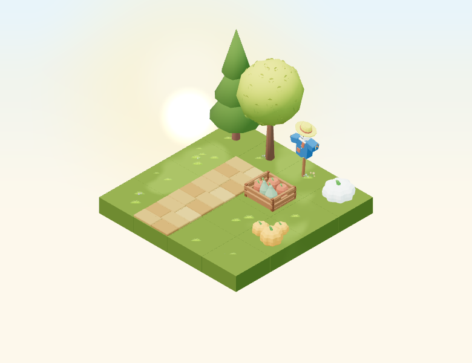
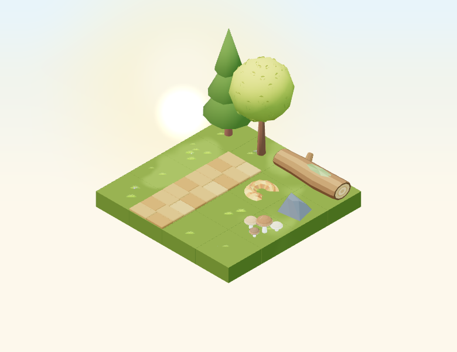
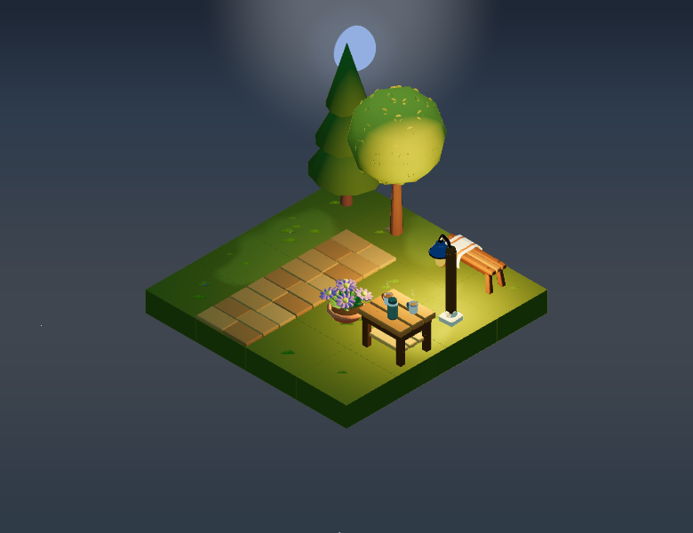
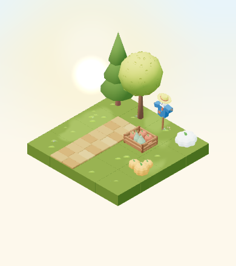
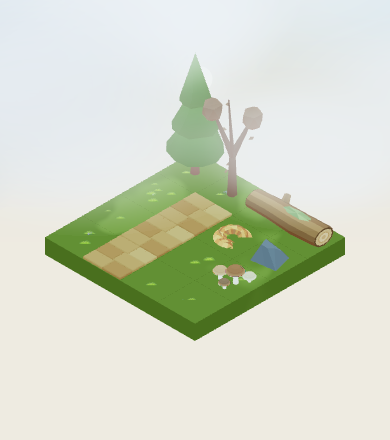
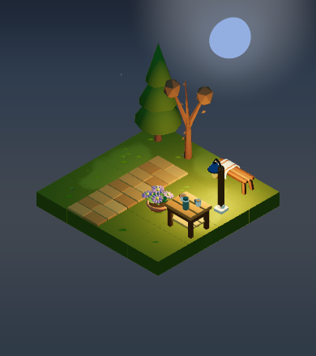

# Autumn 2026: three small-garden arrangements

Manual placement references for [#4983](https://github.com/gredice/gredice/issues/4983),
following the [autumn art direction](autumn-art-direction-2026.md). These compositions
reuse original Gredice models. They do not define purchasable packs, grant inventory,
automatically place objects, publish draft catalogue items, or change customer dates.

The renderer-free shared source is [`autumnArrangements`](../packages/js/src/autumnArrangements/index.ts),
exported as `@gredice/game/autumn-arrangements`. Collection IDs match the autumn picker:
`harvest`, `woodland`, and `evening`. A reference can be shown only when every pictured
identity resolves in the published directory, every included decoration is for sale,
and its reviewed footprint still matches. Sandbox previews may use local fixture data.

## Exact compositions

“Included” below means the decoration list for this manual reference; it is not a
commercial offer. Quantities count placeable catalogue objects. Three pumpkins in a
pumpkin-group model count as one object; the tea table, thermos, and two cups are one
object; the blanket is part of its bench. No colour or variant is chosen randomly.

| Reference | Included decoration objects | Occupied cells | Reserved corner |
| --- | --- | --- | --- |
| Kutak jesenske berbe | 1 × `HarvestPumpkinGroupOrange`; 1 × `HarvestPumpkinSquatCream`; 1 × `HarvestCrateOrchard`; 1 × `GardenScarecrow` | 4 | 2 × 3 |
| Staza uz šumski kutak | 1 × `WoodlandMushrooms`; 1 × `StoneMedium`; 1 × `AutumnLeafPileCrescent`; 1 × `FallenLog` | 5 | 2 × 3 |
| Mjesto za toplu večer | 1 × `AutumnBlanketBench`; 1 × `GardenTeaTable`; 1 × `EnamelGardenLamp`; 1 × `AutumnAsterPotMauve` | 5 | 2 × 3 |

All three pictures also contain **scenery outside the decoration list**: 16 ×
`Block_Grass`, 1 × `Tree`, 1 × `Pine`, and 3 × `StoneWalkway`. Lighting, sky/clouds,
shadows and seasonal leaf colour are environment presentation, not additional items.
The full pictured garden is 4 × 4. Ten cells lie outside the reserved 2 × 3 corner.
The log and blanket bench each reserve two supported cells; nothing sits on them.

Coordinates and quarter-turn rotations are in the manifest; `(0,0)` is the front
corner, X/Z increase across the garden, and all current rotations are zero. The
fixture translates the garden by `(-2,0,-2)` without changing spacing or model scale.
The stone path at X=2 runs from Z=0 through Z=2. The open approach is `(1,1)` for
harvest/woodland and `(1,2)` for the bench. Trees remain behind the props.

## Capture matrix and reproduction

The opt-in isolated fixture mounts production `Scene`, `Environment`, and individual
`EntityFactory` components with local assets and local mock catalogue data. It blocks
remote and non-read requests, supplies no customer plants or operations, freezes the
shared scene clock at debug milestones, and disables audio. Capture dates never reach
a customer garden.

Each composition is captured at early/mid/late autumn from `getSeasonDebugDates(2026)`
and day/overcast/dusk/night, at both 780 × 600 high quality and 390 × 440 low quality
with reduced motion. DPR is 1, animation time is fixed at 12 seconds, springs are
static, wind/rain/snow inputs are zero. The isolated probe hides the unseeded
background star point field so repeated night captures compare exactly; it does not
hide any catalogue object or change production stars, moon, lighting or sky. Overcast uses cloudy=1; dusk uses the existing
solar-time resolver at 0.8, and night is 22:30 local time in Europe/Zagreb.

```sh
pnpm install --frozen-lockfile
pnpm --filter @gredice/game exec tsx --test src/arrangements/autumnArrangements.unit.ts
pnpm --filter garden exec playwright test --config playwright.autumn-arrangements.config.ts --update-snapshots
```

Commit source inputs before capturing. The harness rejects dirty inputs outside its
two output folders, records the input commit/tree and each scene's actual ISO time,
season state, object identities, geometry counts and projected bounds, and verifies
that no source changed during capture. High-quality early-day images for harvest/woodland and the early-night evening image
are copied byte-for-byte to `apps/garden/public/assets/arrangements` for collection previews.
Every pictured object must have geometry and fit inside the canvas; decoration
bounds must remain larger than 14 × 10 pixels on the small canvas. These bounds
checks complement visual inspection; they are not an occlusion or device-performance
benchmark. The committed JSON records are the reproduction evidence.


## Reviewed examples

| Harvest corner | Woodland path | Cozy evening seat |
| --- | --- | --- |
|  |  |  |

At 390 px, low quality and reduced motion:

| Harvest / early day | Woodland / late overcast | Evening / late night |
| --- | --- | --- |
|  |  |  |

The pumpkin cluster and orchard crate remain distinct at small size; the cream
pumpkin and blue shirt separate the harvest corner from green early foliage. The
woodland log's pale ends, large caps and stone survive the overcast cloud wash.
The evening lamp visibly pools warm light on the cups, aster and blanket; the
bench remains recognizable when particles/steam are absent. Night views without
a lamp are intentionally darker, but each included silhouette stays discernible.
The rear trees remain scenery and use the existing seasonal foliage progression.
These are Chromium software-WebGL screenshots, not physical-device performance
or touch/thermal acceptance results.

The collection picker exposes an expandable “Primjer rasporeda” only after the
same manifest's availability gate passes, with four exact decoration entries,
occupied-cell count, and a separate scenery list. It makes no pack-price or
automatic-placement promise. The component resolves the preview using the game
store's `appBaseUrl`, just like GLB model URLs: local in Garden, and the configured
Garden asset host when embedded in WWW. Current `LandingGameScene` passes
`https://vrt.gredice.com`; its Next image configuration already permits that host.
Other future consumers can call `getAutumnArrangementPreviewUrl` with their
configured game asset host. Preview deployment remains a prerequisite for those
consumers; typechecks alone do not prove live asset availability.

Validation includes footprint/support/collision/approach checks, publication and
price gating, all 72 scene captures, the three mobile expandable lists and image
loads, keyboard navigation/back/ordinary purchase and drag behavior, and an
embedded-host URL/image-readback test. The capture JSON records preserve the
committed source revisions used to render them.
