# Autumn 2026: collection art direction

Art decision for [#4947](https://github.com/gredice/gredice/issues/4947), part of
[#4946](https://github.com/gredice/gredice/issues/4946). Reviewed 2026-09-25 against
`c5a42da459d5c68b1a89a9e002ac00ece7e35cef`.

**Keep the existing foliage curve. Make the launch recognizable through the six
core decorative prop families, with warm harvest shapes, Croatian garden details,
green foliage and cool material accents.** This brief establishes production
targets; it does not add models, publish catalogue items, or change customer state.

## Palette and material roles

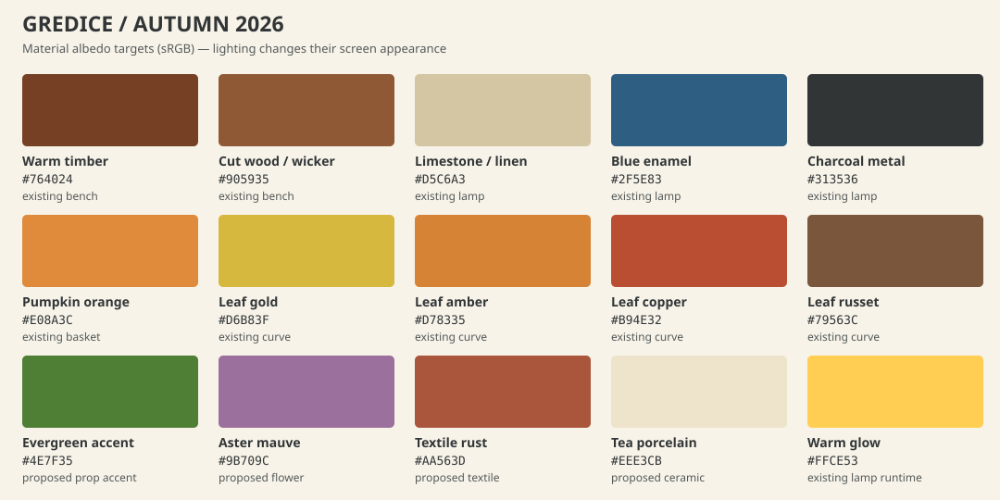

These are **sRGB albedo targets**, not colors sampled from lit screenshots. The
existing anchors come from exported `WoodenBench`, `EnamelGardenLamp` and
`HarvestBasket` GLB materials, converted from linear RGB. Leaf stops come from
[`autumnPalette.ts`](../packages/game/src/scene/autumnPalette.ts). The warm glow
comes from [`EnamelGardenLamp.tsx`](../packages/game/src/entities/EnamelGardenLamp.tsx).
Green, mauve, rust and porcelain are proposed accent roles; they do not recolor
existing grass, crops, evergreen trees or player-owned objects. The basket is a
material reference, not a new decorative harvest reward.

| Role | Colors | Authoring target |
| --- | --- | --- |
| Timber, crates, tool handles | `#764024`, `#905935`; darker ends only | Broad beveled boards; roughness 0.82–0.92, metalness 0. Existing bench roughness is 0.86. Avoid painted-in highlights and tiny wood grain. |
| Limestone, linen, mushroom stems | `#D5C6A3`, `#EEE3CB` | Matte light separator against brown props; stone/fabric roughness 0.88–1, metalness 0. Use geometry for a folded edge or chunky stem. |
| Pumpkin, harvested-produce decoration | `#E08A3C`, a small `#4E7F35` stem | Broad lobes and a bent stem; roughness 0.80–0.90, metalness 0. Whole decorative fruit remains unlit. |
| Leaves and dry accents | Gold `#D6B83F`, amber `#D78335`, copper `#B94E32`, russet `#79563C` | Preserve the existing seasonal sequence on opted-in deciduous trees. Decorative piles use 2–3 of these colors with roughness 0.9–1, metalness 0. |
| Cool enamel and hardware | `#2F5E83`, `#313536` | Small kettle, mug rim, cart pan or bracket accents. Lamp reference: enamel roughness 0.32 / metalness 0.08; metal 0.38 / 0.55. Do not apply glossy metal to the whole prop. |
| Flower and textile accents | Mauve `#9B709C`, rust `#AA563D`, cream above | One accent per group, with 0.9–1 roughness and zero metalness. Use solid color areas; avoid fine plaid and individual petal noise. |
| Lamp or contained flame | `#FFCE53` | Small emissive surface; reuse the runtime night-light budget. The prop must read with no particles and no allocated point light. No baked yellow halo on wood or terrain. |

For a composed corner, aim for about **50% green/neutral visible area, 35% warm
wood/harvest, 10% cream or cool enamel, and at most 5% glow/special accent**.
These are composition targets, not a shader mask or a requirement to recolor the
whole garden. Keep at least one evergreen/green shape and one cool material accent
visible even in late autumn. Do not warm the global scene or erase cool shadows.

## Collection briefs

All proposed sizes below are in garden tile units, measured **after runtime scale**.
Height starts at the supporting surface. A is the launch core; B completes the
arrangements; C is an optional expansion, following the parent epic.

| Collection | Palette and silhouette | Scale, materials and original detail | First readable arrangement |
| --- | --- | --- | --- |
| **Jesenska berba** | Orange lobes, straw gold, timber, cream, a dark green stem. A low round cluster balanced by a friendly upright scarecrow. | A: pumpkin group 1×1, height 0.25–0.55; crate 1×1, 0.35–0.55; scarecrow 1×1, 1.2–1.5. Rough timber, matte fruit, folded cloth. Asymmetric straw hat, blue work-shirt patch, slatted orchard crate and a simple Croatian garden label; no copied character face. | Pumpkin cluster in front, one crate or hay bale beside it, scarecrow behind. Leave a clear crop-facing edge. Wheelbarrow is B, not a launch dependency. |
| **Šumski kutak** | Cream stems, chestnut/russet caps, moss green and one copper leaf patch. A low horizontal mass with 3–5 large mushroom domes. | A: mushroom cluster 1×1, 0.2–0.4; leaf pile 1×1, 0.08–0.18. B: log target 2×1, 0.3–0.45. Use faceted bark, one broad cut end and a small moss patch. Optional woven nut basket is C. Mushrooms are decoration, with no edibility claim. | Mushroom cluster and a low pile at the side of an existing tree; add a cool stone. The evergreen stays visibly green. Add the log only when its full footprint is supported. |
| **Topla večer** | Rust/cream textile, warm timber, blue enamel and a small amber light. A low horizontal seat, square tabletop and one slim upright lamp. | B: preserve the existing bench dimensions and 0.52 root scale; blanket uses one broad fold and a cream edge. Tea arrangement stays within the existing table top; composed thermos and two chunky enamel mugs. Cloth roughness 0.95; enamel retains its own smoother material. No generic sofa or indoor living-room furniture. | Existing bench + table + lamp establish the corner. The new blanket and mugs provide identity without steam. Steam is separate #4972 work. |
| **Jesenski vrt** | Mauve/cream flowers, terracotta, leafy green and restrained copper. Rounded flower mound contrasted with a narrow upright tool. | A: aster pot 1×1, 0.4–0.65, reuse a pot profile and group blooms into 3–5 visible masses. B: shrub 1×1, 0.5–0.8; rake arrangement 1×1, up to 1.1. Weathered terracotta, wooden handle, charcoal rake head. Author a distinct deciduous shrub contract; do not assume the existing Bush changes season. | Pot near a bed entrance, low leaf pile at the outer edge, rake behind when available. Keep real crop foliage and working area unobscured. |
| **Kestenijada** | Chestnut brown, cream paper cones, charcoal pan, blue enamel, one warm ember accent. A squat cart with two obvious wheels and a shallow roasting pan. | C: cart target 2×1, height 0.9–1.2, with a low handle. A chestnut split is one broad pale notch; paper cones are large folded wedges. Use local chestnut-gathering/roasting details and a restrained `Kesteni` sign. Rough wood contrasts with the darker metal pan. No smoke-dependent silhouette. | Cart at the perimeter, one serving surface and one light; reserve an open approach. On a 4×4 garden use a future 1×1 serving prop instead of forcing the full cart into the center. |
| **Noć bundeva — optional** | Pumpkin orange, cream and charcoal with a small blue/mauve accent. A clearly lobed pumpkin with a friendly, broad cutout face. | C: lantern pumpkin 1×1, 0.3–0.55. Keep the existing pumpkin family proportions; cutouts stay readable at small scale. One simple cloth ghost or web accent may follow, with a distinct silhouette. No gore, dense black scenery, neon wash or copied holiday characters. | Two low lanterns marking an edge, with one optional accent behind. Keep this collection independently discoverable so it does not redefine all autumn decoration. |

Core asset owners: [pumpkins #4948](https://github.com/gredice/gredice/issues/4948),
[scarecrow #4949](https://github.com/gredice/gredice/issues/4949),
[crates #4950](https://github.com/gredice/gredice/issues/4950),
[asters #4952](https://github.com/gredice/gredice/issues/4952),
[mushrooms #4954](https://github.com/gredice/gredice/issues/4954), and
[leaf piles #4956](https://github.com/gredice/gredice/issues/4956).
For launch, each collection image must work with its available props; do not
advertise future B/C objects as included items.

## Footprint and small-garden conventions

- One tile is one world unit in X/Z. Use a base-centered authoring origin and
  apply the established entity placement transform. For multi-cell models,
  align that origin to the runtime footprint anchor; never assume an overhanging
  visual mesh reserves adjacent cells. Catalogue `spanWidth` / `spanDepth`,
  quarter-turn rotation and occupancy must agree with
  [`gardenBlocks`](../packages/js/src/gardenBlocks/index.ts).
- For 1×1 props keep the ordinary silhouette inside 0.9×0.9 units, leaving at
  least 0.05 units on each side. A 2×1 prop targets at most 1.9×0.9. Include
  handles, stems, branches and blanket edges in the review. Verify all four
  rotations against adjacent occupied tiles; larger dimensions need an explicit
  supported footprint, not a visual-only exception.
- Heights form three layers: low detail 0.08–0.4, supporting masses 0.4–0.8,
  a single new focal upright 1.0–1.5. Existing trees may exceed this range, but
  keep them behind the composition in its representative view. Preserve existing
  furniture scale; a blanket is not permission to enlarge the bench.
- In a **4×4** garden, the decoration corner uses at most a **2×3** area and
  3–5 individually placed props. Keep at least 10 of 16 tiles outside that area
  available for beds, paths or the user's existing items. Keep a connected
  one-tile approach to the active bed/seat/gate. Do not place a tall prop between
  the default camera and the nearest crop or interaction target.
- Use one focal object, two supporting masses and at most two small accents.
  Compose roughly a triangle of heights, rather than five equal-height objects
  in a row. Keep the focal silhouette and an adjacent patch of clear ground
  visible from the default camera and after quarter-turn rotation.
- Small details must read as a group at a 390 px canvas: pumpkin lobes, mushroom
  caps and a blanket fold. Labels, stitches, steam, individual leaves and sound
  may enrich close-up inspection but cannot carry the theme. Static low-quality
  presentation must still distinguish harvest, woodland and evening seating.

Targets for [the three finished examples in #4983](https://github.com/gredice/gredice/issues/4983):
harvest = one scarecrow + pumpkin group + crate + hay; woodland = tree + mushrooms
+ low pile + stone, replacing two cells with the log in the B version; evening =
bench + composed tea table + one lamp + one pot. Recount occupied cells from the
final catalogue spans, and reduce the item list if it exceeds six. These are
authoring targets, not purchasable pack contents, prices, or automatic layouts.

## Seasonal camera review

The following are real WebGL captures of **shipped Gredice models and the current
Environment renderer**, arranged in a 6×6 local fixture. They establish palette,
scale and lighting references; they are not previews of unbuilt collection assets
or the final arrangements from #4983. Three deciduous trees, one evergreen,
bench, table, enamel lamp, hay, bucket, pot and stone remain in the same positions.
No AI-generated scenery or external-game art is used.

| Date / stage | Sun | Overcast | Dusk | Night |
| --- | --- | --- | --- | --- |
| Sep 23 / early | 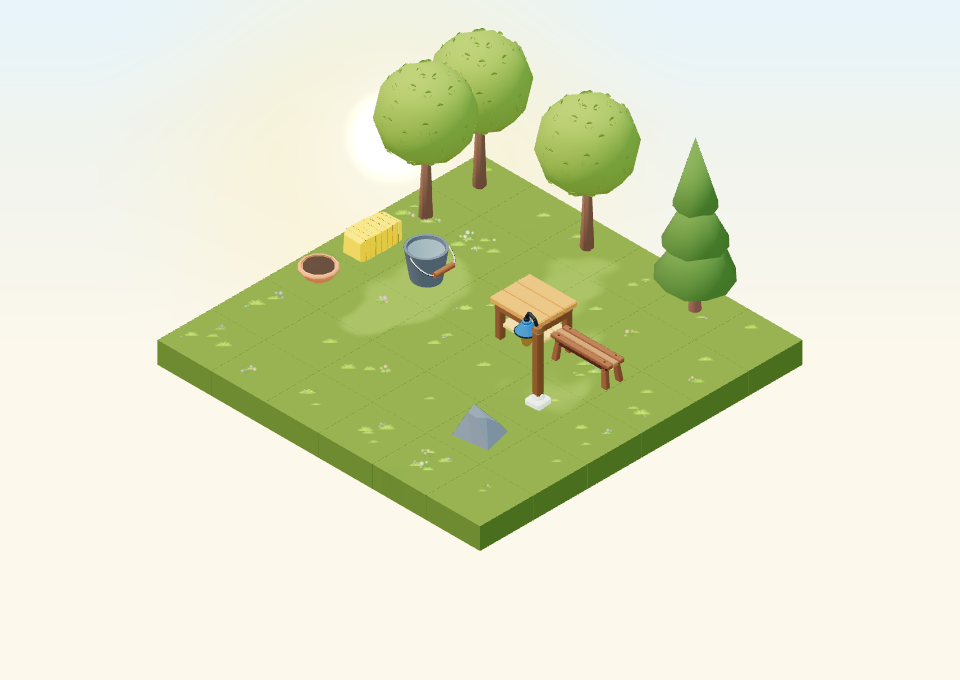 | 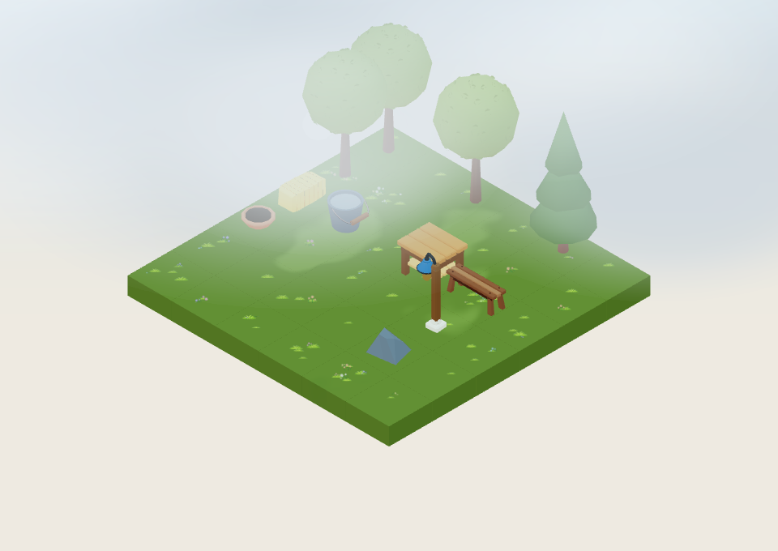 | 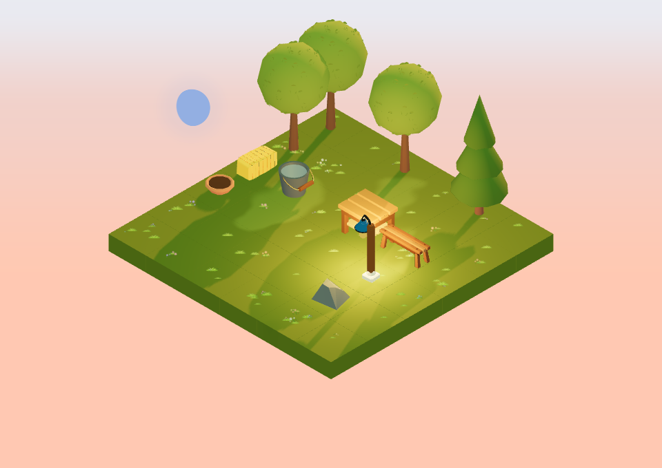 | 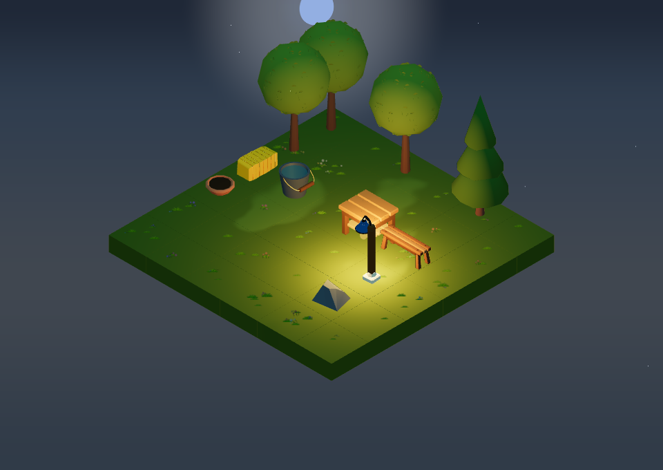 |
| Oct 22 / mid | 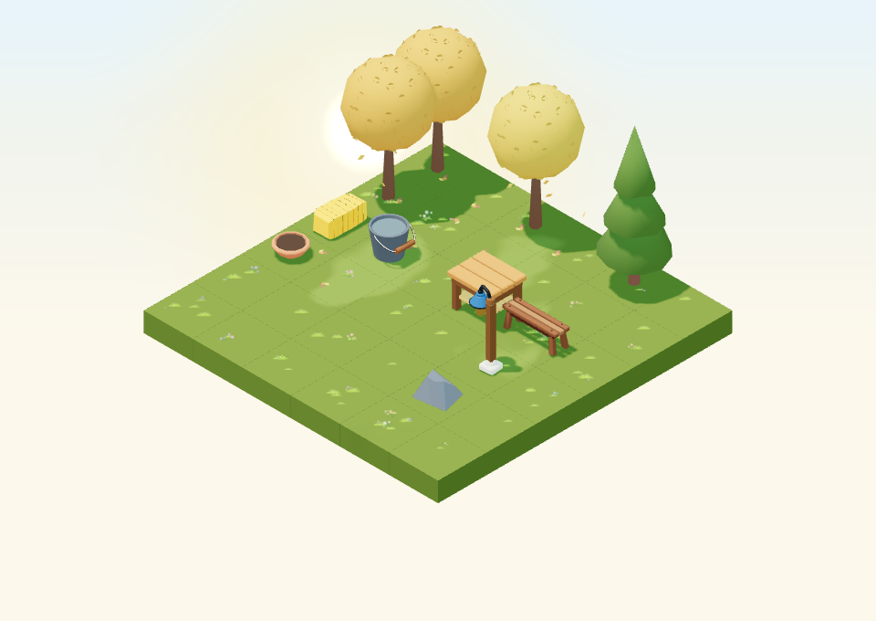 | 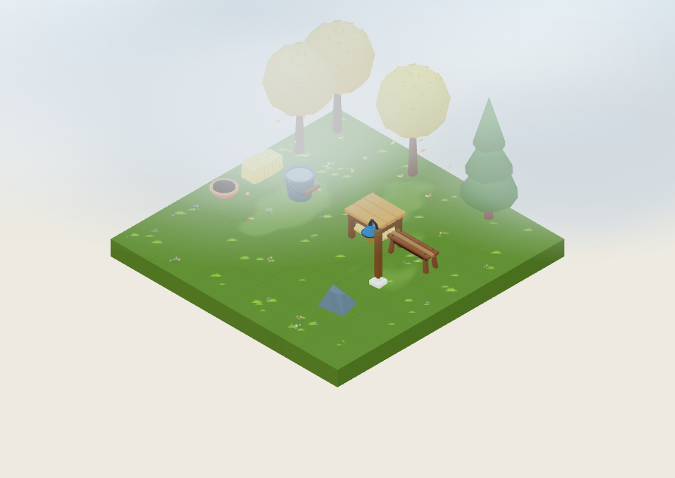 | 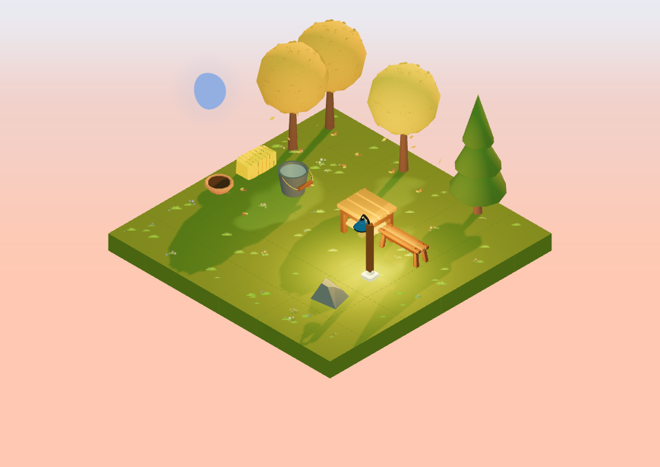 | 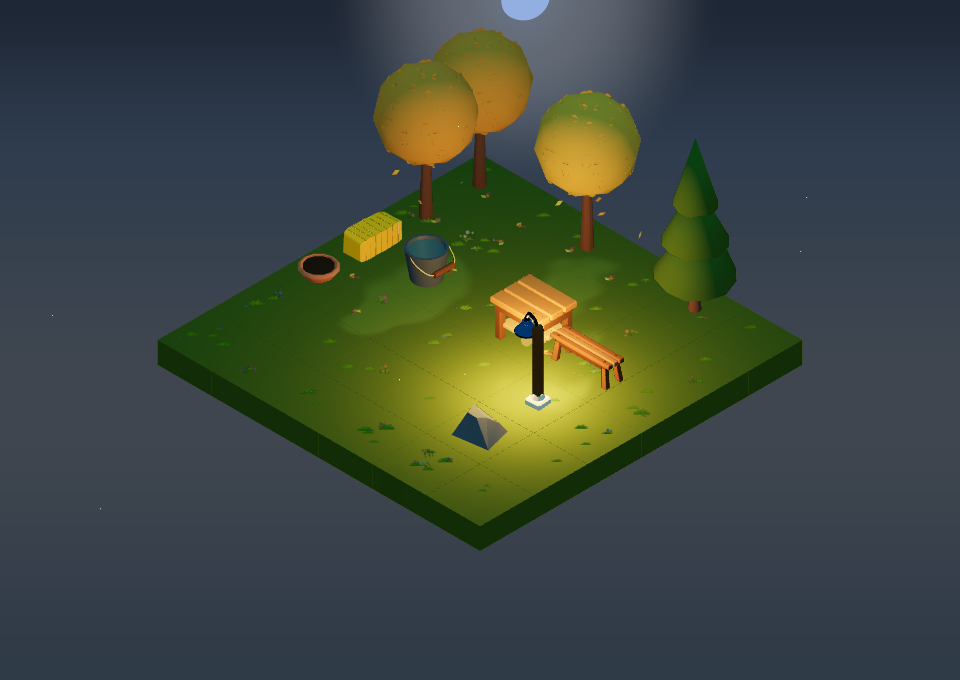 |
| Nov 21 / late | 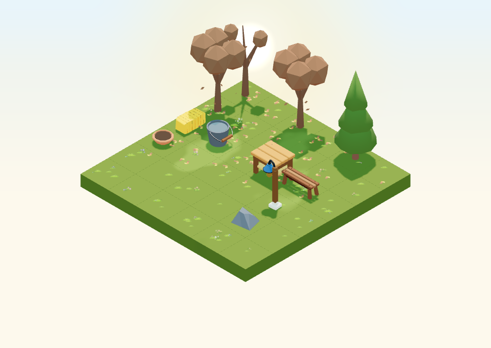 | 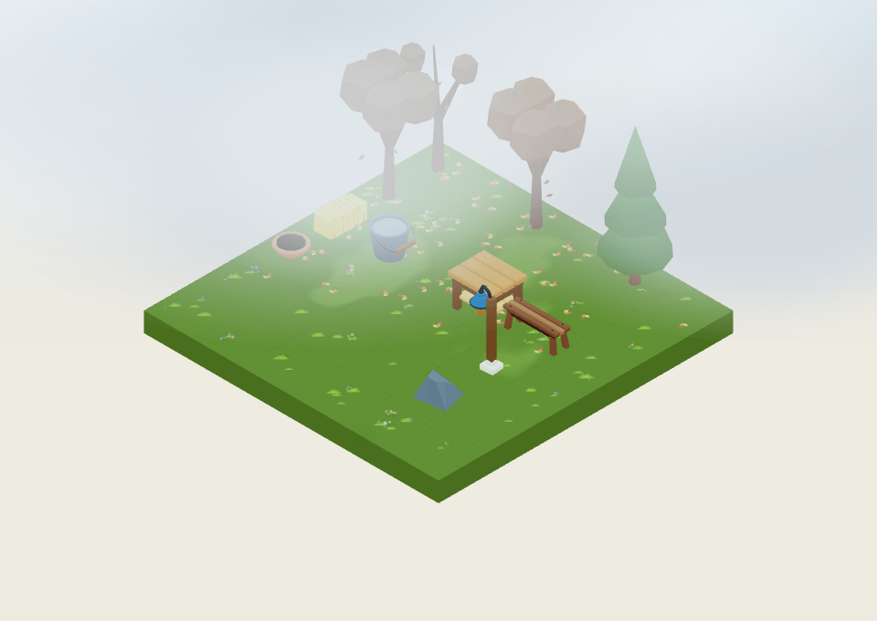 | 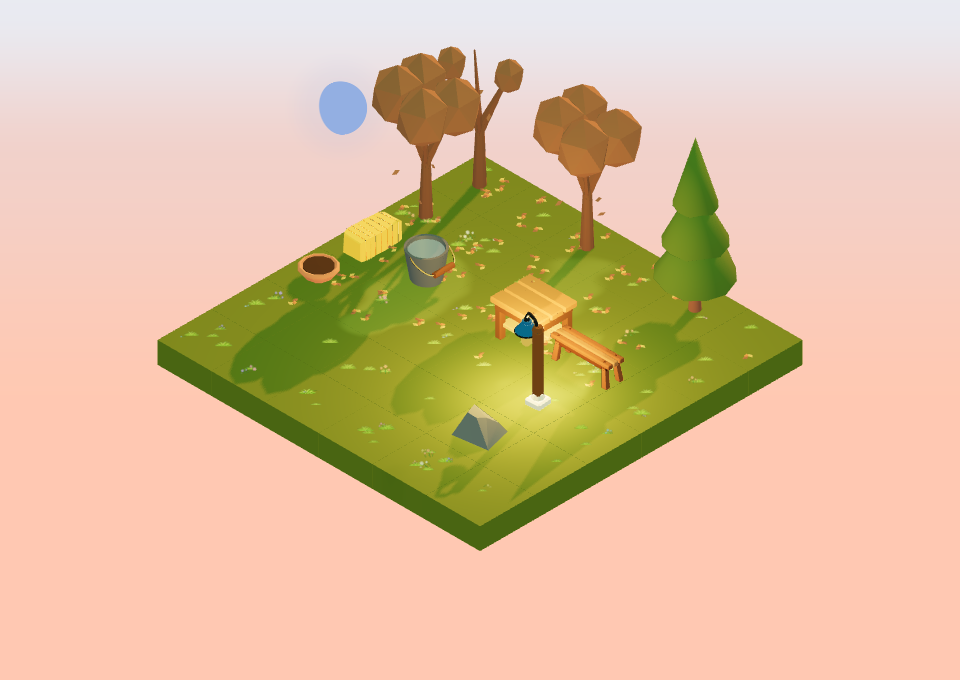 | 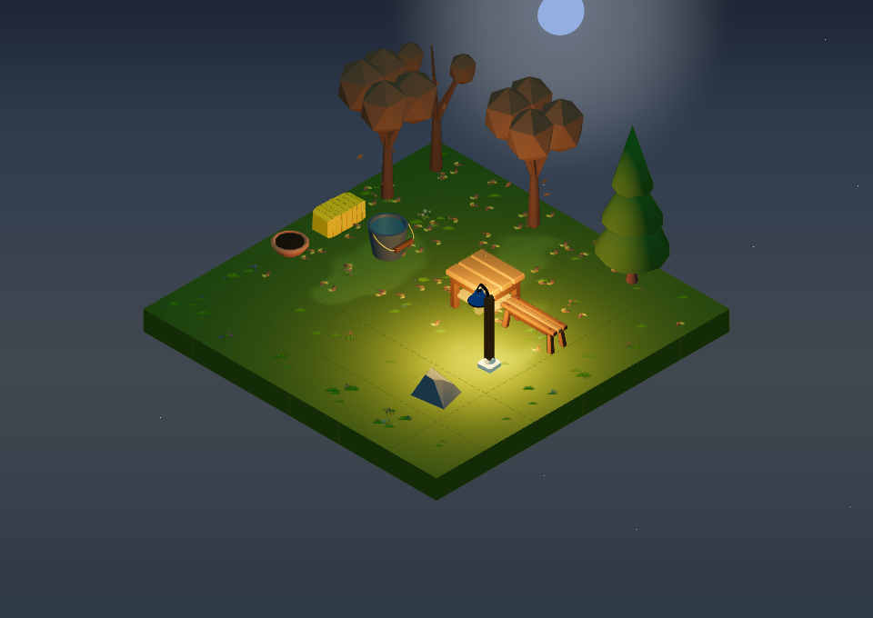 |

Click a capture for its full-size view. Camera direction matches the default
`[-100, 100, -100]`, with target `[-0.5, 0.4, -0.5]` centering this fixture.
Desktop is 960×680, zoom 76 (close to the runtime far zoom of 75), DPR 1, high
quality. Sun and overcast use local noon; overcast has `cloudy=1`, zero rain/fog
inputs, and the normal cloud layer. Dusk uses the date's sunset via
`createDateForGameTimeOfDay(date, 0.8)`; night is 22:30. Timezone is Europe/Zagreb,
animation time is 12 seconds, wind/rain/snow are zero, and audio is disabled.

| Review | Observed result | Direction for asset authors |
| --- | --- | --- |
| Early / sun | Green trees dominate. Hay, light wood and blue enamel read, but the arrangement alone does not announce autumn. | Approve strong pumpkin, crate and aster masses for launch; do not depend on a seasonal background tint. |
| Early / overcast | The cloud layer veils the rear trees and reduces pale-object contrast even with the fog input at zero. Foreground wood and blue enamel remain useful anchors. | Put the new focal prop below canopy height and toward the open front; give cream objects a darker body/stem or border. A stronger foliage curve would not solve this occlusion. |
| Early / dusk | Warm directional light pulls grass, hay and timber toward similar yellow-green values. | Retain blue enamel and cream textile separation; use silhouette and value difference as well as orange hue. |
| Early / night | The lamp makes a clear seating focal point; dark pots and distant greenery lose internal detail. | Put small cozy accents near the light, with readable pale rims; keep the large shape recognizable without illumination. |
| Mid / sun | Gold canopies are clearly distinct from the green pine and ground. Airborne and ground leaves supply the seasonal cue. | Keep some pumpkin copper/rust and cream so new props do not blend into a gold canopy. |
| Mid / overcast | Gold becomes pale under the clouds; shape and placement communicate more than saturated color. | Avoid pale-on-pale mushroom/flower clusters at the rear; retain dark stems, terracotta or moss below. |
| Mid / dusk | Gold trees, hay and the lit table converge; green pine, blue lamp and the bench outline preserve structure. | Limit the number of equal-height warm masses and separate focal objects with open ground. |
| Mid / night | Warm canopies remain visible, with the lamp stronger than the ground details. | Keep one main glow and a quieter supporting palette; no extra point light for every leaf or pumpkin. |
| Late / sun | Sparse russet canopies expose branches; ground leaves become a broad secondary texture. Evergreen contrast is strong. | Keep decorative leaf piles larger and lower than ambient leaf clusters, and reserve clean surrounding ground. |
| Late / overcast | Cloud cover reduces brown canopy contrast substantially; the foreground remains readable. | Use cream cut ends or stems to separate woodland shapes; do not place the only focal detail in the veiled canopy zone. |
| Late / dusk | Branch shadows cross the ground and the warm palette becomes more uniform. | Avoid fine rake tines/leaf scatter as the primary shape; keep a broad handle/head grouping and clear silhouette. |
| Late / night | Russet canopies are dark while the illuminated furniture remains distinct. | Anchor the view with cream/enamel and one evergreen silhouette; do not blacken the whole collection for late autumn. |

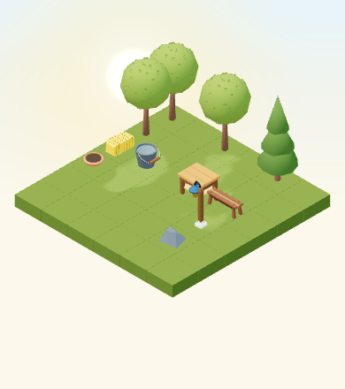

At 390×440, DPR 1 and zoom 42 on low quality, the bench, table, lamp, hay and tree
silhouettes remain distinct. The empty pot rim and small ground details are weak
identity cues. This supports broad flower/fruit clusters and a large blanket fold.
This is a desktop Chromium capture at small canvas size, not a physical-device
performance, touch, thermal or final crop/HUD-occlusion test.

## Foliage-curve decision and continuity

**Decision: retain `getAutumnState` and the current seeded palette/retention
behavior without tuning.** September's green canopy gives the new orange, cream
and mauve props useful contrast. The October and November progression already
provides strong change; advancing the full scene date would also change the
presentation of real plant growth. Date overrides belong only in debug/capture
fixtures. Customer gardens continue using their real shared scene clock.

Current unseeded values from the shared resolver (2026, Europe/Zagreb):

| Local date/time | Foliage progress | Retention | Falling intensity | Settled amount |
| --- | ---: | ---: | ---: | ---: |
| Sep 23, 00:00 (issue baseline) | 0.000573 | 1 | 0 | 0 |
| Sep 23, 12:00 (capture) | 0.001284 | 1 | 0 | 0 |
| Oct 22, 12:00 | 0.386308 | 0.801456 | 0.995986 | 0.203772 |
| Nov 21, 12:00 | 0.931616 | 0.217113 | 0.889833 | 0.729365 |

Values are curve controls, not percentages of visibly orange leaves. Tree IDs
choose bounded color/retention variation. By late autumn different IDs can cross
the sparse-canopy threshold at slightly different times. The unchanged winter
boundary is `(color 1, retention 0.08, falling 0, settled 0.85)`; winter settles
to 0.1 ground-leaf amount at the spring boundary. Spring starts from that same
brown/sparse state and regrows smoothly, finishing green/full with no settled
leaves before summer. The existing boundary, leap-year, palette and canopy tests
passed (17 tests).

Revisit only after the six core props are shown together at September 23 noon
and 390 px, and their silhouettes/palette still fail to communicate autumn.
Any future proposal must compare the same IDs/camera, show the launch benefit,
and preserve all four curve endpoints through autumn/winter, winter/spring and
spring/summer; rerun the existing season tests. Never compensate by recoloring
real crops or moving their date.

## Reproduction and handoff

The [capture record](autumn-art-direction-2026/capture-record.json) contains the
source revision, browser version, resolved ISO instants, camera and curve values.
The fixture uses local models and mock data, blocks remote requests and non-read
requests, and has no authenticated garden queries. It is outside the normal
regression snapshot inventory and mounts no real plants or farm-operation flows.

From the repository root with Node >=24 and the pinned pnpm version:

```bash
pnpm install --frozen-lockfile
pnpm --filter garden exec playwright install chromium
pnpm --filter garden exec playwright test --config playwright.autumn-art.config.ts --update-snapshots
pnpm --filter @gredice/game exec tsx --test src/scene/autumnState.unit.ts src/scene/seasonState.unit.ts src/scene/autumnCanopy.unit.ts
git diff --check
```

The explicit capture command replaces the 13 PNGs and capture record in
`docs/autumn-art-direction-2026`; inspect the images before accepting an update.
It does not launch the customer app or require credentials. The fixed clock
stabilizes the seasonal state and motion; randomized star/cloud placement in the
existing renderer may vary between runs, so these are art references rather than
a pixel-identical cross-machine regression contract. The fixture is
[`AutumnArtDirectionFixture.tsx`](../packages/game/tests/AutumnArtDirectionFixture.tsx).
The [seasonal-effects guide](game-seasonal-effects.md) describes the runtime
curves and leaf layers; the [asset manifest](../assets/game-assets.json) records
the shipped source/output inventory.

Before an individual asset is handed to runtime integration, review it beside
the bench/lamp/pot references at the same camera and all four rotations, check
its authored spans and base contact, and capture sun/overcast/dusk/night with
particles disabled as well as enabled. Name material roles by purpose so snow,
rain and optional glow can be applied selectively. Author original Blender
sources, then follow `pnpm generate:game-assets`; do not hand-edit generated
model metadata. No external-game meshes, textures, traced silhouettes or
recognizable characters belong in this collection. External games may inform
only broad composition principles.

This issue delivers the brief, swatches, current-renderer review and curve
decision. New models, catalogue availability, finished showcase arrangements,
picker collections, optional effects and bundle mechanics remain with their
respective child issues. Decorative produce, mushrooms, leaves and chestnut
props never imply a real harvest, health change, inventory grant or completed
farm operation.
