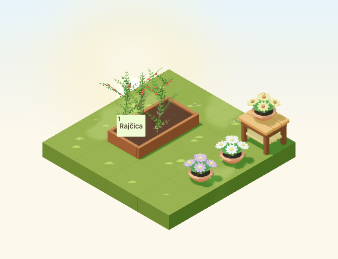
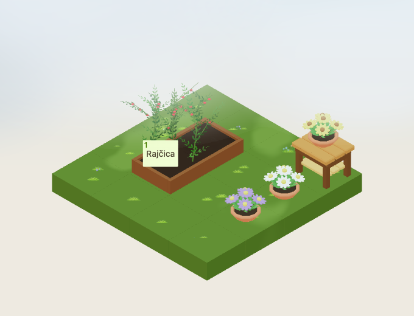
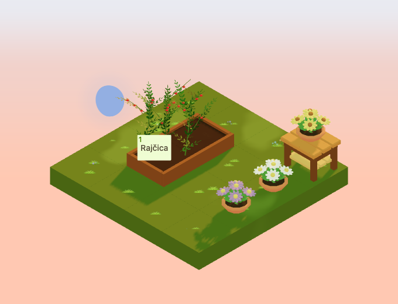
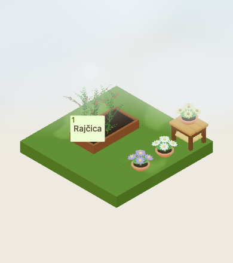

# Potted autumn asters

Implementation for [#4952](https://github.com/gredice/gredice/issues/4952),
following the [autumn art direction](autumn-art-direction-2026.md).
Three new decoration identities share one editable `AutumnAsterPot.blend` and
one lazy GLB. Existing pots, crop purchases and plant growth remain unchanged.
Deployment and catalogue publication belong to #5000.



## Design

Five broad, ten-petal flower heads rise above a mound of lance-shaped leaves.
The lower flowers tilt outward to keep the bloom masses visible at every
quarter-turn. A raised central bloom and contrasting discs read at small sizes.
The low bowl and soil are copied directly from `PotLowBowl.blend`, at their
original dimensions, into the new source. The generator's audit compares every
vertex and polygon with that source. The existing pot source, model, runtime
and catalogue identities are not modified.

First-party references inspected before modeling:

- [Low bowl](../apps/www/public/assets/blocks/PotLowBowl.webp): reuse its broad
  terracotta rim and exact profile, retaining the original empty-pot item.
- [Tulips](../apps/www/public/assets/blocks/Tulip.webp): grouped flower heads
  and angular leaves; the asters instead use flat, rounded flower masses.
- [Autumn dusk scene](autumn-art-direction-2026/mid-dusk.png): keep flower
  colours distinct from green ground and yellow foliage under warm light.

| Catalogue name | Croatian label | Petals / centre | Proposed price |
| --- | --- | --- | --- |
| `AutumnAsterPotMauve` | Ukrasni jesenski asteri – ljubičasti | `#9B709C` / `#D6B83F` | 45 sunflowers |
| `AutumnAsterPotCream` | Ukrasni jesenski asteri – krem | `#EEE3CB` / `#D6B83F` | 45 sunflowers |
| `AutumnAsterPotGold` | Ukrasni jesenski asteri – zlatni | `#D6B83F` / `#965D30` | 45 sunflowers |

All variants occupy one tile with a 0.72 × 0.72 × 0.61 hitbox. Actual bounds
are 0.6469 × 0.6190 × 0.5980 tiles. The origin is at the base centre.
The decorations can sit on compatible ground, walkways or display tables;
they cannot sit on water or support another block. They do not grow, require
sowing or yield a harvest. Croatian copy makes their decorative role explicit.

The **Dekoracija** picker resolves each colour from catalogue data and hides
absent rows before publication. Local sandbox data uses the same specification
from `@gredice/js/autumnAsterPots`. Each placed item owns its petal and centre
materials, so one colour never changes another or mutates cached GLB materials.

## Materials, cost and review

The original terracotta colour is `#C56C45`; soil is `#3F2A1C` and foliage
`#4E7F35`. Flower materials use roughness 0.95; the other roles use 0.86.
All materials are nonmetallic and nonemissive. Existing shared weather overlays
provide rain and snow. The lazy GLB is **128,672 bytes**, with **2,152 triangles, five meshes and five
material roles**, with no textures, animations, lights, sounds or particles.
Five base-pass draws are supplemented by the existing shadow/weather passes.
These are structural costs, not physical-device frame-rate measurements.

The [release manifest](autumn-aster-pots-2026/release-manifest.json) records
the exact GLB byte count and versioned URL, source/model/image hashes, reused
pot-source hash and unpublished catalogue specifications. Each colour has a
transparent cover, four cover rotations and five true top-down images.

| Cloudy | Dusk | Small canvas |
| --- | --- | --- |
|  |  |  |

The review scene is a 4×4 garden: mauve and cream pots on the ground, gold on
a display table, with a planted bed alongside. Three occupied decorative cells
sit within a 1×3 strip; a connected one-tile approach remains clear beside the
bed. All three variants are rendered together, at every rotation in clear day,
night, overcast and dusk. Browser checks inspect actual model bounds, distinct
material identities/colours, ray selection and a clickable production crop
button at a representative anchor. This is component/composition acceptance,
not a live purchase or the complete authenticated close-up HUD.

Captures use September 23, Europe/Zagreb, noon or 22:30; dusk uses the game's
time-of-day value 0.8. Overcast uses cloudiness 1 with no rain, fog or wind.
Camera direction is `[-100,100,-100]`, zoom 90, 680×520, DPR 1; the low-quality
view uses zoom 57 at 390×440. Time is frozen. Night comparisons allow 20 pixels
for existing random stars. Readiness checks loaded geometry, not a frame delay.

## Reproduction and release gate

```bash
/Applications/Blender.app/Contents/MacOS/Blender --background --python-exit-code 1 --python assets/scripts/generate-autumn-aster-pot.py
pnpm generate:game-assets
/Applications/Blender.app/Contents/MacOS/Blender --background --python-exit-code 1 --python assets/scripts/generate-autumn-aster-pot.py -- --check

pnpm --dir apps/garden exec playwright test --config playwright.autumn-aster-pots.config.ts
pnpm --filter @gredice/game exec tsx --import ./scripts/register-test-assets.mjs --test src/data/autumnAsterPotAssets.unit.ts

# Offline catalogue plan; no credentials or database writes.
pnpm --filter @gredice/storage exec tsx scripts/upsertAutumnAsterPotDrafts.ts
```

After export, set the manifest version to the GLB SHA-256's first 12 characters
and regenerate model types. Restore unrelated GLBs rewritten by another Blender
exporter version. To regenerate images, put the shared specifications in ignored
`apps/www/generate/test-cases.json`, with `name` inside `information` and
`prices.sunflowers` from `sunflowers`, then run both generators:

```bash
pnpm --dir apps/www exec playwright test --config playwright-generate.config.ts generate/blocks-snapshots.specgen.tsx -g AutumnAster --workers=1
pnpm --dir apps/www exec playwright test --config playwright-generate.config.ts generate/blocks-top-down-snapshots.specgen.tsx -g AutumnAster --workers=1
# Copy each top-down _1.webp to its unnumbered cover before rebuilding the manifest.
pnpm --filter @gredice/game exec tsx scripts/build-autumn-aster-pots-release.ts
```

The shared importer offers `--dry-run` and `--apply-drafts` only with an explicitly
configured environment. It rejects duplicate names and non-draft rows, preserves
revision/cache/search behaviour and checks readback. It has no publication mode.
No database mode was run here.

For #5000, deploy Garden and WWW on the reviewed SHA, verify the recorded bytes,
review the price, create/read back drafts, then publish through the normal CMS
workflow. Record actual catalogue IDs, refresh caches and verify customer
purchase, placement, rotations and reload persistence for each colour.

## Validation recorded

- Saved Blender audit passes, including exact reuse of the original bowl/soil
  geometry. The standard asset pipeline and regenerated model types pass;
  unrelated exported GLBs were restored.
- Twelve cover and twelve top-down renders pass. All 30 generated image files
  have transparent backgrounds; the 15 cover files are 640×640. The first cover
  hit the generator's 10-second startup limit and passed with a 60-second limit.
- All 1,889 game unit tests pass, including the new release hashes, catalogue
  contract, compatible supports and all rotated hitboxes.
- All 25 focused browser cases pass across the capture run and targeted reruns:
  16 lighting/rotation views, one small canvas and eight picker checks. The first
  run had one scene-readiness timeout; day rotation 3 passed in isolation after
  its missing reference was generated. Dusk 0 and the small view also pass
  comparison against their saved references. All 17 review images were inspected.
- Game/JS lint, changed app/storage-file lint, Game/Garden/WWW typechecks and
  the targeted draft-importer typecheck pass. Game lint retains the existing
  unused suppression warning in `RaisedBedFieldRelationshipIndicator`.
- Garden production build passes. WWW compiles and typechecks, then collecting
  page data for `/blokovi/[alias]` fails because local `POSTGRES_URL` is absent.
- The offline importer returns three draft rows. Database writes, publication
  and live customer purchase/reload acceptance remain with #5000.
