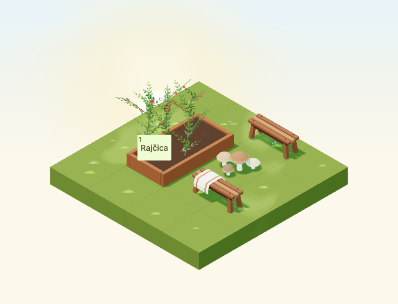

# Autumn blanket bench

Implementation for [#4958](https://github.com/gredice/gredice/issues/4958), release
**B / complete garden**. `AutumnBlanketBench` is a separate decoration identity
with a folded cream/rust throw. The existing `WoodenBench` source, model,
catalogue identity, ownership, runtime and seasonal behavior remain unchanged.
Publication is gated by #5000.



## Design and source

The new asset reuses first-party WoodenBench proportions at its existing 0.52
runtime scale. A broad cream throw folds across one end of the seat and hangs
down both sides, with two rust stripes and a thin solid hem. Its geometry is
readable without a fabric texture. First-party references inspected:

- [WoodenBench](../apps/www/public/assets/blocks/WoodenBench.webp): retain the
  three slats, pins, splayed legs and warm/light timber contrast.
- [BeachTowelStriped](../apps/www/public/assets/blocks/BeachTowelStriped.webp):
  broad textile stripes and thick readable edges, using a folded cream/rust
  treatment instead of a flat summer towel.
- [OutletDisplayTable](../apps/www/public/assets/blocks/OutletDisplayTable.webp):
  shared timber scale and chunky construction for the cozy furniture family.

`AutumnBlanketBench.blend` appends the local bench data without changing its
source. The generator bakes evaluated timber parts at runtime scale and removes
the source's 0.013-tile foot gap to ground the new model. Original part names
remain editable vertex groups in `AutumnBlanketBench_Timber`. The separate
`AutumnBlanketBench_Textile` mesh has broad folded panels and a solid hem.

Bounds are **1.092 × 0.470 × 0.422 tiles**, with a **1.2 × 0.5 × 0.45** hitbox.
The original bench is wider than one tile's 0.9-tile art clearance, so the new
variant deliberately reserves **2×1**, rotating to **1×2**. Its centred model
is offset into the footprint growing positively from the anchor. The original
bench's footprint and behavior are not changed.

Timber uses its original baked colours at roughness 0.87. Textile uses cream
`#EEE3CB`/`#E7D9BB` and rust `#A85835` at roughness 0.98. Both are nonmetallic and
nonemissive, with exported `COLOR_0` palettes. The lazy GLB is **162,344 bytes**,
**1,768 triangles** (1,556 timber + 212 textile), two meshes/primitives/materials
and two base-pass draws. There are no textures, embedded lights, animations,
sounds, particles or dedicated idle render leases. Geometry and materials are
shared immutably across instances. These are structural costs, not measured
device frame rates.

## Catalogue, placement and weather

**Drvena klupa s jesenskom dekom**, proposed **80 sunflowers**, is a nonstackable
decoration. It sits on compatible ground, walkways and display surfaces only
when both cells are free and level. Missing supports, water, occupied cells or
mixed heights block placement and rotation. The shared long-decoration rotation
guard includes this identity alongside the log and wheelbarrow.

Timber and textile use separate shared rain/snow settings: wood allows a little
wet sheen, fabric remains matte and carries a thinner snow layer. Per-entity or
global weather disablement suppresses both overlays. The throw remains attached
to the bench throughout the year; no general attachment mechanic or sitting
interaction is introduced. Picker, sandbox and draft importer share
`@gredice/js/autumnBlanketBench`, and missing catalogue rows remain hidden.

## Leaf-weathering surface review

The exposed left-hand timber is a plausible future resting surface. In the
baked Blender source the seat tops are at **z 0.390**, with slat y ranges
**−0.1508–−0.0624**, **−0.0442–0.0442** and **0.0624–0.1508**. The clear left
zone is approximately **x −0.49–−0.10**. Conservative candidate centres in the
exported Y-up model are **[−0.25,0.392,0.1066]**, **[−0.25,0.392,0]** and
**[−0.25,0.392,−0.1066]**, using leaf scales small enough for the narrow slats.
Any future anchors must inherit the new two-cell offset and rotation.

Reject the entire textile region (**x 0.04–0.42**, Blender **y −0.245–0.225**),
including hanging panels and folded ridges. Also reject pins, legs, underside,
slat gaps and the narrow remaining strip at the right end. This change does not
register new resting anchors. The original bench retains its existing part
anchors; a future blanket-bench integration needs its own audited timber-only
registration, never a wholesale reuse of all original seat anchors.

## Visual and interaction review

A 4×4 garden shows the new bench beside the original bench and mushrooms in a
2×3 corner, with a connected one-cell approach to a real planted bed. Captures
cover every day/night rotation, cloudy/dusk/rain/snow, small low-quality canvas
and four raised-support rotations. Geometry rays select the new bench, original
bench and mushrooms; a production crop button works at a representative anchor.
Separate local rotation tests preserve saved turns and reject blocked second
cells. These are component checks, not authenticated purchase/full close-up HUD
acceptance.

Review time is September 23, 2026, Europe/Zagreb, noon or 22:30, with shared dusk
value 0.8 and fixed animation time 12 seconds. Camera direction is
`[-100,100,-100]`, zoom 90, 680×520, DPR 1; small view is 390×440 at zoom 57.
Rain/snow particle images are visual reviews and night comparisons allow 20
pixels for existing stars. Catalogue previews use October 22 noon.

## Reproduction and release

```bash
/Applications/Blender.app/Contents/MacOS/Blender --background --python-exit-code 1 --python assets/scripts/generate-autumn-blanket-bench.py
pnpm generate:game-assets
/Applications/Blender.app/Contents/MacOS/Blender --background --python-exit-code 1 --python assets/scripts/generate-autumn-blanket-bench.py -- --check
pnpm --dir apps/garden exec playwright test --config playwright.autumn-blanket-bench.config.ts
pnpm --filter @gredice/game test
pnpm --filter @gredice/storage exec tsx scripts/upsertAutumnBlanketBenchDraft.ts
```

Set the version to the first twelve GLB SHA-256 characters; restore unrelated
exporter rewrites before regenerating final model types. Put the shared spec in
ignored `apps/www/generate/test-cases.json`, run both existing Playwright image
generators filtered to `AutumnBlanketBench` with
`BLOCK_SNAPSHOT_FREEZE_TIME=2026-10-22T12:00:00+02:00`, copy top-down `_1.webp` to
the unnumbered preview and run
`pnpm --filter @gredice/game exec tsx scripts/build-autumn-blanket-bench-release.ts`.

The [release manifest](autumn-blanket-bench-2026/release-manifest.json) records
source/model/image hashes, exact cost, versioned URL and unpublished metadata.
The importer defaults to an offline plan and offers explicit draft modes only.
Under #5000, deploy Garden and WWW at the reviewed SHA, verify bytes and price,
create/read back the draft, publish through the normal CMS flow, record the
catalogue ID and verify real purchase, placement, rotations and reload. No live
data writes or publication have occurred here.

## Validation

- Source audit, full asset generation, release hash checks and transparent previews pass.
- All 1,924 game unit tests pass, including footprint rotation and asset bounds.
- All 24 dedicated browser cases pass (17 scene cases and seven picker/local
  rotation cases). The final picker rerun corrected the expected accessible
  name to include the displayed 2 × 1 footprint.
- Game/JS lint, game/Garden/WWW typechecks and scoped importer typecheck pass.
- Garden production build passes. WWW compiles and typechecks, then its existing
  page-data collection requires unavailable `POSTGRES_URL`; the full WWW build
  is therefore unverified locally.
- Offline draft plan and `git diff --check` pass. No authenticated purchase,
  deployment, catalogue publication or live write was performed.
