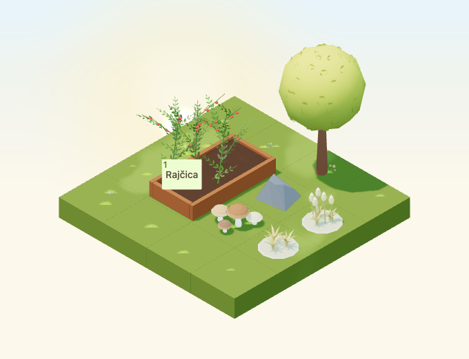

# Ornamental autumn grasses

Implementation for [#4963](https://github.com/gredice/gredice/issues/4963), release C. `AutumnGrassTuft` and `AutumnSeedHeads` are static ornamental clusters. #4981 owns future wind; #5000 owns publication.



## Art and source

Inspected first-party references: [gold asters](../apps/www/public/assets/blocks/AutumnAsterPotGold.webp), [autumn shrub](../apps/www/public/assets/blocks/AutumnShrub.webp), and [grass ground](../apps/www/public/assets/blocks/Block_Grass.webp). Three deliberately grouped clumps sit on a small gravel island, distinguishing them from scattered grass, weeds and crop health. Folded solid blades and five broad tapered seed plumes need no alpha textures or tiny labels. The gold palette is retained year round.

Each editable Blender source has a fixed `Base` mesh, `Foliage` mesh, three `WindRoot` empties and source-only `WindWeight` vertex groups. Materials share named `Material.AutumnGrasses.Gravel` and `.Blades` roles, matte roughness 0.94 and baked corner colours. No cached source material or geometry is mutated.

| Asset | Bounds (width × depth × height) | Hitbox | Triangles | GLB bytes | Price |
| --- | --- | --- | --- | --- | --- |
| AutumnGrassTuft | 0.68 × 0.68 × 0.2922 | 0.9 × 0.9 × 0.35 | 1,020 | 79,260 | 30 sunflowers |
| AutumnSeedHeads | 0.68 × 0.68 × 0.645 | 0.9 × 0.9 × 0.7 | 1,440 | 111,016 | 40 sunflowers |

Each asset uses two meshes/materials/primitives and two base-pass draws; 96 triangles form the gravel. No textures, animations, emitters, sounds, lights or dedicated render leases. These are structural costs, not device performance measurements. Both are one-tile, nonstackable decorations with compatible ground/path/display supports and no water placement.

## Motion and catalogue boundaries

Shared metadata drives the picker, sandbox and offline draft importer. Croatian labels are **Ukrasne jesenske trave – niski zlatni busen** and **Ukrasne jesenske trave – klasovi**. Copy explicitly says they are not weeds, crops or a crop-status indicator and do not produce seeds. No crop geometry or seasonal growth state is changed. Missing catalogue rows remain hidden.

Shared Y-up wind roots are `[-0.10,0.033,0.09]`, `[0.12,0.033,0.025]`, and `[-0.01,0.033,-0.13]`. Exported empties match them. The `AutumnGrass:wind-foliage:<id>` runtime group reserves the moving role, while gravel and the `[0,0.031,0]` selection anchor remain fixed. Source vertex weights are editing aids, not exported shader attributes; a future shader can derive weights from local Y above 0.033. The tested maximum displacement reserve is 0.04 tiles inside the one-tile envelope. #4981 must respect shared clock/wind, reduced motion, quality, visibility and immutable cached materials. Current runtime is static at all quality levels.

## Review and reproduction

The 4×4 fixture places both clusters, existing mushrooms, stone and tree inside a 2×3 corner, preserving a connected approach to a real crop bed. Four day/night rotations, cloudy/dusk/rain/snow, small low-quality view and four raised rotations cover silhouette, actual geometry ray selection, support height and crop-button access. All 13 scene captures were visually reviewed; transparent cover/top-down previews include four rotations and an unnumbered copy per asset.

Scene date is September 23, 2026, Europe/Zagreb, noon/22:30 or shared dusk 0.8, fixed animation time 12 seconds; camera `[-100,100,-100]`, zoom 90, 680×520/DPR 1. Small view is 390×440/zoom 57. Night comparisons allow 20 star pixels; precipitation receives visual review. Catalogue previews use October 22 noon.

```bash
/Applications/Blender.app/Contents/MacOS/Blender --background --python-exit-code 1 --python assets/scripts/generate-autumn-grasses.py
pnpm generate:game-assets
pnpm --dir apps/garden exec playwright test --config playwright.autumn-grasses.config.ts
pnpm --filter @gredice/game test
pnpm --filter @gredice/storage exec tsx scripts/upsertAutumnGrassesDraft.ts
```

Set each model version to its first twelve SHA-256 characters, restore unrelated full-export rewrites before final generated types, render both names from shared metadata with `BLOCK_SNAPSHOT_FREEZE_TIME=2026-10-22T12:00:00+02:00`, copy top-down `_1.webp` to the unnumbered preview and run `packages/game/scripts/build-autumn-grasses-release.ts` using the game package's `tsx`.

The [release manifest](autumn-grasses-2026/release-manifest.json) records exact hashes, URLs, costs and unpublished metadata. The importer defaults offline; explicit writes only prepare drafts. #5000 requires matching-SHA Garden/WWW deployments, byte/price readback, draft creation/readback, publication, catalogue IDs and real purchase/place/rotate/reload acceptance. No live writes occurred.

## Validation

Source audit, full generation, 16 preview renders, transparency and release hashes pass. All 1,945 game unit tests and 22 browser cases pass, including missing-catalogue visibility, prices, sandbox identities and drag payload. Game/JS/app-file lint, game/Garden/WWW typechecks, scoped importer typecheck and Garden production build pass. WWW compiles/types but page-data collection fails without `POSTGRES_URL`; full WWW build remains unverified. Offline draft plan passes; deployment and authenticated purchase acceptance remain with #5000.
