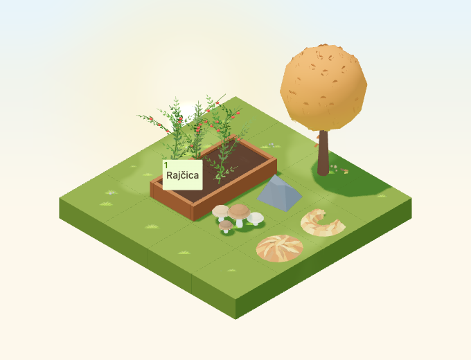

# Owned autumn leaf piles

Implementation for [#4956](https://github.com/gredice/gredice/issues/4956), release
**A / core six**. Two purchased decoration identities stay where placed throughout
the year: `AutumnLeafPileMound` and `AutumnLeafPileCrescent`. They are independent
of date-derived ground foliage. Publication remains gated by #5000.



## Design and editable sources

The low mound uses a broad rounded mass with fifteen folded leaves. The swept
crescent uses a tapered open arc with fifteen leaves arranged along its crest.
Broad lobes and folded centre ridges carry the shape at normal zoom. Copper,
gold and russet colours are baked into one material per model; no texture or
transparency is needed. Both fit one tile and remain below nearby mushrooms.

First-party references inspected before modeling:

- [MulchWood](../apps/www/public/assets/blocks/MulchWood.webp): grounded thin mass
  and subdued woodland colour. The new mound has a raised silhouette and visible
  leaves instead of reading as a flat surface covering.
- [MulchHey](../apps/www/public/assets/blocks/MulchHey.webp): low garden scale,
  with the pile's copper tones and large folded leaves separating it from straw.
- [HarvestCrate](../apps/www/public/assets/blocks/HarvestCrate.webp): broad warm
  shapes, simple facets and readable pale/dark value differences.

Each asset has its own `.blend`, one joined mesh, a `PileBase` vertex group and
fifteen independently selectable `Leaf_*` groups. The generator audits the saved
sources. Corner `Color` attributes export as `COLOR_0`; runtime instances share
immutable cached geometry/materials. Roughness is 0.94, metallic and emission 0.

| Model | Bounds in tiles (width × depth × height) | Triangles | GLB bytes |
| --- | --- | ---: | ---: |
| Mound | 0.800 × 0.740 × 0.138 | 198 | 20,536 |
| Crescent | 0.6464 × 0.7474 × 0.1224 | 248 | 24,864 |

Each has one mesh, primitive and material, so one base-pass draw per instance.
Shared rain, snow and shadow passes add their usual costs. No embedded lights,
textures, animations, sounds or dedicated idle render leases are added. These
counts describe structure, not physical-device frame rates.

## Ownership, catalogue and weather

Croatian labels are **Ukrasno jesensko lišće – niska hrpa** (proposed **25
sunflowers**) and **Ukrasno jesensko lišće – pometeni polumjesec** (**30**).
Both use a **0.9 × 0.9 × 0.18** hitbox, 1×1 footprint and nonstackable decoration
contract. Compatible ground, walkways and display surfaces can support them;
water cannot. Placement does not request or complete farm work, alter crops,
add rewards or change any real operation.

The runtime has no seasonal visibility/removal branch. Snow adds a thin shared
overlay and rain adds shared wet shading; neither changes owned block records.
Global or per-entity weather disablement suppresses those overlays. Both models
remain geometry ray targets. Existing ambient foliage retains its own date,
weather and density rules and cannot intercept selection rays. No owned pile is
registered as an ambient source or additional leaf resting surface.

The picker hides missing catalogue rows; sandbox, importer and release data share
`@gredice/js/autumnLeafPiles`. The real local serializer/reloader preserves both
names, IDs, positions and rotations over repeated save/load cycles. Browser
scenarios independently verify retained geometry in March, July, October,
November and January with snow. Authenticated customer purchase/reload remains
part of the publication acceptance under #5000.

## Stable activity anchors

The model-local Y-up anchors exported from `autumnLeafPileInteractionAnchors`
are **[0, 0.10, 0]** for the mound and **[0.24, 0.10, 0]** for the crescent.
Each runtime instance contains `AutumnLeafPile:rake-anchor:<block-id>` under
its placed/rotated group. The crescent anchor lies in the solid arc, not its
empty centre; all quarter-turns retain a real geometry ray hit from the default
camera. The initial higher anchor missed the steep outer slope at two angles;
the final surface-level anchor is covered by geometry and browser checks.

These are origins for the later cosmetic interaction #4995. They do not create
an action, keyboard control, animation, sound, reward or work request. A future
activity may add its own visual offset and must preserve normal item dragging.

## Visual and interaction review

The 4×4 fixture places both owned piles with mushrooms, stone and a tree inside
a 2×3 corner. A real planted bed keeps a connected one-tile approach. It checks
all four day/night rotations, overcast, dusk, rain, snow, small low-quality
canvas, raised supports and four additional seasonal dates. Readiness requires
actual ambient leaf geometry for October cases without snow, plus loaded crop
meshes and the owned shapes. Tests click each activity anchor's projected
geometry and the production crop button at a representative anchor.

The default calendar is October 22, 2026, Europe/Zagreb, noon or 22:30; shared
dusk value is 0.8. Animation time is 12 seconds; camera direction
`[-100,100,-100]`, zoom 90, 680×520, DPR 1. The small view is 390×440 at zoom 57.
Seasonal captures use March 21, July 15, November 20 and January 15. Moving
rain/snow captures are reviewed images rather than pixel baselines. Night
comparisons allow 20 pixels for existing stars. This is component acceptance,
not the full authenticated close-up HUD.

## Reproduction and publication

```bash
/Applications/Blender.app/Contents/MacOS/Blender --background --python-exit-code 1 --python assets/scripts/generate-autumn-leaf-piles.py
pnpm generate:game-assets
/Applications/Blender.app/Contents/MacOS/Blender --background --python-exit-code 1 --python assets/scripts/generate-autumn-leaf-piles.py -- --check
pnpm --dir apps/garden exec playwright test --config playwright.autumn-leaf-piles.config.ts
pnpm --filter @gredice/game test
pnpm --filter @gredice/storage exec tsx scripts/upsertAutumnLeafPilesDraft.ts
```

Set each manifest version to the first twelve GLB SHA-256 characters. Restore
unrelated exporter rewrites before regenerating final model types. Write the two
shared specifications into ignored `apps/www/generate/test-cases.json`, generate
covers/top-downs with the existing Playwright generators filtered to
`AutumnLeafPile` and `BLOCK_SNAPSHOT_FREEZE_TIME=2026-10-22T12:00:00+02:00`, then
copy each top-down `_1.webp` to its unnumbered preview and run
`pnpm --filter @gredice/game exec tsx scripts/build-autumn-leaf-piles-release.ts`.

The [release manifest](autumn-leaf-piles-2026/release-manifest.json) records two
sources, versioned model URLs, exact costs, unpublished metadata and twenty
image hashes. The importer defaults to an offline plan and only offers explicit
draft modes. Under #5000, deploy both consumers at the reviewed SHA, verify the
bytes and prices, create/read back drafts, publish through normal CMS workflows
and verify real purchase, placement, rotation and reload. No live data writes
or publication have occurred here.

## Validation

- Saved-source audits and standard asset generation pass; unrelated exporter rewrites were restored.
- All 1,913 game unit tests pass, including saved-garden round trips, exact release hashes, rotated hitboxes/support rules and geometry rays through both activity anchors at every rotation.
- All 23 focused browser cases pass after correcting the crescent anchor: eight day/night rotations, four weather/light conditions, small canvas, four additional seasons, raised supports and five picker checks. All seventeen review images were inspected.
- Eight cover and eight top-down render cases pass. All twenty image files have transparency; covers are 640×640.
- Relevant lint and Game/Garden/WWW typechecks pass, including the targeted importer typecheck. Game lint retains its existing unused suppression warning in `RaisedBedFieldRelationshipIndicator`.
- Garden production build passes. WWW compiles/typechecks but page-data collection is blocked by the missing local `POSTGRES_URL`.
- Offline importer returns two draft rows. No database writes or publication occurred.
