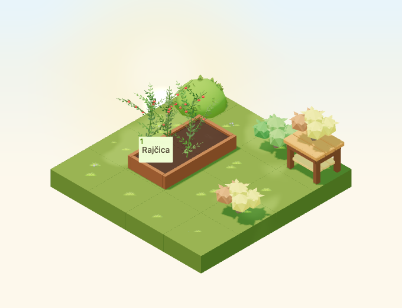
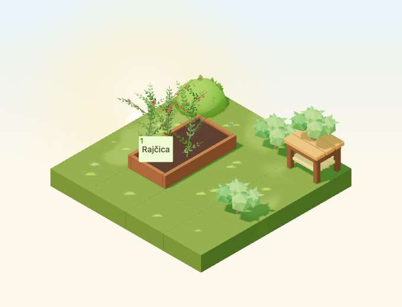
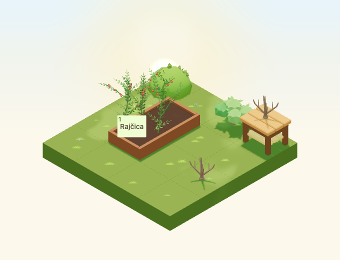
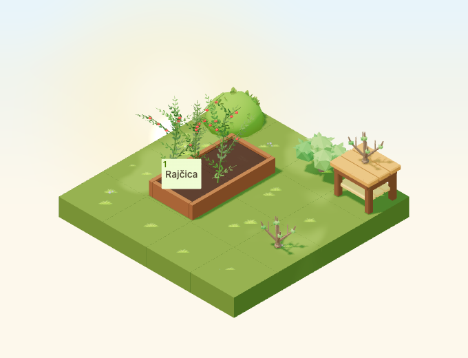

# Deciduous autumn shrub

Implementation for [#4953](https://github.com/gredice/gredice/issues/4953),
following the [autumn art direction](autumn-art-direction-2026.md).
`AutumnShrub` is a new one-tile decoration in release B (complete garden).
Deployment, catalogue drafts and publication remain with #5000.



## Design and catalogue

Five low, spreading lobes, broad angular leaves and a fan of exposed branches
form a distinct silhouette. The editable source contains named full, thinning
and bud-stage foliage pairs; winter renders only the wood mesh. In Blender,
show Wood plus exactly one foliage stage when reviewing the source.

First-party references inspected:

- [Bush](../apps/www/public/assets/blocks/Bush.webp): retain the game's faceted
  vegetation language, but use a spreading multi-lobed crown instead of its dome.
- [Tree](../apps/www/public/assets/blocks/Tree.webp): match opaque angular foliage
  and simple woody forms at garden scale; keep the shrub low and compact.
- [Autumn dusk](autumn-art-direction-2026/mid-dusk.png): gold/russet foliage must
  remain distinct from the green ground and the existing yellow tree canopy.

The Croatian label is **Listopadni ukrasni grm**, with a proposed price of
**55 sunflowers**. Copy explains the seasonal changes and explicitly says it is
ornamental and yields no harvest. It occupies one tile, with a 0.9 × 0.9 × 0.72
hitbox and base-centred origin. Actual full-model dimensions are approximately
0.862 × 0.758 × 0.700 tiles. Compatible ground, walkways and display tables can
support it; it cannot sit on water or support another block.

The **Dekoracija** picker hides the item while its catalogue row is absent.
Local sandbox data and the offline draft importer share the same specification
from `@gredice/js/autumnShrub`. Existing `Bush` assets, materials, identity and
behaviour remain unchanged.

## Seasonal policy

The entity reads `useAutumnState` and `useSeasonState`, including the common
`freezeTime` clock. It does not create its own date or change seasonal curves.

| State | Appearance |
| --- | --- |
| Summer | Full green foliage, following the shared yellowing curve from August 22 |
| Early/mid autumn | Full gold/russet crown; colour progresses with the shared curve |
| Late autumn | ID-seeded thinning and sparse stages; brown at the end |
| Winter | Bare branches once retention reaches 0.1 |
| Spring | Bare initially, then green buds, thinning foliage and full green regrowth |
| Per-entity or global weather disabled | Full green crown, without shrub rain/snow overlays |

Each foliage mesh owns its runtime material. Seasonal updates never recolour
cached GLTF materials or add vertex colours to cached geometry. The wood remains
brown. The shrub joins trees in the canopy shadow-cache key, using its own bare
endpoint. It does **not** register as a source for airborne/settled leaves,
ground gusts or leaf-rustle ambience; those systems retain tree-only eligibility.

| Summer | Winter | Spring buds |
| --- | --- | --- |
|  |  |  |

## Materials, cost and review

Source colours are wood `#79563C`, gold `#D6B83F` and russet `#B06A3D`.
Summer/spring foliage uses `#6D913F` and `#4E7F35`. Roughness is 0.86 for wood
and 0.95 for foliage; all materials are nonmetallic and nonemissive. Shared
weather overlays provide rain and light snow when enabled.

The lazy GLB is **96,420 bytes**, with seven stored meshes, three material roles
and **1,000 stored triangles**. Only the wood plus one foliage pair is mounted:

| Stage | Rendered triangles | Base-pass draws |
| --- | ---: | ---: |
| Full | 640 | 3 |
| Thinning | 560 | 3 |
| Sparse/buds | 480 | 3 |
| Bare | 340 | 1 |

Shadow/weather passes add their usual cost. There are no textures, animations,
lights, particles or dedicated idle render leases. These are structural counts,
not physical-device frame-rate measurements. The [release manifest](autumn-shrub-2026/release-manifest.json)
records exact source/model/image hashes, the versioned URL and unpublished
catalogue specification.

The 4×4 review garden places the shrub on ground and a display table, alongside
an independently weather-disabled shrub, an existing green bush and a planted
raised bed. Three decorative cells leave a connected approach to the bed. Tests
inspect actual geometry bounds, owned material identities, ray selection of each
shrub and a clickable production crop button at a representative anchor.
This is component/composition acceptance, not a live purchase or the complete
authenticated close-up HUD.

Captures use the shared 2026 seasonal milestones in Europe/Zagreb, noon or 22:30.
Spring samples are 10, 28 and 64 days after spring starts. Camera direction is
`[-100,100,-100]`, zoom 90, 680×520, DPR 1. The low-quality small view is 390×440,
zoom 57. Calendar time is frozen and animation time is fixed at 12 seconds.
Readiness checks loaded meshes and the resolved shared date; rain/snow cases also
wait for their actual overlays. Animated precipitation captures are review images,
not pixel-comparison baselines. A live mounted-scene test changes the shared date
through autumn, winter, spring, disablement and summer while verifying cached
materials and the existing bush remain unchanged.

## Reproduction and release gate

```bash
/Applications/Blender.app/Contents/MacOS/Blender --background --python-exit-code 1 --python assets/scripts/generate-autumn-shrub.py
pnpm generate:game-assets
/Applications/Blender.app/Contents/MacOS/Blender --background --python-exit-code 1 --python assets/scripts/generate-autumn-shrub.py -- --check

pnpm --dir apps/garden exec playwright test --config playwright.autumn-shrub.config.ts
pnpm --filter @gredice/game test

# Offline plan; no credentials or database writes.
pnpm --filter @gredice/storage exec tsx scripts/upsertAutumnShrubDraft.ts
```

After export, set the manifest version to the first 12 characters of the GLB
SHA-256 and regenerate model types. Restore unrelated GLBs rewritten by another
Blender exporter version. Put the shared specification in ignored
`apps/www/generate/test-cases.json`, with `name` inside `information` and
`prices.sunflowers` from `sunflowers`, then render both preview families:

```bash
BLOCK_SNAPSHOT_FREEZE_TIME='2026-10-22T12:00:00+02:00' pnpm --dir apps/www exec playwright test --config playwright-generate.config.ts generate/blocks-snapshots.specgen.tsx -g AutumnShrub --workers=1 --timeout=60000
BLOCK_SNAPSHOT_FREEZE_TIME='2026-10-22T12:00:00+02:00' pnpm --dir apps/www exec playwright test --config playwright-generate.config.ts generate/blocks-top-down-snapshots.specgen.tsx -g AutumnShrub --workers=1 --timeout=60000
# Copy top-down _1.webp to the unnumbered preview before building the manifest.
pnpm --filter @gredice/game exec tsx scripts/build-autumn-shrub-release.ts
```

Both generators now accept the same optional frozen date; their existing default
is unchanged. The five cover and five true top-down images show the autumn crown.
The importer supports explicit `--dry-run` and `--apply-drafts` modes against a
configured environment, rejects duplicate names and non-draft rows, preserves
revision/cache/search behaviour and checks readback. It has no publication mode.
No database mode was run here.

For #5000, deploy Garden and WWW on the reviewed SHA, verify the recorded bytes,
review the price, create/read back the draft, and publish through the normal CMS
workflow. Record the catalogue ID, refresh caches and verify customer purchase,
placement, rotations and reload persistence. Seasonal visuals must also be
checked against the deployed shared clock.

## Validation recorded

- Saved Blender audit and the standard asset pipeline pass. Generated model
  types contain the seven new nodes and three materials; unrelated exported
  GLBs were restored.
- Four cover and four top-down render cases pass. All ten image files have
  transparent backgrounds; all five cover files are 640×640.
- All 1,897 game unit tests pass, including seasonal policy, shared shadow
  invalidation, release hashes, compatible supports and all rotated hitboxes.
- All 24 focused browser cases pass across the isolated day-0 rerun and the
  remaining 23-case run: eight day/night rotations, ten seasonal/weather cases,
  a small canvas, live mounted-scene date/disable changes and four picker checks.
  The first day-0 attempt timed out waiting for scene readiness while other
  checks were running; it passed in isolation without a runtime change.
  All 19 review images were inspected.
- Game/JS lint, changed app/storage-file lint, Game/Garden/WWW typechecks and
  the targeted draft-importer typecheck pass. Game lint retains the existing
  unused suppression warning in `RaisedBedFieldRelationshipIndicator`.
- Garden production build passes. WWW compiles and typechecks, then collecting
  page data for `/blokovi/[alias]` fails because local `POSTGRES_URL` is absent.
- The offline importer returns one draft row. Database writes, publication and
  live customer purchase/reload acceptance remain with #5000.
