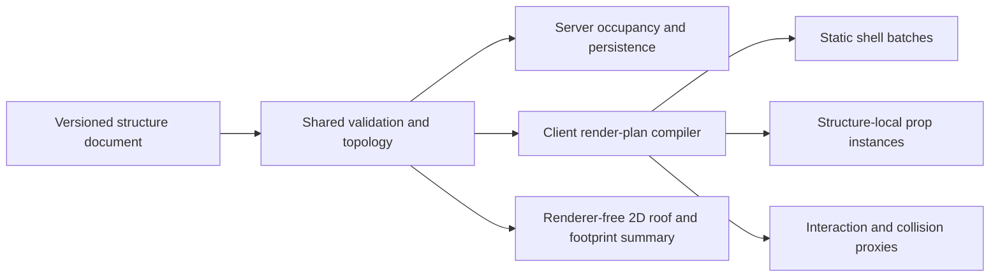

# Garden Building System Plan

Date: 2026-08-30

Status: In progress behind independent default-off presentation, server
mutation, and normal-garden commercial gates

## Outcome

Add a mobile-first building system to the Garden experience. A customer should
be able to place and customize single-floor barns, houses, greenhouses, sheds,
and similar garden buildings from reusable structural pieces. Buildings may
contain floors, exterior and interior walls, doors, windows, roofs, furniture,
and small decorative or utility items.

The feature should feel like a focused part of the existing garden rather than
a separate game. It must keep the current Garden canvas mounted, use the
existing camera and interaction foundations, remain usable in portrait mobile
view, and avoid creating one React/Three object for every building part.

## Product principles

- A building is one logical garden object with one identity, placement,
  revision, and lifecycle. Its walls and furniture are not independent garden
  blocks.
- The saved document is semantic and compact. Meshes, collision data, roof
  geometry, and render batches are derived outputs and are never persisted.
- Templates accelerate creation but do not create separate rendering systems.
  Barn, house, and greenhouse templates all produce the same versioned
  structure document.
- The first version is single-floor by contract. It does not store dormant
  multi-floor data or expose stairs and upper levels.
- Editing happens in a dedicated Structure Build Mode with an explicit state
  machine. Normal block dragging, raised-bed close-up, avatar movement, and
  structure editing must not compete for the same gesture.
- Structure Build Mode is orthogonal to the current normal/close-up camera view
  and must not reuse `hudPlacementDrag`. Camera navigation remains active while
  a tool is armed and pauses only during an active single-pointer transform.
- Mobile is the primary interaction and performance target. Desktop adds
  shortcuts and a wider layout, but does not own a different workflow.
- The normal garden view renders compiled structures. Only the actively edited
  structure exposes part-level selection.
- Version 1 prices the building footprint at 50 Sunflowers per footprint cell.
  Walls, openings, roofs, materials, furniture, and miscellaneous parts do not
  add per-item charges.
- A placeable greenhouse is structural and visual in the initial release. A
  later, separate projection will display the garden's current
  greenhouse-located plants inside an eligible greenhouse structure, analogous
  to the Outlet experience consuming its own authoritative data source. The
  existing planting lifecycle remains authoritative; plant identity/status is
  never copied into the structure document, and structure size or layout does
  not determine sowing, operations, inventory, or automation eligibility.

## Current foundation and constraints

The implementation should extend the existing architecture instead of adding a
second scene or placement stack.

| Existing capability | How the building system should use it |
| --- | --- |
| One R3F scene in `packages/game/src/GameScene.tsx` | Mount a structure renderer inside the existing entity group; never create or remount a second canvas for build mode. |
| `GameCameraRig` | Add an explicit structure-focus/build command that saves the normal camera, frames the footprint, supports top-down editing, and restores the previous view on exit. |
| `BlockInteractionLayer` and registry | Reuse the shared ray/pointer routing model. Add one structure editing interaction surface for the active structure instead of a hit mesh per part. |
| `gameQuality.ts` | Make shell detail, interior visibility, greenhouse transparency, shadows, and prop density quality-aware. |
| Camera-change subscriptions and demand rendering | Recalculate cutaways, culling, and selectable handles on camera/document changes, not in a permanent per-part frame loop. |
| Shared block footprint validation in `@gredice/js/gardenBlocks` | Generalize the occupancy input so blocks and first-class structures share support-height and overlap rules. Do not duplicate placement math in the client and API. |
| `gardenAvatarMovement` collision world | Merge compiled structure floors, portals, walls, ceilings, and prop proxies with existing stack surfaces; keep collision semantic and bucketed rather than mesh-derived. |
| Garden detail/public serialization | Include compact structure documents only in garden detail responses; do not add them to garden list payloads. |
| Renderer-free 2D overview | Render a roof/footprint summary and structure details. Full structure editing remains a 3D-route capability in the first release. |
| Game asset generation pipeline | Add modular source assets and generated GLBs/types through `pnpm generate:game-assets`; do not hand-edit generated output. |
| Production game profiler | Add building-specific desktop/mobile scenarios and metadata before rollout decisions. |

The repository already contains an unregistered monolithic `Greenhouse.glb`
that is also referenced by operation-cover generation, but it is not a modular
placeable entity. It may guide the visual language, but the building system
needs purpose-built, consistently anchored modular kit assets.

## Scope

### Target capability

- Start from Barn, House, Greenhouse, or Blank Structure templates.
- Place the structure on a flat, valid garden footprint and rotate it in
  90-degree increments.
- Edit one orthogonally connected single-floor footprint. Version 1 includes
  rectangular seeds plus add/remove-cell tools, so L-, T-, and U-shaped
  buildings and connected covered-outdoor extensions are supported.
- Add, replace, recolor, or remove floor regions.
- Add exterior and interior wall segments.
- Replace compatible wall segments with doors or windows.
- Add one or more roof regions using supported styles such as flat, shed, or
  gable.
- Mark cells as interior or covered outdoor. Covered-outdoor cells may have a
  roof without perimeter walls or a building floor, supporting porches,
  verandas, and similar front spaces.
- Place supported furniture and miscellaneous props on eligible
  structure-local interior or covered-outdoor cells.
- Select, move, rotate, replace, duplicate, and delete supported parts.
- Undo and redo editor commands.
- Autosave safely and recover an unsaved local draft after an interrupted
  mobile session.
- Reopen, move, rotate, edit, or demolish an existing building.
- Render the finished building in owned and public garden views.
- Let the avatar enter and navigate buildings through open edges or doorway
  portals using coarse semantic collision compiled from the structure.

### First-release boundaries

- One floor only.
- Concurrent tabs or devices may open the editor, but revisions are never
  merged or overwritten silently; stale saves receive a typed conflict.
- No arbitrary uploaded models, textures, URLs, scripts, or free-form material
  parameters.
- No blueprint marketplace, copying another customer's building, or public
  collaborative editing.
- No electrical, plumbing, structural engineering, farming-yield, storage
  capacity, or weather-protection simulation.
- No greenhouse-plant projection in the shell MVP. The later projection is an
  independently delivered integration and does not change planting ownership.
- No migration of the current monolithic DogHouse, HorseStable, animal shelter,
  or similar placeable blocks. They remain valid legacy entities while new
  templates use the structure aggregate.
- No avatar opening/closing doors or using furniture in the initial shell MVP.
  Avatar entry and interior traversal are required, so starter buildings use a
  visibly open doorway or open edge; interactive door state may follow later.
- No full editor in the renderer-free 2D overview for the first release.

## Structure Build Mode

### Entry and exit

1. Add a clearly labelled Gradnja entry next to the existing item-placement
   affordance. Do not add every building part to the current horizontal
   `ItemsHud` strip.
   In the renderer-free 2D route, the same entry opens the read-only structure
   summary and an explicit Switch to 3D action that preserves the selected
   garden/structure and returns to 2D after editing.
2. Selecting Gradnja opens a mobile-first template sheet with Barn, House,
   Greenhouse, Blank Structure, and Existing Buildings.
3. A new template appears as a lightweight footprint preview on the normal
   garden grid. The user moves and rotates the footprint, then confirms its
   location. It remains a local, versioned recovery draft through editing; no
   server row or economy effect exists until Done commits the draft and the
   server acknowledges the structure and its footprint debit. An existing
   building keeps its server identity and uses revision-checked autosave for
   free edits; footprint-size changes use a separate confirmed resize command.
4. The existing canvas stays mounted. `GameCameraRig` frames the structure and
   transitions into a stable top-down or high-isometric editing view.
5. The normal bottom HUD is replaced by `StructureBuildHud`; unrelated garden
   interactions and avatar controls are suspended while the mode is active.
6. Done flushes pending work and waits for server acknowledgement before it
   restores the previous camera/HUD. On failure, remain in the editor or offer
   an explicitly labelled local-recovery exit without claiming the structure
   is saved. Cancel discards only a new local, not-yet-created draft. Demolish
   is a separate destructive action whose confirmation shows the full remaining
   footprint refund before committing it.

### Editor state machine

Use a discriminated state machine rather than a set of loosely related
booleans:

```text
browse
  -> placing-template
  -> editing.select
  -> editing.footprint
  -> editing.shell
  -> editing.openings
  -> editing.roof
  -> editing.interior
  -> saving | conflict | asset-error
  -> browse
```

Only one editing tool owns single-pointer drawing at a time. Moving between
states must clear stale previews, pointer capture, and selected-part actions.
Mobile browser/system Back closes the current sheet or tool level first, then
uses the same save-aware exit flow; it must not navigate away from an
unacknowledged draft.

### Mobile layout

- Keep Done, undo, and redo in a safe-area-aware top bar.
- Keep the current footprint count, `used / 100` limit, dimensions, and total
  or pending Sunflower delta visible whenever Footprint is active.
- Enforce a shared hard safety ceiling of 625 active structures per garden in
  both the locked create transaction and the renderer. This is a defensive
  collection limit, independent of the 100-cell per-structure footprint limit.
- Use a bottom sheet for the active category and its part palette. The canvas
  must remain visible above the sheet in portrait orientation.
- Use four primary categories: Footprint, Structure, Roof, and Interior.
  Doors/windows are a Structure subcategory so the top level stays compact.
- Show selected-part actions in a contextual bar: rotate, replace, duplicate,
  and delete. Do not depend on a context menu or long press.
- Keep all primary touch targets at least 44 by 44 CSS pixels.
- Avoid permanent instructional copy over the canvas. Use a short first-use
  coach mark and state-specific labels in the sheet.
- Respect display cutouts and the existing game safe-area CSS variables.

### Gestures

- Default Select tool: tap to select, drag the selected handle to move, and
  drag empty canvas to pan.
- Active paint tool: tap or drag across valid cells/edges to apply the selected
  part. Two-finger pan/zoom remains available; an explicit Hand tool provides a
  one-finger navigation escape hatch.
- In Footprint, create a rectangular seed and then tap or paint cells to add or
  remove them. Preview the resulting width, depth, cell count, and
  charge/refund before applying; reject a removal that would disconnect the
  footprint.
- For wall chains on mobile, make tap-start/tap-end with a visible path preview
  and confirmation the precise primary flow. Freehand painting may be an
  accelerator, but not the only way to draw behind the user's finger.
- Pinch zoom and two-finger pan continue through `GameCameraRig`.
- Rotate the whole structure with an explicit button. Do not require a twist
  gesture.
- Invalid previews use shape/icon/text as well as color.
- Optional haptics may confirm placement or rejection, but must not be the only
  feedback. Use the existing game haptic abstraction and respect the stored
  opt-out; do not call device vibration directly.
- Keep a tap as selection until the established movement threshold is crossed.
  Pointer cancel, lost capture, tool change, and mode exit must clear the whole
  gesture. One paint stroke produces one preview and one batched undoable
  command, not one mutation, autosave, announcement, or haptic per cell.

### Desktop and accessibility

- At wider breakpoints, move the part palette to a side panel while preserving
  the same categories and state machine.
- Support Tab navigation through all DOM controls, Escape to back out one
  level, arrow-key nudging, Delete/Backspace for the selected removable part,
  and documented undo/redo shortcuts.
- Expose an accessible inspector/list for the selected cell, edge, roof region,
  or prop. Canvas-only hit targets are not sufficient keyboard access.
- Announce tool changes, invalid placement reasons, save state, and conflicts
  through a polite live region. Deduplicate messages and emit them only for a
  discrete change or settled invalid target, never for every pointer move.
- Preserve focus when sheets open/close and return focus to the Gradnja trigger
  when build mode exits.
- Respect reduced motion during camera transitions, sheet animation, and part
  previews.

### Required UI states

- Template list loading, empty, and failed.
- Kit asset loading and failed, with a footprint/silhouette fallback.
- Valid and invalid footprint placement.
- New unsaved draft, saving, saved, offline/retrying, and conflict.
- Footprint resize pending confirmation, insufficient Sunflowers, debit failed,
  refund failed, and commercial command completed.
- Empty building, incomplete interior-shell warning, valid intentional
  covered-outdoor/open shell, and complete building.
- Selected, unavailable, locked, and unsupported part.
- Demolition pending, failed, and completed.

## Canonical domain model

Create a first-class `GardenStructure` aggregate rather than encoding a whole
building in `garden_blocks.variant`, `message`, or hundreds of ordinary block
rows.

### Placement record

The structure record owns server-authoritative garden placement:

| Field | Purpose |
| --- | --- |
| `id` | Stable UUID/text identity. |
| `gardenId` | Ownership and query boundary. |
| `anchorX`, `anchorY` | Anchor on the existing integer garden grid. |
| `rotation` | Whole-structure quarter turn, normalized to 0-3. |
| `revision` | Monotonic optimistic concurrency token. |
| `templateKey` | Origin template for analytics and reset actions; not renderer dispatch. |
| `kitKey` | Deterministic kit identity used for compatibility and renderer selection. |
| `kitVersion` | Immutable/content-addressed part definition and generated-asset version. |
| `pricingVersion` | Server-owned commercial rule version used for debit/refund compatibility. |
| `sunflowerPricePerCell` | Paid unit-price snapshot; fixed at 50 for version 1. |
| `refundableSunflowerPrincipal` | Remaining paid footprint value available to refund; never client-authored. |
| `document` | Validated compact JSON document. |
| `createdAt`, `updatedAt`, `isDeleted` | Existing repository lifecycle conventions. |

Do not duplicate the anchor inside the document. Moving or rotating a building
changes placement and revision atomically; internal edits change the document
and revision. `document.schemaVersion` is the single decoder/migration version;
do not duplicate it in another column unless a generated/indexed projection is
proven necessary.

Domain/storage `anchorY` and document-local `y` name the second horizontal
garden-grid axis. The compiler maps local/world grid `(x, y)` to Three.js
`(x, 0, z = y)`; Three.js `y` remains the vertical height axis. Keep this
conversion at the renderer boundary so domain geometry is renderer-free.

Version 1 canonicalization normalizes every document so the local footprint
has `minX = 0` and `minY = 0`. Integer local and world coordinates identify
cell centers; cell boundaries are at `coordinate +/- 0.5`. The placement anchor
is the world-grid center of the normalized minimum cell. Whole-structure
rotation rotates the semantic document by a quarter turn and then normalizes
the rotated bounding box back to non-negative local coordinates before adding
the anchor. This yields one deterministic document/placement representation
for equivalent layouts and matches the existing center-based Garden grid.

### Version 1 document

The exact TypeScript and validation schema belongs in a shared, renderer-free
module under `packages/js`, for example `packages/js/src/gardenStructures`.

```ts
type GardenStructureDocumentV1 = {
    schemaVersion: 1;
    footprint: {
        cells: Array<{
            x: number;
            y: number;
            spaceKind: 'interior' | 'covered-outdoor';
        }>;
    };
    floors: Array<{
        cell: { x: number; y: number };
        materialId: string;
    }>;
    edges: Array<{
        id: string;
        from: { x: number; y: number };
        direction: 'north' | 'east';
        partId: string;
        kind: 'wall' | 'door' | 'window';
    }>;
    roofRegions: Array<{
        id: string;
        cells: Array<{ x: number; y: number }>;
        styleId: string;
        materialId: string;
        rotation: 0 | 1 | 2 | 3;
    }>;
    props: Array<{
        id: string;
        partId: string;
        x: number;
        y: number;
        rotation: 0 | 1 | 2 | 3;
        variantId?: string;
    }>;
};
```

This is a conceptual contract, not a requirement to preserve the example field
names verbatim. The implementation may encode repeated cells/edges more
compactly after profiling, provided the decoded contract remains deterministic
and versioned.

### Invariants

- All coordinates are finite bounded integers or approved sub-grid values.
- The footprint is non-empty, unique, orthogonally connected, and contains only
  level-zero cells. Diagonal contact alone does not connect two regions.
- The footprint contains at most 100 cells. Its local axis-aligned bounding box
  is at most 20 cells wide and 20 cells deep:
  `maxX - minX + 1 <= 20` and `maxY - minY + 1 <= 20`. Both limits apply, so
  20x5 is valid while 20x20 is not.
- Every footprint cell declares one space intent. Missing enclosure on an
  `interior` cell is a non-blocking completeness warning. A
  `covered-outdoor` cell is intentionally open: perimeter walls and applied
  flooring are optional, but roof coverage is required for that cell to be
  considered complete.
- All floor cells, wall edges, roof regions, and props remain within or on the
  footprint boundary allowed for their type.
- Edge IDs and prop IDs are unique within a structure.
- Part, material, variant, roof-style, and template IDs come from server-side
  allowlists/catalogue data. The server never trusts a client-supplied asset
  URL.
- Doors and windows replace compatible wall segments; they do not overlap a
  second edge part.
- Every door part is classified by immutable kit metadata as a passable-open
  portal or a solid-closed leaf, and its rendered state must agree with that
  collision state. Until interactive doors ship, the state is fixed by the
  selected part. Every starter enclosed interior has a reachable exterior path
  through at least one passable portal or open edge.
- Props cannot overlap another solid prop, wall, or closed door collision.
- Roof regions may overlap only where the selected roof definitions explicitly
  support a join. A footprint shape never becomes invalid merely because one
  automatic roof join is unsupported; the editor asks for separate compatible
  roof regions and reports the exact join problem.
- The structure footprint must have level support across every occupied garden
  cell and may not overlap raised beds, structures, non-stackable blocks, water,
  or other unsupported surfaces.
- Drafts may omit walls, doors, or roofs. Invalid geometry and out-of-bounds
  parts are hard errors; incomplete interior shells are warnings. Intentional
  covered-outdoor spaces are not mislabeled as unfinished rooms.
- The 100-cell and 20-cell-side limits are hard version 1 rules enforced by the
  shared validator and server boundary. Edge, roof-region, prop, and payload
  guardrails are set from the vertical performance spike without relaxing
  those footprint limits.

### Pricing and footprint accounting

Version 1 costs 50 Sunflowers per normalized footprint cell:

```text
totalPrice = footprint.cells.length * 50
```

A 1x1 structure costs 50 Sunflowers, a 5x5 structure costs 1,250, and the
100-cell maximum costs 5,000. The footprint—not the presence of a floor
material—is the billable area. Covered-outdoor, roof-only porch/veranda cells
therefore count toward occupancy, limits, and price. Walls, doors, windows,
roofs, flooring/material choices, furniture, and miscellaneous parts carry no
additional version 1 charge.

For an existing structure, calculate one server-authoritative delta from the
persisted and candidate documents:

```text
cellDelta = candidateCellCount - persistedCellCount
unitPrice = persisted sunflowerPricePerCell
debit = max(cellDelta, 0) * unitPrice
refund = min(max(-cellDelta, 0) * unitPrice, persisted refundable principal)
```

- A positive delta debits only the added cells and increases refundable
  principal by the same amount.
- A negative delta refunds only the removed cells up to the persisted paid
  principal, then decreases principal by the refund.
- A zero delta has no currency effect, including an equal-area reshape.
- Moving, rotating, changing a space kind, or changing parts/materials is free.
- Demolition is a resize to zero and refunds the remaining paid footprint
  principal in full, then sets it to zero atomically.
- Sandbox create/resize/demolition has no currency effect and accrues no
  refundable principal.

The server invariant is
`0 <= refundableSunflowerPrincipal <= cellCount * sunflowerPricePerCell`.
Normal paid version 1 structures use a unit price of 50; the bound also safely
supports sandbox, comped, or pre-pricing records with zero/partial principal.

An existing building's footprint change is staged locally and committed only
through an explicit Confirm size change action showing old size, new size, and
the exact debit or refund. Ordinary document autosave rejects footprint changes.
Failed validation, stale revision, occupancy conflict, or insufficient balance
leaves both the canonical structure and Sunflower balance unchanged.

### Templates and kits

A template is only a validated seed document plus presentation metadata. A kit
defines compatible part IDs, materials, asset nodes, thumbnails, anchors,
collision bounds, fixed first-release door passage state, and quality variants.

CMS/directory entities may own reusable template, kit, part, material,
availability, and presentation metadata. The version 1 unit price belongs to a
versioned server commercial policy, not mutable CMS content. Player-authored
layouts must not be stored as CMS EAV rows. The renderer/server contract still
needs a bounded generated allowlist so a published row cannot point the client
at an arbitrary asset.

Published `kitVersion` definitions are immutable. Every version referenced by
a saved structure must retain its part IDs, node/material mappings, generated
asset keys, anchors, and compatibility rules until those structures are
explicitly migrated. Publishing mutable CMS data therefore creates a new
immutable definition artifact (or a bounded definition snapshot), never an
in-place change hidden behind a coarse catalogue cache version. Part IDs are
kit/version-scoped unless the generated registry deliberately guarantees global
uniqueness.

Initial content should prove three materially different cases:

| Template | What it validates |
| --- | --- |
| Barn | Opaque timber shell, wide door, gable roof, work table/storage props. |
| House | Mixed wall/window/door placement, interior partition, flooring, furniture, and a roofed open front porch. |
| Greenhouse | Transparent or dithered panels, narrow frame batching, shed/gable roof, tables/planters. |

Blank Structure starts with a small supported footprint and no shell. It should
not bypass catalogue or part compatibility rules.

## Occupancy, collision, and garden integration

Structures should not be inserted as hundreds of `garden_blocks`. Extend the
shared garden placement model to build one occupancy index from:

- current block stacks and their catalogue footprints;
- current structures and their rotated footprint cells; and
- the moving candidate excluded from its old footprint during a move.

The same pure functions must be consumed by automatic block placement, JSON
stack-patch validation, structure create/move/rotate validation, local sandbox,
the 2D overview, renderer interaction bounds, avatar collision, and animal
exterior occupancy/future opt-in navigation. This prevents a structure from
appearing free in one surface while blocking another.

Serialize footprint-changing commands with a garden-level advisory lock (or an
equivalent database-safe strategy), then rebuild occupancy inside the
transaction. Do not rely on the current application-level stack existence check
as a concurrency boundary.

The same garden lock and combined occupancy rebuild must cover ordinary block
placement, garden-box inventory placement, stack JSON patch/move, direct block
rotation, every structure create/move/rotate/delete, and removal of terrain or
support beneath a structure. Direct block rotation must revalidate its rotated
footprint. Deletion/support removal must reject leaving a structure unsupported;
no mutation path may bypass the combined index.

Initial placement rules:

- All footprint cells must have the same support height.
- Terrain may remain below a building; the structure occupies the non-stackable
  space above it.
- Existing ordinary props cannot remain inside a new footprint. The first
  release asks the user to move them instead of silently absorbing them into
  the structure.
- Structure-local furnishings exist only in the structure document and do not
  enter global garden stacks.
- Avatar entry and interior movement use coarse semantic proxies compiled from
  the structure document: walkable surfaces for supported interior and
  covered-outdoor cells; merged thin oriented boxes for solid wall/window runs;
  passable transitions at open edges and doorway portals; a simple leaf box for
  a closed door; bounded boxes/cylinders for solid props; and ceiling proxies
  beneath roofs.
- Coarse means cheaper than rendered geometry, not one obstacle for the entire
  footprint. Never derive collision from GLB triangles or create one collider
  per mesh node. Merge adjacent compatible proxies and index them by garden cell
  so each movement substep checks only nearby buckets.
- Compile a floor-cell navigation graph with blocked edge transitions alongside
  the continuous-movement primitives. This lets routing distinguish a wall
  between two otherwise walkable cells. Open porches remain traversable.
- Resolve containing-structure membership against exact rotated footprint cells
  and space intent after a bounds broad phase. Concave gaps inside an L-, T-, or
  U-shaped bounding box must not trigger interior reveal, grounding, or
  collision.
- A floorless covered-outdoor cell grounds the avatar on its underlying terrain
  or support surface, creates no phantom floor/step, remains traversable, and
  still applies the intended roof ceiling.
- Extend the current avatar collision world to merge revision-keyed structure
  navigation with stack surfaces in owned and public scenes. A visibly open
  doorway must meet shared avatar-radius/standing-height clearance and be
  passable in every whole-structure rotation.
- On entry, reveal only the containing structure's interior and fade/hide its
  roof and camera-facing walls. First- and third-person cameras need coarse
  shell-obstruction handling so the camera does not clip through the building.
- Do not automatically route animals indoors. Animal interior behavior remains
  opt-in per species and outside the initial building release.

## Persistence and API

### Storage

Add schema and repository ownership under `packages/storage`. A dedicated
`garden_structures` table should use a garden foreign key, revision, versioned
JSON document, placement columns, pricing version/unit-price/refundable-principal
columns, timestamps, and soft deletion. Add indexes for active structures by
garden and a uniqueness/integrity strategy that makes retries safe.

Persist command receipts in a dedicated table such as
`garden_structure_operations`, with a database uniqueness constraint on
`(gardenId, operationId)`, the command kind, a canonical request payload hash,
and the resulting canonical response/revision. The mutation and receipt commit
in the same transaction. Retrying the same ID, kind, and hash returns that saved
response; reusing an ID with a different kind or payload is rejected. A
process-local dedupe cache is not sufficient.

`garden_structures` is the authoritative current state. Structure events are
audit records only unless a later design deliberately implements full replay
with complete, versioned payloads; do not imply that sparse audit metadata can
reconstruct the document.

Run `pnpm db-generate` for schema work and follow the repository migration
coordination rules. Never use `pnpm db-push`.

Repository mutations must be transactional and return a controlled conflict
when the expected revision no longer matches. Create, resize, and demolition
commands must accept an idempotency/client-command key before a Sunflower debit
or refund is attached.

Every mutating command, including autosave replacement and movement, should
carry an `operationId`. An exact retry returns the canonical prior result rather
than creating another revision or a misleading conflict.

Use the current event-backed Sunflower balance as the version 1 authority. Debit
through the transaction-injected, reason-idempotent batch spending path and add
a symmetric reason-idempotent credit helper that accepts the same transaction
for refunds. Scope every currency reason to garden ID, command kind,
structure/client-draft ID, and operation ID, for example
`gardenStructure:<gardenId>:<command>:<subjectId>:<operationId>`. This prevents
the same account's operations in two gardens from suppressing each other. Do
not use a non-idempotent earn call or a separate refund ledger that the current
balance endpoint does not read. The currency entry, structure revision, audit
event, and operation receipt must either all commit or all roll back.

### Routes

Add authenticated routes beneath the existing garden route family:

- `POST /gardens/:gardenId/structures` commits a new local draft only when Done
  is pressed, using its validated template/document, expected placement, and
  operation ID. In a non-sandbox garden it debits `cellCount * 50` atomically.
- `PUT /gardens/:gardenId/structures/:structureId` replaces the semantic
  document using `expectedRevision` and operation ID, but rejects a changed
  footprint so ordinary autosave cannot trigger currency effects.
- `POST /gardens/:gardenId/structures/:structureId/resize` applies a complete
  candidate document and its adjusted placement through an explicit size
  confirmation, using `expectedRevision` and operation ID. It validates the
  combined placement, dependent floors, edges, roofs, and props, then atomically
  writes the document and placement while debiting or refunding the
  server-calculated cell delta.
- `PATCH /gardens/:gardenId/structures/:structureId/placement` atomically moves
  or rotates it using `expectedRevision` and operation ID.
- `DELETE /gardens/:gardenId/structures/:structureId` soft-deletes it and
  refunds its remaining paid footprint principal using `expectedRevision` and
  operation ID. Sandbox structures refund zero.

Prefer whole-document replacement over part-by-part JSON Patch. The document is
bounded, easy to validate atomically, and the editor already owns a command
history. The response should return the canonical document, new revision,
placement, committed cell count, unit price, currency delta, and updated
Sunflower balance when applicable.

Validation failures should return bounded issues addressable to a structure,
cell, edge, roof region, or prop. This lets the editor highlight a recoverable
problem instead of reducing every rejection to a generic invalid drop.

Version 1 uses a server-owned published kit/part allowlist plus footprint
pricing. It has no separate kit entitlement or per-part price. A later paid-kit
or inventory-backed unlock model requires its own explicit server-authoritative
design; it must not be inferred from client-visible catalogue data.

Every mutation must:

1. authenticate and authorize the current account for the garden;
2. validate the request envelope, route IDs, schema version, operation ID, and
   bounded payload before locking;
3. resolve published kit/part availability on the server;
4. acquire locks in the global order: account Sunflower balance first, garden
   placement second, then structure/stack rows in stable ID order;
5. inside those locks, re-read the operation receipt, ownership, expected
   revision, persisted document/principal, and candidate; perform full semantic
   validation and calculate price from server-owned state, never a client total;
6. rebuild authoritative occupancy and reject overlaps/uneven support;
7. write the structure, updated principal, currency effect, audit metadata, and
   operation receipt atomically;
8. return a typed 400, 404, or 409 result without exposing internals.

Garden detail serialization should expose active structures to the owner.
Public garden detail should expose only the validated visual document and safe
catalogue IDs required to render it. Garden list endpoints stay summary-only.
The garden preview source revision/hash must include structure placement and
revision so day/night previews refresh after a building edit.

### Client persistence

- Keep an immutable base revision and a bounded command-based undo/redo history
  for the active editor.
- Apply editor commands locally for immediate feedback.
- For a new building, save only a versioned local recovery draft while editing;
  issue one idempotent create command when Done is pressed, then leave only
  after its acknowledgement. For an existing building, debounce
  revision-checked whole-document autosave for edits that preserve the
  footprint. Stage any footprint change separately until the user confirms its
  exact debit/refund, then flush free edits on Done and before the page becomes
  hidden when practical.
- Persist only the current unsaved document, placement, editor version, and base
  revision in a versioned local recovery record. This is crash recovery, not
  general offline synchronization, and it must be removed only after the
  canonical server response is stored in the query cache.
- On a network failure, keep the local draft visible and show Retry. Never claim
  it is saved.
- On 409, stop autosave and show a conflict surface with Reload latest and Save
  as new building only when the latter can pass placement, availability, and
  affordability validation. Never silently overwrite another revision.
- Update React Query from the canonical response and invalidate garden/public
  preview consumers using the established query-key patterns.
- Extend the inferred Hono client type, `useCurrentGarden` transformation, and
  `currentGardenStructuralSharing` so changing one structure preserves
  referential identity for unrelated structures, stacks, and raised beds.

## Rendering architecture

### Data flow



### Compiler and cache

Add a pure render-plan compiler in `packages/game` that consumes a validated
document, world placement, immutable kit definitions, and quality profile. It
should output typed arrays and small records for opaque shell batches,
transparent greenhouse batches, roof batches, prop instances, world bounds,
interaction IDs, walkable cells, blocked edge transitions, bucketed coarse
collision/ceiling primitives, containing-structure bounds, and an exact rotated
cell mask for concave-footprint containment.

- Cache semantic topology/navigation by `structureId`, revision, placement,
  `kitKey`, and immutable `kitVersion`; cache visual batches with those keys plus
  relevant quality options. Low/medium/high visual variants and asset-error
  fallbacks must expose identical floors, portals, blockers, and ceilings.
- Recompile only the changed active structure during editing.
- Prefer instancing for the live editor where transforms change frequently.
  Merge only committed stable opaque parts after save or an idle debounce;
  rebuilding merged geometry for every pointer edit is not acceptable.
- Dispose replaced GPU buffers/material references through an explicit bounded
  cache lifecycle.
- Do not store Three.js objects in server/query data.
- Do not mount a React component or `useFrame` callback per floor, wall,
  window, roof panel, or prop.

### Normal garden rendering

- Frustum-cull an entire structure by bounds before submitting its parts.
- Merge or instance opaque structural geometry by kit/material/chunk across
  visible structures where this reduces draw work.
- Instance repeated furniture by asset/material across visible structures.
- Hide interiors and most small props while the roof is closed at normal/far
  zoom. Low/auto-constrained quality may use a simplified shell or roof proxy.
- When the avatar is inside, reveal only the containing structure's required
  interior batches and fade its roof/camera-facing walls without expanding all
  other structures.
- Use the shared scene clock only for genuinely animated materials. Static
  buildings must not keep the canvas rendering.
- Apply snow/rain/wetness per compiled material batch, not per part. A
  greenhouse must avoid layered alpha surfaces and expensive shadow casting;
  prototype alpha-test/dithered and simplified constrained-tier materials.
- Lazy-load kit GLBs only when a visible structure or active editor needs them.
  A garden without structures must not download building geometry.
- Keep an asset-error silhouette/footprint so one failed kit cannot blank the
  garden.

### Active editing rendering

- Keep all non-active structures in their normal compiled representation.
- Render the active structure with selectable segment/cell IDs and a small
  number of interaction proxies owned by one editor interaction layer.
- Show the roof as visible, ghosted, or hidden. Default to ghosted/hidden while
  editing interiors.
- Cut away camera-facing walls from camera-change updates, not from one hook per
  wall per frame.
- Render valid/invalid previews in a separate transient batch that is never
  persisted or included in collision.
- Suspend nonessential animals, weather particles, and unrelated detail while
  build mode is active, then restore their prior state. Do not mutate the
  user's saved quality or weather settings.
- Bypass the static opaque-scene cache while a structure is actively edited.
  That cache remains a stable High-tier optimization and must also stay off in
  auto-constrained mobile quality and other interaction/weather states where
  the existing renderer already disables it.

### Suggested module ownership

| Area | Proposed ownership |
| --- | --- |
| Renderer-free contract/topology/limits | `packages/js/src/gardenStructures` |
| Schema and repository | `packages/storage/src/schema` and `packages/storage/src/repositories/gardenStructuresRepo.ts` |
| Authorization/orchestration | `apps/api/lib/garden/gardenStructuresService.ts` and existing garden routes |
| Query/mutations | `packages/game/src/hooks` alongside current garden hooks |
| Client DTO and structural sharing | inferred Hono client, `useCurrentGarden`, and `currentGardenStructuralSharing` |
| Compiler/renderer | `packages/game/src/structures` |
| Avatar collision/navigation | structure compiler output merged by `gardenAvatarMovement` into owned/public scene collision worlds |
| Build-mode state and interactions | `packages/game/src/structures/editor` and `useGameState` integration |
| Responsive HUD | `packages/game/src/hud/structures` mounted by `GameHud` |
| Asset sources and generation | `assets/game-assets`, `assets/game-assets.json`, generated model registries |
| 2D/public representation | `gardenOverview2DLayout`, 2D wrapper, public garden serialization, preview hashing |
| Profiling | garden debug profile route and `apps/garden/scripts/profile-game-scene.mjs` |

## Asset and content pipeline

### Modular kit requirements

- Author source Blender assets under `assets/game-assets` with stable,
  kit-prefixed object and material names.
- Define one consistent world unit, pivot convention, wall edge length, wall
  height, floor thickness, opening anchor, roof pitch, and prop footprint.
- Keep exterior/interior faces intentional so cutaways do not expose missing or
  inverted geometry.
- Reuse materials and texture atlases within a kit. Avoid a unique material per
  part or color.
- Supply coarse collision bounds and low-detail/proxy geometry as generated
  metadata rather than inferring bounds from rendered meshes at runtime.
- Keep transparent greenhouse panels separate from the opaque frame so quality
  tiers and sorting can treat them differently.
- Create small WebP thumbnails or a palette atlas for templates, parts, and
  materials; do not render a live 3D canvas in every picker card.
- Add deterministic asset tests for node names, bounds, anchors, material count,
  byte size, and generated-manifest synchronization.

Run the established generation pipeline when source assets change:

```bash
pnpm generate:game-assets
pnpm --filter garden generate-playwright:garden-structure-kit-v1-catalog
```

The catalogue generator renders the tracked runtime kit with a fixed camera and
lighting setup, then writes versioned WebP template thumbnails and part/material
swatches under `apps/garden/public/assets/structures`. Picker cards consume
those static files and must not mount a WebGL canvas per item.

### Initial content slice

The first complete slice should include enough pieces to make each template
editable rather than merely reskinnable:

- two compatible floor materials;
- opaque wall, corner/trim treatment, structural porch post, wide/narrow door,
  and at least one window;
- flat plus one pitched roof family;
- greenhouse frame, panel, door, and roof pieces;
- table/workbench, stool or bench, shelf/storage, planter, and a small
  miscellaneous decoration;
- template thumbnails and part/material swatches.

Additional content should use the same contract and pipeline. Adding a new
table or roof must not require a new persistence shape or editor branch.

## Performance plan

### Instrumentation

Extend the existing profiler metadata with:

- total/visible structure count;
- active structure revision and part counts by category;
- compiled batch, draw, instance, vertex, and triangle counts;
- compiler duration and cache hit/miss/eviction counts;
- building asset bytes requested/resident;
- visible interior and prop counts, whole-structure/prop frustum rejection, and
  closed-roof exterior prop suppression as separate counters;
- transparent greenhouse surface count;
- structure navigation compile duration, walkable/blocked-edge counts,
  collision primitive/bucket counts, and avatar collision-step p95;
- editor pointer-resolution and command-apply duration;
- autosave payload bytes and request duration, without recording the document.

Add deterministic production scenarios:

- one empty shell on desktop and constrained mobile;
- one furnished house in normal view;
- active portrait-mobile shell editing;
- active portrait-mobile interior editing with roof cutaway;
- several mixed buildings in a dense 25x25 garden;
- greenhouse plus rain/snow and day/night lighting;
- first- and third-person entry through an open porch and doorway in every
  rotation;
- a furnished 100-cell structure with a 20-cell side on constrained mobile;
- public garden and renderer-free 2D representation.

### Initial release gates

These are targets to validate in the vertical spike and tighten with measured
baselines:

- A garden with no structures loads no building GLB and has no material
  renderer-budget regression.
- Normal and active editing meet the existing mobile fallback target of p95
  frame time at or below 33.3 ms on the selected physical-device floor.
- Active editing also meets that frame target in auto-constrained mobile quality
  with the static opaque-scene cache disabled; a High-tier cached profile is
  supplemental evidence, not the mobile release gate.
- Common editor actions update the preview within 100 ms at p95 and do not
  produce a main-thread stall above 500 ms.
- Avatar movement checks only nearby collision buckets and stays inside the
  collision-step budget established by the spike in the furnished 100-cell
  scenario; no rendered-triangle or all-structure scan is accepted.
- Camera pan, pinch zoom, drawing, undo/redo, save, and sheet interaction remain
  responsive in portrait mobile view.
- A 10-minute normal-view and editing soak has no rising retained heap, recurring
  recompilation, WebGL context loss, or sustained rendered-FPS decline.
- Non-active interiors and props are absent from submitted work when roofs are
  closed/far.
- Kit assets have an explicit compressed-byte and material/draw budget enforced
  by tests. Use the spike to set the value; do not accept an unbounded first kit.
- Headless production profiles, real iPhone/Android interaction, and
  physical-device thermal proof are reported as separate evidence.

The automated production profiler owns a dedicated `buildings` matrix behind
an exact server gate. It starts with a no-structure/no-GLB-request baseline,
then measures empty desktop/mobile shells, a dense-garden plus furnished-house
mixed workload, shell and cutaway-interior editing, greenhouse weather, the
valid 20x9 / 100-cell / 301-edge / 100-roof-region / 100-prop worst case in
both closed-roof exterior and fully furnished cutaway states, edit churn, and
repeated enter/exit. One route-built bounded descriptor drives both normal
rendering and editing; the production scene does not construct profile
fixtures.

The saved-scene layer performs one conservative bounds/frustum test per
structure only when the camera projection-view matrix changes, then passes the
resulting IDs to the collection renderer before batch instance submission. No
visible structure means no kit renderer and no GLB request. Prop instances use
a second explicit admission set that defaults empty; future avatar/authoring
callers must add only the containing or actively cut-away structure. The gated
fixture editor applies the same rule directly. This keeps the closed-roof
exterior default at zero submitted props without confusing that optimization
with far/detail quality suppression.

Reports enforce the existing mobile frame and editor interaction targets and
contain bounded counts/durations/cache outcomes only. Resolved production GLB
draws, vertices, triangles, unique geometry/index bytes, texture estimates,
instance buffers, fallback/preview work, and exact response/resource timing are
reported separately. Each resolution prepares, validates, canonicalizes, and
keys the document exactly once. Prepare-plus-cache-lookup timing measures that
complete hot path on hits; miss-resolution timing starts before preparation and
ends after the prepared plan is compiled, so it cannot hide preparation cost.
Current and maximum lookup time, miss-resolution maximum, and hit/miss outcomes
stay separate. When the gated profiler is off, the runtime skips profile clocks,
editor RAF sampling, pointer wrappers, collection measurement geometry, and the
lazy kit metrics reporter plus its `appBaseUrl` subscription. Ten-minute
Chromium soaks remain CI/browser evidence;
physical-device memory, thermal, interaction, and GPU-resource measurements
remain a separate rollout gate.

## Reliability, security, and privacy

- Validate every structure document on the server with the shared versioned
  decoder plus the server-published kit/part allowlist.
- Bound recursion, arrays, strings, payload bytes, coordinate ranges, and part
  counts before compilation or persistence.
- Reject unknown schema versions; do not best-effort render unvalidated JSON.
- Authorize every read/write against garden ownership. Public routes are
  read-only and receive no internal audit/idempotency metadata.
- Store no arbitrary HTML, script, texture URL, or asset URL in a structure.
- Never log the full structure document. Log safe IDs, schema/revision, part
  counts, command type, garden/account IDs in structured context, and the caught
  error for failed critical writes.
- Make create, resize, demolition, debit, and refund idempotent. Never deduct or
  refund per wall, material, prop, or ordinary autosave.
- When a commercial command touches multiple domains, enforce one global lock
  order: account inventory/currency first, garden placement second, then
  structure and stack rows in stable ID order. Keep validation, effects,
  authoritative state, and the operation receipt in the same transaction.
- Include decoder migrations or a compatible read adapter before changing the
  document shape. Existing saved structures must remain renderable and
  editable.
- Treat asset loading and compiler failures as isolated visual degradation;
  they must not corrupt the canonical document.
- Analytics may capture template/kit IDs, counts, durations, device class, and
  completion/abandonment step. Do not capture the full layout, user text, or a
  rendered image of a private garden.

## Delivery milestones

### [ ] Milestone 0: Prove the vertical slice and remaining budgets

- Treat 100 cells and 20 cells per side as fixed version 1 footprint limits;
  use the mobile spike to set only the remaining part/payload budgets.
- Prove the 50-Sunflowers-per-cell calculation and price/delta presentation in
  the sandbox UI, while keeping sandbox commands currency-free.
- Build a debug/sandbox prototype with a small opaque kit, one greenhouse
  material, one roof, and one prop.
- Prove document validation, compile/cache, normal rendering, part selection,
  camera mode, cutaway, and mobile bottom-sheet interaction without persistence.
- Prove avatar entry/exit through an open shell, roof-only porch traversal,
  floor grounding, wall blocking, roof/camera cutaway, bucketed collision, and
  collision-debug output.
- Keep this spike fixture-only. If the local sandbox is later allowed to save
  structures, first add an explicitly versioned storage/hydration adapter and
  migration for its sandbox key; do not let production persistence silently
  diverge from an old local-storage shape.
- Add profiler counters and capture a no-building baseline plus active-editing
  profile.

Current headless foundation evidence (2026-08-30 broader matrix, with a clean
2026-09-01 two-row timing refresh at `99609d91e`) establishes contract bounds
without claiming physical-device proof:

| Budget or invariant | Current version 1 value/evidence |
| --- | --- |
| Footprint | 100 cells, 20 cells on either local side; fixed product rules. |
| Addressable edges | 301 maximum. A connected `n`-cell polyomino has at most `4n - (n - 1)` distinct incident grid edges. |
| Roof regions and props | 100 roof regions and 100 props; at most one bounded region/solid prop per footprint cell in the current contract. |
| Identifiers and coordinates | 96 JavaScript/UTF-16 code units per identifier and integer local coordinates within `+/-1000`. |
| Serialized document | 192 KiB hard decoder limit. The adversarial valid 100-cell/301-edge fixture serializes to 56,531 bytes. |
| Worst-case compiler output | 12 render batches, 601 instances, 38 open portals, 263 blocked transitions, 204 merged wall boxes, 100 prop boxes, 100 ceiling proxies, and 220 spatial buckets. |
| Headless compile baseline | 3.663 ms median across three warmed 1,000-compile Node runs (3.451-3.714 ms) on local Apple M4 Pro/24 GiB. The clean production-Chromium refresh measured complete miss-resolution max / prepare-plus-lookup max/current / navigation-compile max at 10.3 / 5.0/2.6 / 0.4 ms for the worst case and 0.7 / 0.4/0.2 / 0.1 ms for the house; all passed 100 ms gates. These are host/browser measurements, not constrained-mobile CPU results. |
| Avatar collision step | The clean comparable production-Chromium refresh retained the initial 2 ms automated p95 gate. The furnished 100-cell solid-wall workload recorded 445 complete movement resolutions (31 during the held-key leg), 0.15 ms p95, 0.2 ms max, 304 collision primitives, and 220 buckets. Representative house two-view movement recorded 452 resolutions (66 during the held-key legs), 0.10 ms p95, 0.2 ms max, and moved 1.39 m in third-person plus 1.24 m in first-person; that timed row has no portal/interior witness and therefore makes no doorway-crossing claim. Four-rotation semantic checks and owned/public WebGL traversal remain supporting doorway correctness evidence rather than unprofiled timing claims. |
| Production kit/network | `GardenStructureKitV1.glb` response body 364,684 bytes (41,117 encoded / 41,417 transferred by local `next start`), below the 600,000-byte gate. The validated generated kit contains 23 nodes, 56 primitives, 12 materials, and 6,064 source triangles. The refresh resolved 24 worst-case and 16 house production draws with zero unresolved batches, fallback draws, or textures; the broader historical cutaway row resolved 29 draws. |
| Constrained-mobile browser budget | At 390x844, browser DPR 3 capped to effective DPR 1, auto-constrained tier, 1024 px shadows, and 5 s warmup/sample, the refreshed worst-case row recorded 26.9/98.1 ms p95/max with one long task and the house row recorded 27.1/27.3 ms with zero long tasks. Both passed the 33.3 ms mobile p95 gate. |
| Interior/editor budget | Not rerun by the two-row timing refresh. The broader 2026-08-30 matrix remains explicit historical evidence: closed-roof exterior submitted 0 props and suppressed 100; cutaway submitted all 100; edit-churn action p95/max was 15.6/17.0 ms and final Canvas pointer resolution max was 2.0 ms, below the 100/500/100 ms gates. |

The production-build Chromium/WebGL flow now proves one canvas identity across
entry/exit, 390x844 portrait and 844x390 landscape layout, resize-aware camera
framing and full camera restoration, an accessible DOM part selector and focus
return, a cache hit after template reuse, real touch pointer input, two-contact
pinch, pointer cancellation/lost capture, and mid-gesture exit cleanup. The
true no-structure row makes zero building-kit GLB requests; enabled fixtures
measure the resolved production GLB and keep fallback/preview work separate.
Headless semantic movement proves the visible open door traversable and a solid
edge blocking in all four rotations. Production-browser WebGL component flows
now prove owned and public avatars crossing/exiting the open room doorway and
covered porch while preserving the same Canvas and cutaway contract. Physical
iPhone/Android traversal, memory, thermal, touch, and GPU-resource measurements,
plus ten-minute soak behavior, remain open Milestone 0 evidence and must be
reported separately.

Exit criteria: the architecture meets the one-canvas/no-per-part-component
constraints and has a credible constrained-mobile budget. If it does not, fix
the compiler/interaction design before adding persistence or content volume.

### [ ] Milestone 1: Shared contract, occupancy, and persistence

- Add the versioned shared document decoder, orthogonal topology helpers,
  100-cell/20-side guardrails, space intent, pricing math, and deterministic
  template expansion.
- Generalize garden occupancy so block and structure placement use one index.
- Add storage schema/repository, persisted operation receipts, revision
  conflicts, soft deletion, and audit-only safe events.
- Add create/replace/resize/move/delete routes with authorization, validation,
  persisted pricing basis, idempotency, rollback, and typed conflicts.
- Keep commercial effects and non-sandbox structure creation/resizing/deletion
  disabled until Milestone 6; reject those normal-garden commands rather than
  creating free structures that would need a pricing migration.
- Include structures in authenticated/public garden detail and preview
  revision hashing.
- Add repository, route, serialization, authorization, collision, rotation,
  limit, pricing/refund, conflict, retry, and invalid-version tests.

Exit criteria: concurrent and retried mutations cannot overlap structures,
lose a revision, duplicate a structure, or apply a commercial effect twice.

### [ ] Milestone 2: Production renderer and modular asset foundation

- Add generated modular kit definitions and asset validation.
- Implement render-plan compiler, cache/disposal, shell batches, prop instances,
  quality variants, culling, weather surfaces, and error fallback.
- Emit bucketed avatar collision primitives, walkable floor cells, blocked edge
  transitions, doorway portals, ceiling proxies, containing-structure bounds,
  and an exact rotated containment mask from the same revision-keyed semantic
  compiler.
- Extend Walk collisions debug output to distinguish floor surfaces, wall/prop
  boxes, ceilings, blocked transitions, and open portals.
- Add normal/public rendering and 2D footprint/roof summaries.
- Preserve the renderer-free bundle boundary: the 2D summary and shared editor
  commands must not import Three.js, R3F, GLBs, or 3D debug modules.
- Ensure garden switching and structure edits update data within the existing
  mounted canvas.
- Add unit, asset, visual, public-view, and profiler coverage.

Exit criteria: mixed structures render deterministically in normal/public/2D
views and a garden without structures loads no kit geometry.

### [ ] Milestone 3: Dedicated Structure Build Mode

- Add the editor state machine and suspend conflicting garden interactions.
- Extend `GameCameraRig` with structure framing, build view, and restoration.
- Implement responsive HUD, template sheet, tool/category sheet, contextual
  actions, accessible inspector, live announcements, and focus restoration.
- Implement transient previews, pointer tools, Hand mode, keyboard controls,
  undo/redo, autosave, recovery, retry, and conflict UI.
- Add rectangle seed plus add/remove-cell tools, live 100-cell/20-side status,
  interior/covered-outdoor intent, total price, and explicit resize
  charge/refund confirmation.
- Detect touch capability from coarse pointer, hover support, touch points, and
  observed touch input rather than viewport width alone.
- Add Storybook coverage for reusable DOM UI and Playwright coverage at mobile,
  tablet, and desktop viewports.

Exit criteria: the entire workflow is operable in 390px portrait view, by
desktop keyboard, and with reduced motion, including failure/conflict recovery.

### [ ] Milestone 4: Shell MVP and sandbox rollout

- Deliver Barn, House, Greenhouse, and Blank Structure seeds.
- Support footprint editing within the 100-cell/20-side limits, floors, walls,
  one door family, one window family, roof regions, move/rotate, and demolition.
- Let avatars enter/exit every starter shell through open edges/doorways in all
  four rotations. Support walkable roofed outdoor cells, interior roof/wall
  reveal, first-/third-person camera safety, and safe relocation if an edit
  invalidates the avatar's position.
- Roll out behind a managed feature flag, first in the DB-backed sandbox and
  then to an internal cohort using sandbox gardens only. Keep the Milestone 0
  fixture-only debug spike separate from this persistence evidence.
- Use three independent default-off gates: the managed Garden flag controls
  discovery/editor entry and client mutation calls;
  `GREDICE_GARDEN_BUILDING_SYSTEM_ENABLED` authorizes server mutations; and
  `GREDICE_GARDEN_BUILDING_COMMERCIAL_ENABLED` additionally authorizes normal-
  garden creation, footprint resizing, and demolition with Sunflower effects.
  The server gate may be enabled for sandbox proving while the commercial gate
  remains off. Footprint-neutral replace and placement edits remain available
  when commerce is paused, and exact operation retries may replay a previously
  committed canonical result after the commercial gate changes. The emergency
  server mutation gate is checked before receipt lookup and rejects every
  mutation, including retries, while disabled. No gate may hide or stop
  decoding, read-only rendering, public/2D summaries, or semantic collision for
  already-saved structures. Fixture-only debug routes may opt in explicitly
  only while they have no production persistence or currency path.
- Review completion funnel, error/conflict rates, payload sizes, compile/cache
  behavior, and real-device performance.

Exit criteria: users can create clearly different valid single-floor shells,
leave/reopen them, see them in public/preview/2D views, and walk through their
open porches and interiors without clipping or being blocked by the footprint.

### [ ] Milestone 5: Interiors and furniture

- Add the structure-local prop placement grid, collision, selection,
  replacement, duplication, rotation, and deletion.
- Add the first table/workbench, seating, storage/shelf, planter, and misc
  content set.
- Add roof visibility controls and camera-facing wall cutaway for interior
  editing.
- Extend batching/culling/profiling to furnished and mixed-kit dense scenes.
- Compile bounded furniture collision proxies and verify avatar route-around
  behavior without enabling animals to roam indoors.

Exit criteria: a furnished building remains editable and meets mobile budgets
without submitting hidden interior work in normal garden view. Furniture
proxies block only their bounded area, routes go around them, and a furniture
edit cannot leave the avatar trapped without safe relocation.

### [ ] Milestone 6: Normal-garden footprint pricing

- Activate normal-garden create/resize/demolition only after the currency and
  rollback tests pass; no unpriced normal-garden structures precede this gate.
- Charge 50 Sunflowers per committed footprint cell: 50 for 1x1, 1,250 for
  5x5, and at most 5,000 for the 100-cell limit. Parts/materials remain free.
- Enforce the global transaction lock order: account inventory/currency,
  garden placement, then structure/stack rows in stable ID order.
- Keep per-edit autosaves free of currency side effects. Debit on create or
  expansion, refund shrinkage up to paid principal, charge nothing for
  equal-area reshape, and treat demolition as a full refund of remaining
  footprint principal.
- Add idempotent transaction-injected credit/debit helpers, operation-linked
  audit history, and Croatian Sunflower-history labels for construction,
  resizing, and demolition refunds.

Exit criteria: normal-garden commercial behavior is explicit, idempotent, and
passes exact retry, insufficient-balance, stale-revision, occupancy-failure,
shrink/expand, and demolition rollback tests without creating Sunflowers.

### [ ] Milestone 7: Release hardening and gradual rollout

- Complete targeted package/app checks, production builds, desktop/mobile
  Playwright, visual comparisons, and building profiler scenarios.
- Run physical iPhone and Android interaction and 10-minute thermal/heap soaks.
- Verify public garden rendering, generated previews, 2D fallback, error
  boundaries, feature-flag off behavior, and rollback compatibility.
- Roll out in measured cohorts. Stop or reduce rollout on crash/context-loss,
  save/conflict, frame-time, or completion regressions.
- Update `docs/game-scene-performance.md`, asset documentation, and contributor
  instructions with measured results and the final limits.

Exit criteria: runtime rollout evidence, not only green CI or a merged change,
meets the release gates.

### [ ] Later separate workstream: Greenhouse plant projection

- Build an independently gated greenhouse-contents adapter/viewer, analogous to
  the Outlet experience consuming its own domain source.
- Read current `sowingLocation: greenhouse` plantings and lifecycle status from
  their existing authoritative source. Never copy plant identity or progress
  into the structure document.
- Render those plants inside the entered or selected eligible greenhouse
  structure. Define deterministic selection when a garden has multiple
  greenhouse structures and preserve a renderer-free/list fallback.
- Keep existing greenhouse workflows working when no structure exists. Editing
  or demolishing a visual greenhouse must not mutate or delete planting data.
- Specify private/public visibility, empty/loading/error behavior, plant update
  synchronization, mobile rendering budgets, and independent rollback before
  rollout.

Exit criteria: the projected greenhouse shows the same current plants and
statuses as the authoritative planting workflow without making that workflow
depend on structure geometry or availability.

## Validation matrix

| Layer | Required coverage |
| --- | --- |
| Shared domain | Version decoding, orthogonal connectivity, interior/covered-outdoor intent, rotations, edge normalization, roof joins, prop collisions, 100-cell and 20-side limits, deterministic template expansion, and migration fixtures. |
| Occupancy | Blocks versus structures, structure versus structure, moving-self exclusion, uneven support, rotation, negative coordinates, water, non-stackable blocks, and sandbox parity. |
| Storage/API | Auth, public read boundary, persisted receipt replay, operation-ID payload mismatch, create/resize/delete idempotency, post-lock revision/principal re-read, expected-revision conflicts, transaction rollback, lock order, audit-only events, soft delete, invalid IDs/version/limits, and serialized detail shapes. |
| Pricing | 1x1 = 50, 5x5 = 1,250, 100 cells = 5,000, 101 rejected, 21x1 rejected, 20x5 accepted, 20x20 rejected, roof-only cells billed, equal-area reshape free, expansion delta debit, principal-bounded reduction/demolition refund, comped/pre-pricing records, insufficient balance rollback, exact retry, changed-payload rejection, cross-garden reason isolation, shrink/re-expand conservation, and sandbox zero-principal behavior. |
| Compiler | Stable batches/IDs, transform correctness, coordinate-axis mapping, immutable kit-version cache keys, material grouping, visual quality variants, exact concave containment, bucketed collision/navigation output, quality-equivalent navigation, cache replacement/disposal, and asset-error fallback with collision retained. |
| Avatar navigation | Entry/exit in four rotations, floorless porch terrain grounding, wall/window blocking, open portal passage, door visual/collision agreement, partition routing, no diagonal corner crossing, merged-wall splits at portals, floor/ceiling clearance, threshold crossing, thin-wall tunnelling, corner sliding, standing/crouching/jumping/double-jumping collision, safe spawn/relocation, and owned/public first-/third-person movement. |
| Assets | Generated manifest/types, node/material naming, anchors, bounds, byte budgets, transparent/opaque separation, and thumbnails. |
| UI unit/Storybook | Every tool and contextual action plus loading, empty, invalid, saving, retrying, offline, conflict, unavailable, and asset-error states. |
| Browser | Template placement, connected footprint editing, size/price preview, confirmed resize, new-local-draft commit, edit/reopen, open porch, wall/opening/roof/furniture, avatar entry, move/rotate, undo/redo, autosave/reload, conflict, demolish, keyboard, real touch events, safe areas, reduced motion, system Back, focus, and one persistent canvas. |
| Visual | Barn/house/greenhouse and roofed open porch in four world rotations, day/night, rain/snow, low/medium/high quality, roof open/closed/avatar-inside, normal/far/build views, public view, and 2D summary. |
| Performance | No-building baseline, active auto-constrained editing with static opaque cache disabled, furnished 100-cell/20-side avatar navigation, mixed dense garden, greenhouse transparency/weather, cache reuse, asset residency, hidden-interior culling, collision-step p95, and 10-minute device soaks. |

The browser suite needs a touch-enabled WebGL project, not only a narrow desktop
viewport. It must produce `pointerType: 'touch'`, exercise pinch while a tool is
armed, `pointercancel`/lost capture, and mode exit during a gesture. Verify the
top bar, bottom sheet, safe areas, and visible canvas at 390x844 portrait and
844x390 landscape. A DOM inspector/action path must cover every critical
operation so no acceptance flow depends exclusively on a canvas hit target.

If the DB-backed local sandbox is included, add adapter hydration, migration,
corrupt-record recovery, and server/local parity fixtures. If it is excluded,
assert that the fixture-only spike cannot write a production-shaped recovery
record.

For implementation changes, use the narrowest relevant repository checks and
include package consumers:

```bash
pnpm lint --filter @gredice/js
pnpm test --filter @gredice/js
pnpm lint --filter @gredice/game
pnpm typecheck --filter @gredice/game
pnpm test --filter @gredice/game
pnpm typecheck --filter garden
pnpm typecheck --filter www
pnpm build --filter garden
git diff --check
```

Storage/API, public WWW, generated assets, and browser flows require their own
focused checks as those milestones touch them. Do not run generators for a
documentation-only change.

## Rollout telemetry and stop conditions

Track only bounded, privacy-safe properties:

- build mode opened/closed and entry source;
- template selected, structure created, reopened, saved, or demolished;
- editor step reached and abandonment step;
- part counts by category, footprint cell count, and template/kit ID;
- footprint resize direction/cell delta, expected price delta, and commercial
  result, without recording account balance;
- save latency/result, conflict/retry count, document byte size;
- compile duration/cache outcome, asset-load result, quality tier/device class;
- avatar structure entry/exit, collision-step budget result, and safe-relocation
  result;
- frame budget result, context loss, and error-boundary activation.

Stop or hold rollout when any of the following is confirmed above the agreed
threshold:

- canonical documents fail to decode after a deployed version change;
- overlapping/unsupported placement persists despite a rejected command;
- create/resize/delete applies a wrong or duplicate debit/refund, or a
  shrink/expand sequence creates Sunflowers;
- save failures or revision conflicts cause silent data loss;
- build mode traps navigation/focus or makes the canvas unclickable on mobile;
- an open doorway/porch is impassable, a solid wall is passable, or the avatar
  becomes trapped after a structure edit;
- no-building gardens load building assets or regress materially;
- physical-device frame time, thermal behavior, memory, or WebGL context loss
  fails the release gate.

## Resolved product decisions

1. Pricing: charge 50 Sunflowers per footprint cell. Version 1 has no per-part,
   material, furniture, or kit surcharge.
2. Limits: allow at most 100 cells and at most 20 cells on either local side;
   both rules apply to every draft and committed structure.
3. Footprint shape: this decision was rectangle-only versus connected-cell
   editing. Version 1 supports arbitrary orthogonally connected shapes using a
   rectangle seed plus add/remove-cell tools; automatic roof joins do not gate
   the shape.
4. Open space: covered-outdoor cells are intentional building space. They may
   have a roof without walls or an applied building floor and are not treated as
   incomplete interior rooms.
5. Avatar interiors: avatars can enter the initial buildings. Navigation uses
   coarse semantic floor, wall, portal, ceiling, and prop proxies—not rendered
   triangles or one whole-footprint blocker. Animal interior roaming remains
   separate.
6. Greenhouse contents: the initial building is visual/structural. A later,
   separate integration projects current authoritative greenhouse-located
   plants into an eligible structure, analogous to Outlet's separate domain
   integration.
7. Refunds: committed footprint growth debits the area delta, shrinkage refunds
   the area delta up to paid principal, equal-area reshape is free, and
   demolition refunds the remaining paid footprint principal.
8. Renderer-free route: the first release provides a read-only footprint/roof
   summary with an explicit Switch to 3D action that preserves selection and
   return context. A later lightweight plan editor may reuse the same
   renderer-free commands if device evidence justifies it.

## Definition of done

- Barn, house, greenhouse, and blank templates all create the same validated
  versioned single-floor aggregate.
- Floors, walls, doors, windows, roofs, furniture, and misc props can be edited
  through the dedicated mobile-first mode.
- Orthogonally connected footprints, including intentional roofed open spaces,
  enforce the 100-cell and 20-cell-side limits in UI, shared validation, and
  server commands.
- The editor never creates a second canvas and never mounts one component/frame
  callback per building part.
- Structure placement participates in the same authoritative occupancy rules as
  existing garden blocks.
- Autosave, retry, conflict, reopen, move/rotate, and demolition preserve data
  and revision history.
- Create/expand debits and principal-bounded shrink/demolition refunds use 50
  Sunflowers per cell, are atomic/idempotent, and never charge for ordinary
  part edits.
- Avatars can enter, leave, and navigate open and enclosed structure spaces in
  owned and public gardens using performant semantic collision in first- and
  third-person views.
- Normal, public, preview, and 2D garden surfaces represent structures safely.
- Accessibility, portrait-mobile gestures, safe areas, keyboard operation,
  reduced motion, and required failure states are covered.
- Production profiles and physical-device checks meet the agreed frame, input,
  memory, asset, and thermal budgets.
- Greenhouse planting data remains separate and authoritative. Its approved
  later projection is tracked as an independent workstream and does not block
  the core building-system release.
