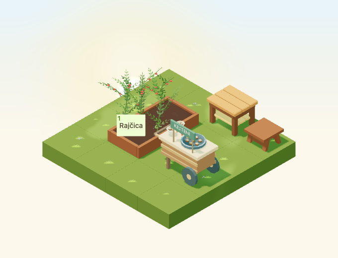

# Chestnut roasting cart

Implementation for [#4960](https://github.com/gredice/gredice/issues/4960), release **C / seasonal expansion**. `ChestnutRoastingCart` is an original Kestenijada decoration with a roasting pan, two composed paper servings and a festive sign. Publication remains under #5000.



## Design and source

First-party references inspected: [HarvestCrateOrchard](../apps/www/public/assets/blocks/HarvestCrateOrchard.webp) for broad grouped produce and simple timber sides, [OutletDisplayTable](../apps/www/public/assets/blocks/OutletDisplayTable.webp) for serving height and chunky construction, and [Stool](../apps/www/public/assets/blocks/Stool.webp) for supporting furniture proportions. The cart's two wheels, legs, handle, roasting pan, paper cones, chestnuts, double-sided KESTENI sign and rust/gold bunting are original authored geometry. The two serving cones form part of the cart; no loose-item attachment contract is introduced.

The editable source uses named vertex groups for every cart/sign/serving/roaster part. Its base origin is centred on the full silhouette including the handle. Bounds are **1.47 × 0.76 × 1.42 tiles**, inside a **1.6 × 0.8 × 1.45** hitbox. The **2×1** footprint rotates to **1×2** using the shared positive-grid offset and spanning-decoration rotation guard. Wheels and feet sit at height zero; the pan is deliberately visible without active fire.

Two baked vertex-colour material roles separate wood/paper (roughness 0.90) from the matte roaster (0.84), both nonmetallic and nonemissive. The GLB is **184,624 bytes**, **2,016 triangles** (1,452 cart + 564 roaster), two meshes/primitives/materials and two base-pass draws. No textures, animations, lights, emitters, audio or idle render leases are added. Geometry and cached materials remain shared and immutable. Costs are structural; device frame rates were not measured.

## Catalogue and clearances

**Kolica s pečenim kestenima**, proposed **110 sunflowers**, is a nonstackable decoration. Shared Croatian metadata drives the picker, sandbox and draft importer. Both support cells must exist, be compatible, clear and at the same height. The cart cannot be put on water, stacked upon, or rotated into a conflicting second cell. Catalogue rows stay hidden until published. It neither produces food nor heats/protects crops.

The complete handle, wheels and sign remain inside the two-cell clearance envelope in all rotations. Reserve an approach beside the serving edge rather than filling the neighbouring path with another prop. The 4×4 review uses a 2×3 corner containing this cart and existing table/stool furniture, leaving a connected one-cell approach to a real planted bed. The raised-only fixture brings the serving table onto the free rear support cell so the elevated cart does not occlude its centre ray. Raised supports exercise the same two-cell contract without implying a realistic cart-on-table interaction in the product.

## Future effect anchors

Saved Blender empties survive export and match the shared Y-up metadata. Runtime named groups `ChestnutRoastingCart:<effect>:<blockId>` inherit stack height, rotation and the two-cell offset. They currently have no active effects.

| Effect | Local Y-up position | Radius | Boundary |
| --- | --- | --- | --- |
| Steam | −0.275, 0.986, 0 | 0.16 | Above the pan contents; keep the plume clear of sign/servings. |
| Fire | −0.275, 0.60, 0 | 0.18 | Inside the closed firebox; any later flame geometry must remain contained below the pan. |
| Sound | −0.275, 0.72, 0 | 0 | Origin only; no mixer registration here. |

#4972/#4980 own effects, culling, reduced motion, audio/weather disablement and disposal. The firebox currently has a closed door: do not let future particles pass through solid wood/metal to make fire visible. The static model is the intended effects-disabled appearance. Shared rain/snow overlays respect global and per-entity disablement.

## Review and reproduction

Dedicated fixtures capture all four day/night rotations, cloudy/dusk/rain/snow, a small low-quality canvas and four raised-support rotations. Geometry rays select the cart and supporting furniture; a production crop button remains usable. Separate local-store checks verify saved rotations and reject blocked/mixed-height second cells. These checks do not replace authenticated customer purchase acceptance.

Scene time: September 23, 2026, Europe/Zagreb, noon/22:30 or shared dusk 0.8; fixed animation time 12 seconds. Camera `[-100,100,-100]`, zoom 90, 680×520/DPR 1; small 390×440/zoom 57. Night comparisons allow 20 pixels for existing stars; weather particle captures are visual reviews. Catalogue previews use October 22 noon.

```bash
/Applications/Blender.app/Contents/MacOS/Blender --background --python-exit-code 1 --python assets/scripts/generate-chestnut-cart.py
pnpm generate:game-assets
pnpm --dir apps/garden exec playwright test --config playwright.chestnut-cart.config.ts
pnpm --filter @gredice/game test
pnpm --filter @gredice/storage exec tsx scripts/upsertChestnutRoastingCartDraft.ts
```

Set the model version to its first twelve SHA-256 characters. Restore unrelated exporter rewrites before final model types. Feed the shared spec to ignored `apps/www/generate/test-cases.json`, generate four covers/top-down views filtered to `ChestnutRoastingCart` with `BLOCK_SNAPSHOT_FREEZE_TIME=2026-10-22T12:00:00+02:00`, copy top-down `_1.webp` to the unnumbered image, then run `pnpm --filter @gredice/game exec tsx scripts/build-chestnut-cart-release.ts`.

The [release manifest](chestnut-cart-2026/release-manifest.json) records hashes, model cost, versioned URL and unpublished metadata. The importer defaults offline and only offers explicit draft-write modes. #5000 must deploy Garden/WWW at the reviewed SHA, verify bytes and price, create/read back the draft, publish through CMS, record the catalogue ID and check real purchase, placement, rotation and reload. No live writes occurred here.

## Validation

- Source audit, full asset pipeline, eight preview renders, transparent-image metadata and release hashes pass.
- All 1,935 game tests pass, including all rotated footprint/placement and exported anchor checks.
- All 24 browser cases pass: the final 17-scene rerun uses an exposed tabletop corner for neighbour selection; seven picker/local rotation cases passed separately.
- Game/JS/app-file lint, game/Garden/WWW typechecks and scoped importer typecheck pass.
- Garden production build passes. WWW compiles/types successfully; page-data collection requires unavailable `POSTGRES_URL`, so the full WWW build remains unverified.
- Offline draft plan and whitespace checks pass. No live write, deployment or authenticated purchase acceptance was performed.
