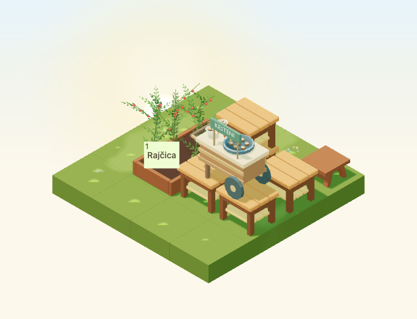
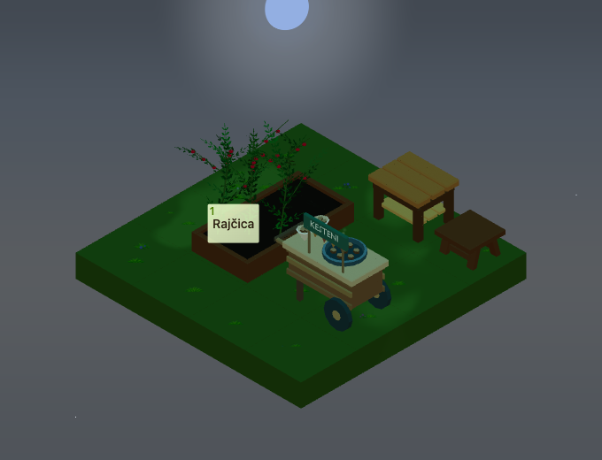

# Chestnut pan steam validation

The remaining chestnut-pan half of #4972 attaches the existing `SteamEmitter`
to the authored `steam` anchor of `ChestnutRoastingCart`. Tea mugs and chestnut
pans share the same Canvas registry and `LocalizedSteam` instanced batch. No
new particle pool, Environment layer, light, model, material or asset was added.

The anchor is `[-0.275, 0.986, 0]` with a 0.16-tile radius. Reading the existing
GLB confirms the pan geometry inside that radius tops out at 0.956040 tiles:
the origin clears it by 0.029960 tiles. The geometry test samples six particles
at 321 times and four wind strengths, bounding each complete billboard above
the pan, inside its radius and below 0.33 tiles above the origin. Parent
transforms provide the cart's two-cell offset, support height and quarter turns.

Steam uses the existing low/auto-constrained-off, medium-four, high-eight and
custom-six emitter policy, with six puffs per admitted source and 48 maximum.
Global and per-entity weather disablement, reduced motion and heavy rain/snow
suppress emission. Frozen scene time repeats samples without an animation
lease. Hidden/offscreen scenes release their lease; source removal unregisters
the exact source and layer disposal releases its mesh, geometry and material.
The effect has no raycast targets and does not consume fuel or change crops.

## Browser and source checks

The dedicated suite uses Chromium SwiftShader, one worker, port 5484, a
720×580 viewport and DPR 1. It checks all four raised rotations, actual cart
and neighboring furniture rays and the existing crop button. It also checks
frozen repeatability, night visibility, quality and weather fallbacks, global
and per-cart disablement and reduced motion.

Six real alternating carts/tea tables register nine anchors in the isolated
lifecycle fixture. The shared layer admits eight on high and four on medium;
changing quality, reduced motion, frozen time, source removal, page visibility,
frustum visibility and unmount verifies counts, leases and resource disposal.
The original cart asset fixture uses an isolated steam registry by default,
so its dormant day and low-quality captures remain meaningful and unchanged.

The [validation record](chestnut-steam-2026/validation.json) records the exact
source/GLB/artifact hashes and tooling. Thirteen focused unit tests, nine steam
WebGL tests (with the six functional cases replayed), two parent snapshots, two
shared lifecycle/isolation cases, all three typechecks and focused lint pass.
The suite is included in regular Garden WebGL CI discovery. Local checks:

```sh
pnpm --filter garden exec playwright test --config playwright.chestnut-steam.config.ts
pnpm --filter garden exec playwright test tests/chestnut-steam.spec.tsx --config playwright.config.ts --project chromium-webgl --list
pnpm --filter @gredice/game exec tsx --import ./scripts/register-test-assets.mjs --test src/scene/chestnutSteam.unit.ts src/scene/steamMotion.unit.ts src/data/chestnutRoastingCartAssets.unit.ts src/entities/chestnutRoastingCartPlacement.unit.ts
pnpm --filter @gredice/game typecheck
pnpm --filter garden typecheck
pnpm --filter www typecheck
GREDICE_GARDEN_CT_PORT=5484 pnpm --filter garden exec playwright test --config playwright.chestnut-cart.config.ts --project chromium-webgl --grep 'chestnut cart day 0$|chestnut cart small low-quality canvas'
```

## Matched autumn workload

Measured on 2026-10-03 in a local component-test build. The scene contains 225
ground tiles, 25 deciduous trees, 50 autumn props, four tea tables and two
chestnut carts at October 22 with strong wind. Both states retain the same
models, two active warm-prop registrations and populated falling/ground/entity
leaves; only steam anchor visibility changes. Each state warms for 60 rendered
frames and samples the following 120. The canvas is 680×520 at DPR 1.

The deterministic extra geometry is 0/48/96 triangles and 0/1/1 draw calls for
low/medium/high, with 0/24/48 puffs. Whole-scene frame timings from headless
SwiftShader on a shared host are diagnostic, not a physical-device budget.
Concurrent host work can dominate timing even on low, where steam draws nothing.
Physical mobile touch, thermal and hardware frame-budget acceptance remains a
release check; local rendering does not prove production deployment.

The [raw profile record](chestnut-steam-2026/profile.json) retains both states,
source IDs and leaf/warm-prop counts.

| Tier | Puffs | Draw calls off → on | Triangles off → on | p95 frame off → on |
| --- | ---: | ---: | ---: | ---: |
| Low | 0 | 201 → 201 | 163,942 → 163,942 | 90.9 → 897.1 ms |
| Medium | 24 | 219 → 220 | 167,224 → 167,272 | 375.8 → 1094.7 ms |
| High | 48 | 219 → 220 | 168,066 → 168,162 | 151.5 → 133.7 ms |

## Captures

The plume is deliberately faint. Both views use fixed scene time of 12 seconds;
the raised cart exercises support transforms and the night view uses ground level.




