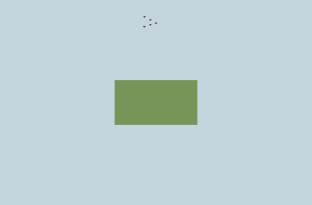
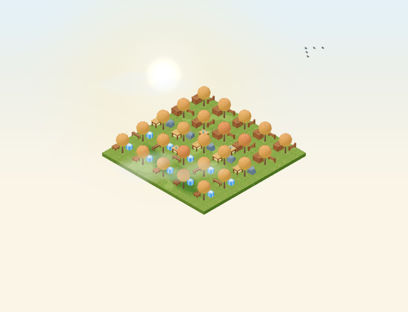

# Distant autumn bird-flock validation

Issue #4978 adds a quiet, distant crossing using the existing `BirdSmall` runtime
asset. The flock clones and bakes its mesh parts into a gliding pose and one
instanced draw call. Its geometry and material have separate disposal lifetimes;
the cached GLTF and existing interactive bird actors remain unchanged. There are
no new Blender, GLB, animation-clip or audio assets and no garden/domain writes.

## Scheduling and limits

The seed contains the garden ID, UTC calendar date and six-minute slot number.
Each slot contains one 24–28-second window starting 75–155 seconds into the slot.
There is at least 252 seconds between crossings. Position, direction, formation,
gentle roll and window fade sample the shared semantic scene clock. A frozen time produces
the same formation independently of earlier quality changes.

`SceneTime` owns one monotonic elapsed-time reader for semantic deadlines. Live
time includes idle/hidden periods; frozen time returns the exact existing fixed
time override. The capped R3F animation clock and shader uniform remain unchanged.
Using animation deltas to discover rare events would repeatedly reschedule the
first window on an otherwise idle Canvas. The new reader adds no timer loop or
render lease of its own.

High and custom quality admit at most five birds, medium admits three, and low
and auto-constrained quality disable the effect. Live quality upgrades wait for
the next crossing; reductions apply immediately. Reduced motion, disabled
weather effects, settled close-up framing, non-autumn dates, rain at least 0.5,
snow above 0.05, fog at least 0.6 or wind at least 12 disable it. Invalid weather
numbers fail closed. `Environment.noDistantBirdFlocks` supports static captures.
The flock adds no sound and does not alter ambient audio preferences.

Between windows the effect owns one deadline and no continuous render lease.
Changing the garden/date recomputes that deadline. During a live window it owns
one shared ambient render lease; frozen views own neither a lease nor deadline.
The scene scheduler suspends hidden/offscreen canvases. Resume samples current
time, skips expired windows and fades a newly visible live crossing in over two
seconds. Unmount releases the deadline, lease, instance buffer, owned geometry
and owned material.

The flight lane stays beyond the garden's positive-Z footprint: its center is
eight units beyond the furthest stack, with formation offsets at most 1.1 units.
Birds stay about six units above ground. The beginning/end window fade and a
fade over the outer 20% of camera framing prevent hard edge entrances. Depth
testing preserves physical occlusion; depth writes and shadows are disabled.
The mesh has an empty raycast and no pointer handlers or interaction targets.

## Local evidence

The [validation record](distant-bird-flocks-2026/validation.json) pins the source
and capture hashes. Seven focused unit tests cover sparse seeded windows,
boundaries, caps, weather, framing, outside-footprint positions and cached-asset
lifetime isolation and the real GLB's attached gliding-wing bounds. Four real Chromium WebGL component tests cover exact frozen
replay, shared live-clock coordinates, quality changes, reduced motion, weather,
season changes, selected-ground clicks, raycast exclusion, camera clipping,
deadline input changes, hidden/offscreen resume, skipped windows and disposal.
The live test advances browser monotonic time with no frame-clock mutator; an
otherwise idle Canvas must wake from its deadline and later return to zero leases.
The suite is included in the regular Garden WebGL CI test pattern.
The existing scheduler suite also passes (70 cases, 77 unit cases including the
feature tests), alongside the existing two-root production-isolation browser case.

The matched high-quality scene contains 225 ground tiles, 25 deciduous trees,
50 autumn props and four tea tables at October 22. Both states use the same
frozen animation time and camera. Each warms for ten rendered frames and samples
the next twenty. Only distant flock visibility changes.

| Measurement | Flock off | Flock on |
| --- | ---: | ---: |
| Draw calls per frame | 215 | 216 |
| Triangles per frame | 164,070 | 167,630 |
| Birds | 0 | 5 |
| Steam particles | 48 | 48 |
| Falling leaves | 160 | 160 |
| Ground leaf clusters | 221 | 221 |
| Entity leaf clusters | 20 | 20 |

Each reused bird has 712 triangles. The incremental work is exactly one draw
call and 3,560 triangles on high quality, with no shadow pass. These are headless
Chromium SwiftShader counts on a shared macOS host. They do not establish
physical-device frame times or production acceptance. After stacking onto leaf
raking and chestnut steam, four flock cases passed with freshly recreated
captures and identical counts. The record preserves the original evidence and
separately pins the rebased source, 2,087 Game and 178 JS test results, three
leaf-raking cases, four photo regressions and consumer typechecks.

Validated commands from the repository root:

- `pnpm --filter @gredice/game exec tsx --test src/scene/distantBirdFlock.unit.ts src/scene/distantBirdGeometry.unit.ts src/scene/sceneElapsedTime.unit.ts`
- `pnpm --filter garden exec playwright test --config playwright.distant-bird-flocks.config.ts`
- Game, Garden and WWW typechecks and changed-file Biome checks.

The dedicated browser config uses port 5485 and one worker. All browser requests
are restricted to local GET/HEAD requests. No production data, sale configuration
or deployment is changed by these checks.

