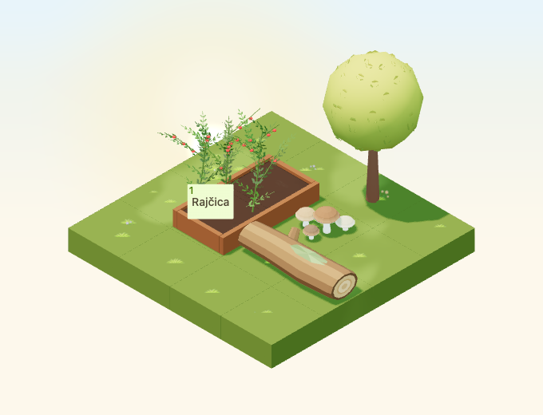

# Fallen log

Implementation for [#4955](https://github.com/gredice/gredice/issues/4955), release
**B / complete garden**. `FallenLog` adds a horizontal woodland shape beside the
existing tree and mushroom cluster. Catalogue publication remains with #5000.



## Design and source

The original low-poly model has a tapered, faceted trunk, broad pale cut rings,
one blunt branch stub and a small angular moss patch. The cut rings use geometry
and baked colours, with no texture dependency. First-party references inspected:

- [DeadTreeStump](../apps/www/public/assets/blocks/DeadTreeStump.webp): warm bark,
  simple cut planes and a blunt branch silhouette.
- [Tree](../apps/www/public/assets/blocks/Tree.webp): faceted natural masses and
  subdued green foliage; the log remains low enough to read separately.
- [WoodenBench](../apps/www/public/assets/blocks/WoodenBench.webp): timber scale
  and warm end-grain contrast, without reusing its furniture shape.

`assets/game-assets/FallenLog.blend` contains one joined mesh with named vertex
groups `Bark`, `CutEndLeft`, `CutEndRight`, `BranchStub` and `Moss`. The generator
preserves these independently selectable parts and audits the saved source.
The base-centred model bounds are approximately **1.842 × 0.7071 × 0.432 tiles**;
its underside touches the support plane. Declared hitbox: **1.9 × 0.9 × 0.45**.

The bark palette uses `#79502F`, `#845933` and `#94653B`; cut ends use `#C0925C`
and `#D2A56F`; moss ranges from `#66723E` to `#839050`. Corner vertex colours
export as `COLOR_0`, sharing one rough, nonmetallic, nonemissive material.
The lazy GLB is **22,988 bytes**, **389 triangles**, one mesh/primitive/material
and one base-pass draw per instance. Runtime shares immutable cached geometry
and material. Rain/snow use existing overlays, respecting global and per-entity
disablement. There are no textures, embedded lights, animations, sounds or
intrinsic particles. These are structural costs, not measured device frame rates.

## Catalogue and placement

**Palo deblo s mahovinom**, proposed price **55 sunflowers**, is one decoration
identity with a **2×1** footprint. Odd quarter-turns use **1×2**. Runtime centres
the authored model within the footprint growing from the anchor in positive
coordinates. The full geometry stays inside both occupied cells at every turn.

Ground, walkways and compatible display surfaces may support it when both cells
are level and free. Missing support, water, occupied cells or mixed heights block
placement. It cannot support other items and does not produce wood, create
harvests or change plant growth. The shared rotation guard now covers the log and
the previously guarded harvest wheelbarrow, preserving its prior behavior.

The decoration picker hides the new identity until catalogue metadata is
published. Sandbox data, the offline-first draft importer and release metadata
all use `@gredice/js/fallenLog`.

## Future leaf-weathering surface review

The `.blend` `Bark` group supplies twelve longitudinal facets over five segments.
Its two upper facets per segment (original bark polygon indices 2/3, 14/15,
26/27, 38/39 and 50/51) face upward. A conservative future resting zone is the
uncovered upper barrel at Blender **x 0.42–0.78, y −0.04–0.04**, roughly
**z 0.38–0.40**. In the exported Y-up model this maps to x unchanged, height Y,
and Z equal to negative Blender y. A future anchor must sample the actual facet
height and rotate/translate with the two-cell entity.

Reject the vertical cut ends, lower bark, underside and narrow branch tip.
The raised moss fan occupies roughly x −0.58–0.12 and needs its own surface
sampling; a flat barrel anchor there could clip. No seasonal source or leaf
resting anchor is enabled by this change. That requires explicit registration
and overlap/coverage review in the existing seasonal system.

## Review fixture

A 4×4 garden contains the log, existing woodland mushrooms and tree inside a
2×3 decoration corner. A real planted bed keeps a connected one-cell approach.
Captures cover all four day/night rotations, overcast, dusk, rain, snow and a
390×440 low-quality canvas. Separate raised-support cases cover all four turns.
The fixture uses real entity geometry and the production crop button at a
representative anchor; it is not the authenticated purchase or full close-up HUD.

Calendar time is September 23, 2026, Europe/Zagreb, noon or 22:30, with shared
dusk value 0.8. Animation time is frozen at 12 seconds, camera direction
`[-100,100,-100]`, zoom 90, 680×520, DPR 1; small view zoom 57. Rain/snow captures
are visual reviews because precipitation moves. Night comparisons allow 20 pixels
for existing stars. Transparent catalogue covers and top-down previews use
October 22 noon, and all ten files have hashes in the
[release manifest](fallen-log-2026/release-manifest.json).

## Reproduction and release

```bash
/Applications/Blender.app/Contents/MacOS/Blender --background --python-exit-code 1 --python assets/scripts/generate-fallen-log.py
pnpm generate:game-assets
/Applications/Blender.app/Contents/MacOS/Blender --background --python-exit-code 1 --python assets/scripts/generate-fallen-log.py -- --check
pnpm --dir apps/garden exec playwright test --config playwright.fallen-log.config.ts
pnpm --filter @gredice/game test
pnpm --filter @gredice/storage exec tsx scripts/upsertFallenLogDraft.ts
```

Set the manifest version to the first twelve GLB SHA-256 characters and regenerate
model types. Restore unrelated exporter rewrites before regenerating the final
types. For catalogue images, write the shared specification to ignored
`apps/www/generate/test-cases.json`, run both existing cover/top-down generators
filtered to `FallenLog` with `BLOCK_SNAPSHOT_FREEZE_TIME=2026-10-22T12:00:00+02:00`,
copy top-down `_1.webp` to the unnumbered preview, then run
`pnpm --filter @gredice/game exec tsx scripts/build-fallen-log-release.ts`.

The importer defaults to an offline plan. Its explicit draft modes preserve
normal revision/cache/search behavior and have no publish mode. Under #5000,
deploy Garden and WWW at the reviewed SHA, verify the recorded asset bytes,
review the price, create/read back the draft and publish via the normal CMS
workflow. Record the catalogue ID and verify customer purchase, all rotations,
placement and reload persistence. No live data has been written here.

## Validation

- Saved-source audit and standard asset generation pass; unrelated exporter rewrites were restored.
- All 1,908 game unit tests pass, including exact release hashes, all rotated/translated model bounds and supported/blocked placement checks for both the log and wheelbarrow.
- All 24 focused browser cases pass: day/night rotations, cloudy/dusk/rain/snow, small canvas, four raised-support rotations, persistent local rotation and blocked second-cell cases, plus four picker checks. Geometry ray tests select the log, neighboring mushrooms and tree, and the adjacent crop button remains usable.
- All 13 review images were inspected. Four cover and four top-down render cases pass; all ten generated images have transparent backgrounds, with 640×640 covers.
- Game/JS lint, changed app/storage-file lint, Game/Garden/WWW typechecks and targeted importer typecheck pass. Game lint retains the existing unused suppression warning in `RaisedBedFieldRelationshipIndicator`.
- Garden production build passes. WWW compiles and typechecks, then page-data collection fails because local `POSTGRES_URL` is absent.
- Offline importer returns one unpublished draft row. Live purchase/reload acceptance and publication remain with #5000.
