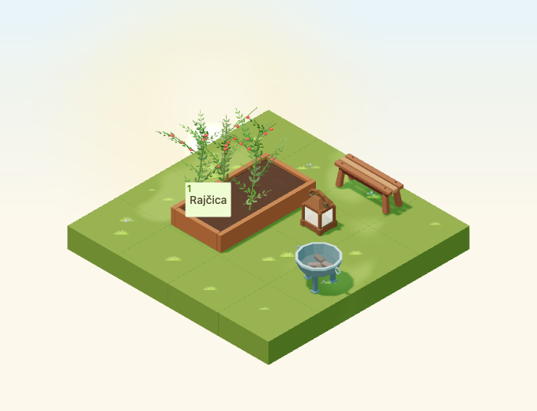

# Garden brazier

The contained runtime effects are now documented in [seasonal effects](game-seasonal-effects.md#contained-warm-prop-effects-4980). The asset review and captures below preserve the dormant base appearance using `Environment.noWarmProps`.

Implementation for [#4962](https://github.com/gredice/gredice/issues/4962), release **C / cozy expansion**. `GardenBrazier` is a compact static decoration with dormant authored effect roles. #4980 owns activation; #5000 owns publication.



## Design and source

First-party references inspected: [ChestnutRoastingCart](../apps/www/public/assets/blocks/ChestnutRoastingCart.webp) for restrained matte metal and contained fuel geometry, [WoodenHandLantern](../apps/www/public/assets/blocks/WoodenHandLantern.webp) for the cozy garden scale and existing light infrastructure, and [StackedFirewood](../apps/www/public/assets/blocks/StackedFirewood.webp) for broad billet shapes. The original brazier has a thick open twelve-sided bowl, three grounded legs with broad feet, two external hollow loop handles and four charred billets. It remains recognizable without flames or smoke.

One editable source contains named part vertex groups and two meshes/material roles: `GardenBrazier_Metal` and `GardenBrazier_Embers`. Metal roughness is 0.86; charcoal roughness 0.94. Both use a baked corner palette, without textures or metallic reflections. The authored ember material has a warm emission factor reserved for later effects. Runtime creates an instance-owned material with **emissive intensity zero**, while retaining the immutable cached source and shared geometry. No cached GLTF material is mutated.

Bounds are **0.86575 × 0.680 × 0.485 tiles**, hitbox **0.9 × 0.9 × 0.5**, footprint **1×1**. It is nonstackable and cannot be placed on water, while compatible ground/path/display supports remain available. Runtime is static on high/low quality and with weather disabled. Shared rain/snow overlays apply to the outdoor bowl/charcoal and respect global/per-entity disablement.

Model cost: **1,088 triangles** (912 metal + 176 embers), two meshes/primitives/materials and two base-pass draws. The GLB is **102,196 bytes**; exact hashes are in the release manifest. It adds one owned runtime material per instance, no textures, animations, particles, sound, point lights, shadow lights or dedicated idle render leases. Existing fixture lanterns provide night lighting. These are structural costs, not device frame-rate measurements.

## Catalogue and effect boundaries

**Ukrasno vrtno ložište**, proposed **65 sunflowers**, uses shared metadata in the picker, sandbox and offline draft importer. Croatian copy explicitly describes a decoration without flames: it does not heat the garden, protect crops or consume wood/resources. Missing catalogue rows stay hidden.

Authored Blender empties survive GLB export and match shared Y-up coordinates. Runtime groups `GardenBrazier:<effect>:<blockId>` inherit stack height and rotation:

| Effect | Local position | Radius | Boundary |
| --- | --- | --- | --- |
| Fire | 0, 0.395, 0 | 0.18 | Centred above billets and inside the 0.30 inner rim. |
| Smoke | 0, 0.515, 0 | 0.14 | Above the rim; later particles need a restrained height and opacity. |
| Sound | 0, 0.37, 0 | 0 | Origin only; no mixer registration. |

#4980 must reuse `GardenNightLight`/`GardenLightProvider` if a physical light is added, preserving the shared budget and no per-prop shadow light. It owns restrained fire/smoke, audio fade/mute, visibility cleanup, shared clock, quality and reduced-motion behavior. The current unlit material is the effects-disabled fallback; do not enable emission by mutating the cached source.

## Review and reproduction

The 4×4 review places the brazier, existing bench and lantern in a 2×3 corner, keeping a connected approach to a real planted bed. Four day/night rotations, cloudy/dusk/rain/snow, small low-quality view and four raised rotations verify readability, geometry selection and crop-button access. An additional weather-disabled case confirms no wet/snow overlay. Every scene asserts zero runtime ember emission, a distinct owned material and shared immutable source geometry. The static tests allow no network mutations.

Scene time is September 23, 2026, Europe/Zagreb, noon/22:30 or shared dusk 0.8, fixed animation time 12 seconds; camera `[-100,100,-100]`, zoom 90, 680×520/DPR 1. Small view is 390×440/zoom 57. Night comparisons allow 20 pixels for stars, rain/snow captures are visual reviews. Catalogue previews use October 22 noon.

```bash
/Applications/Blender.app/Contents/MacOS/Blender --background --python-exit-code 1 --python assets/scripts/generate-garden-brazier.py
pnpm generate:game-assets
pnpm --dir apps/garden exec playwright test --config playwright.garden-brazier.config.ts
pnpm --filter @gredice/game test
pnpm --filter @gredice/storage exec tsx scripts/upsertGardenBrazierDraft.ts
```

Set the version from the first twelve GLB SHA-256 characters and restore unrelated exporter rewrites before final model types. Put shared metadata in ignored `apps/www/generate/test-cases.json`, generate covers/top-down views filtered to `GardenBrazier` with `BLOCK_SNAPSHOT_FREEZE_TIME=2026-10-22T12:00:00+02:00`, copy top-down `_1.webp` to the unnumbered preview and run `pnpm --filter @gredice/game exec tsx scripts/build-garden-brazier-release.ts`.

The [release manifest](garden-brazier-2026/release-manifest.json) contains hashes, exact bytes, versioned model URL and unpublished catalogue metadata. The importer defaults offline and explicit write modes only create/update drafts. #5000 requires matching-SHA Garden/WWW deployments, byte/price readback, draft creation/readback, CMS publication, catalogue ID recording and real purchase/placement/rotation/reload acceptance. No live writes occurred here.

## Validation

- Source audit, full asset pipeline, eight final preview renders, transparency checks and release hashes pass.
- All 1,941 game unit tests and 22 browser cases pass. Three focused night/low-quality/weather-disabled cases also pass after switching to the generated typed material map.
- Game/JS/app-file lint, game/Garden/WWW typechecks and scoped importer typecheck pass.
- Garden production build passes. WWW compiles/types successfully but page-data collection needs unavailable `POSTGRES_URL`; the full WWW build remains unverified.
- Offline draft plan and diff whitespace checks pass. No live write, deployment or authenticated purchase acceptance was performed.
