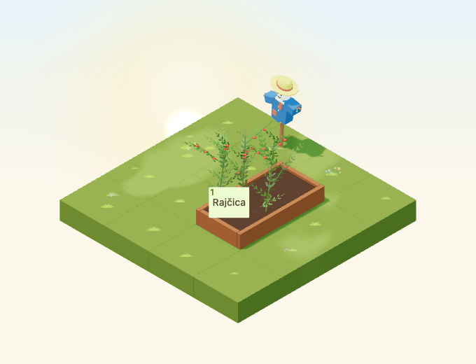
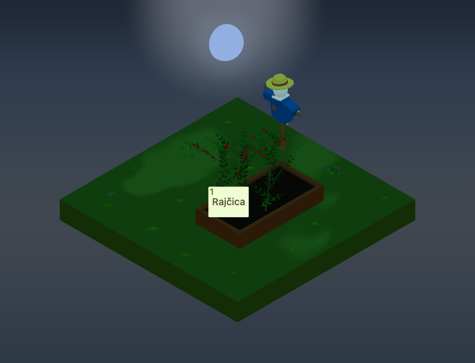
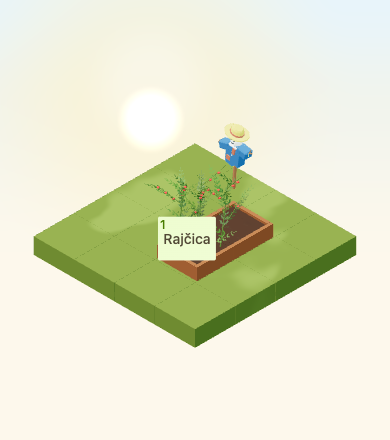

# Garden scarecrow

Implementation for [#4949](https://github.com/gredice/gredice/issues/4949),
following the [autumn art direction](autumn-art-direction-2026.md).
`GardenScarecrow` is a static, purely decorative object. Wind sway belongs to
#4981; deployment and catalogue publication belong to #5000.



## Design and catalogue

An uneven blue work shirt, rust patches, forked twig hands, cream sack head
and curled straw hat form an original, crooked silhouette. The small smile is
a close-up detail; the hat and broad shirt carry the identity at garden zoom.
The single timber stake touches the supporting surface. The source contains
editable mesh islands merged by material role, with a base-centered origin.

First-party references inspected before modeling:

- [Wooden bench](../apps/www/public/assets/blocks/WoodenBench.webp): warm timber,
  soft bevels and matte response; the scarecrow uses a single crooked stake.
- [Summer hat](../apps/www/public/assets/blocks/SummerHat.webp): chunky crown and
  readable brim; the new hat has an uneven curled edge and rust band.
- [Hay bale](../apps/www/public/assets/blocks/BaleHey.webp): grouped straw and
  broad golden areas; cuffs use short bundles rather than fine fibers.
- [September garden](autumn-art-direction-2026/early-sun.png): existing scale,
  green background and lighting. No external game assets were copied.

| Contract | Value |
| --- | --- |
| Catalogue name / label | `GardenScarecrow` / **Vrtno strašilo** |
| Footprint | 1×1 at all four rotations |
| Measured width × depth × height | 0.840 × 0.410 × 1.410 tiles |
| Declared hitbox | 0.86 × 0.42 × 1.41, swapped horizontally on quarter-turns |
| Placement | Existing solid supports; not water; cannot support another block |
| Proposed price | 80 sunflowers; local sandbox is free |
| Behaviour | No crop, pest-control, yield, light, sound or wind-sway effect |
| Publication | Unpublished; catalogue ID remains null |

Croatian copy and attributes live in `@gredice/js/gardenScarecrow`, shared by
the local sandbox, HUD fixtures and draft importer. The regular decoration
picker resolves its item from catalogue data, so the button is absent before
publication. Runtime registration remains available for already-owned items.

## Materials and cost

| Role | sRGB albedo | Roughness / metalness |
| --- | --- | --- |
| Timber | `#905935` | 0.86 / 0 |
| Straw | `#D6B83F` | 0.95 / 0 |
| Linen | `#EEE3CB` | 0.95 / 0 |
| Shirt | `#2F5E83` | 0.95 / 0 |
| Patches / hat band | `#AA563D` | 0.95 / 0 |
| Face | `#313536` | 0.95 / 0 |

The lazy GLB is **147,720 bytes, 2,088 triangles, six meshes and six materials**.
It has no textures, animation clips, particles or point lights. Six base-pass
draws are supplemented by existing shadow/weather passes when active. The
runtime reuses `WeatheredEntityPart` for rain and snow; it preserves exported
node transforms and does not mutate cached geometry/materials. Structural
costs are recorded here; no physical-device frame-rate claim is made.

The [release manifest](garden-scarecrow-2026/release-manifest.json) records the
source, model and ten image hashes, plus the exact unpublished catalogue spec.
The standard cover faces the camera. Top-down rotations follow the garden's
dedicated plan-view renderer and the runtime rotation numbering.

| Night, reverse view | Small canvas, low quality |
| --- | --- |
|  |  |

The review scene uses a 4×4 garden, a real raised-bed model and generated
tomatoes, with the scarecrow behind the bed's far corner. The approach remains
clear. A production `RaisedBedFieldItemButton` at a representative crop anchor
is checked for clicks and separation from the projected scarecrow bounds.
This exercises the component and composition, not the complete authenticated
close-up HUD or a live purchase. Existing full HUD tests cover that surface.

All four object rotations are captured at noon and 22:30 on September 23,
Europe/Zagreb. The camera direction is `[-100,100,-100]`, zoom 90, 680×520,
DPR 1; the low-quality view is 390×440 at zoom 57. Weather is clear and calm;
time is frozen only in the fixture. Night comparisons tolerate 20 pixels for
the existing random stars. The model has no dependency on wind or particles.

## Reproduction and release gate

```bash
/Applications/Blender.app/Contents/MacOS/Blender --background --python-exit-code 1 --python assets/scripts/generate-garden-scarecrow.py
pnpm generate:game-assets
/Applications/Blender.app/Contents/MacOS/Blender --background --python-exit-code 1 --python assets/scripts/generate-garden-scarecrow.py -- --check

pnpm --dir apps/garden exec playwright test --config playwright.garden-scarecrow.config.ts
pnpm --filter @gredice/game exec tsx --import ./scripts/register-test-assets.mjs --test src/data/gardenScarecrowAssets.unit.ts

# Offline plan: no database credentials or writes.
pnpm --filter @gredice/storage exec tsx scripts/upsertGardenScarecrowDraft.ts
```

After exporting changed bytes, set the asset manifest version to the first 12
characters of the GLB SHA-256 and regenerate model types. Restore unrelated
GLBs rewritten by a different Blender exporter version.

For image generation, put the shared catalogue definition in the ignored
`apps/www/generate/test-cases.json`, with `name` inside `information` and
`prices.sunflowers` set from `sunflowers`. Run:

```bash
pnpm --dir apps/www exec playwright test --config playwright-generate.config.ts generate/blocks-snapshots.specgen.tsx -g GardenScarecrow --workers=1
pnpm --dir apps/www exec playwright test --config playwright-generate.config.ts generate/blocks-top-down-snapshots.specgen.tsx -g GardenScarecrow --workers=1
cp apps/garden/public/assets/blocks/top-down/GardenScarecrow_1.webp apps/garden/public/assets/blocks/top-down/GardenScarecrow.webp
pnpm --filter @gredice/game exec tsx scripts/build-garden-scarecrow-release.ts
```

The shared draft importer also supports `--dry-run` and `--apply-drafts` with
an explicitly configured storage environment. It rejects duplicate names and
non-draft rows, preserves revisions/cache/search updates and checks readback.
Neither database mode was run here. It has no publication mode.

For #5000, deploy Garden and WWW on the reviewed SHA, verify the recorded bytes,
review the price, create/read back the draft, publish through the normal CMS
workflow and refresh caches. Record the actual catalogue ID, then verify
customer purchase, placement, rotation and persistence after reload.

## Validation recorded

- Blender source audit and standard generated-asset pipeline pass. Only the
  new GLB and expected generated metadata are included.
- Four catalogue and four plan-view renders pass; plan-view alpha was checked.
- Game/JS lint, changed app/storage-file lint, Game/Garden/WWW typechecks and
  the two draft importers' targeted storage typecheck pass. Game lint has the
  existing unused suppression warning in `RaisedBedFieldRelationshipIndicator`.
- All 1,874 game unit tests pass; both autumn releases' eight focused asset
  checks also pass after refreshing plan-view hashes.
- Thirteen browser checks cover rotation, ground contact, rendered crops,
  mesh ray selection, crop-button clearance/clicks, small-canvas readability,
  catalogue gating, displayed price, sandbox uniqueness and HUD drag identity.
- Garden production build passes. WWW compiles and typechecks, then stops
  collecting `/biljke/[alias]` because `POSTGRES_URL` is not configured locally.
- The shared draft-writer refactor retains the pumpkin command's nine-item
  offline plan; the scarecrow command yields one draft. Live DB, purchase and
  deployment checks remain with #5000.
