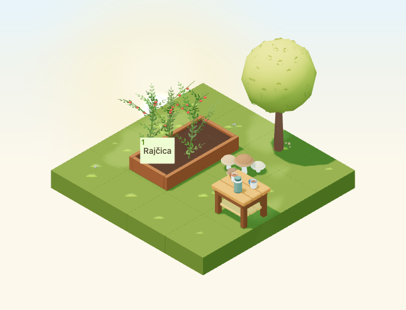

# Garden tea table

Implementation for [#4959](https://github.com/gredice/gredice/issues/4959), release **B / complete garden**. `GardenTeaTable` composes a timber table, thermos and two enamel mugs into one static decoration. Publication is gated by #5000; steam belongs to #4972.



## Design and source

First-party references inspected: [OutletDisplayTable](../apps/www/public/assets/blocks/OutletDisplayTable.webp) for chunky planks, legs and lower shelf; [WateringCan](../apps/www/public/assets/blocks/WateringCan.webp) for a restrained blue enamel palette and readable handle opening; [WoodenBench](../apps/www/public/assets/blocks/WoodenBench.webp) for timber proportions alongside the cozy furniture family. The mug bodies, open C handles, dark rims, tea surfaces and thermos are original geometry.

`GardenTeaTable.blend` appends the display table at 96% scale. Named source-part vertex groups preserve editable timber parts without changing the original table. The two mugs have cream bodies, blue/rust rims and visible tea; the sage thermos has a broad cream shoulder band and dark lid. There are two meshes/material roles, timber and enamel, with baked corner vertex colours. Roughness is 0.88/0.83; neither is metallic or emissive. The model needs no image textures, animation, audio, steam, lights or idle render leases.

Bounds: **0.864 × 0.720 × 0.9552 tiles**. Hitbox **0.9 × 0.9 × 1**, footprint **1×1**, nonstackable and not placeable on water. It can sit on compatible ground, paths or display surfaces, but its composed mugs do not create a general attachment contract. Proposed catalogue entry: **Vrtni stolić s čajem**, **70 sunflowers**. Shared metadata drives runtime fixtures, picker and the offline draft importer. Missing catalogue rows remain hidden.

The GLB is **108,248 bytes**, **1,280 triangles** (616 timber + 664 tea set), two meshes/primitives/materials and two base-pass draws. Materials and geometry remain immutable/shared across instances. These are structural costs, not measured device frame rates. Outdoor surfaces use shared rain/snow overlays; global or per-entity weather disablement suppresses both. The static prop is identical on low quality and without audio.

## Authored mug anchors for #4972

Saved Blender empties `GardenTeaTable_MugSteamLeft` and `GardenTeaTable_MugSteamRight` survive the GLB export. Runtime exposes named groups `GardenTeaTable:mug:left:<blockId>` and `GardenTeaTable:mug:right:<blockId>` under the rotating/stacked entity. Coordinates are base-centred, exported Y-up:

| Mug | Position | Proposed emitter radius |
| --- | --- | --- |
| Left | −0.20, 0.8072, 0.13 | 0.035 |
| Right | 0.20, 0.8072, 0.03 | 0.035 |

Both sit 0.01 above the rim and 0.034 above tea. A downward geometry ray validates that each anchor is over its own tea surface; source/export/shared metadata coordinates are compared. Steam must inherit entity rotation and stack height. Future emitters should remain within the open mug bore and respect #4972's quality, reduced-motion, weather, visibility and cleanup rules. This PR creates no emitters or sound.

## Review and reproduction

A 4×4 garden keeps the tea table, mushrooms and tree in a 2×3 corner beside a real planted bed and connected approach. Dedicated captures check four day/night rotations, cloudy/dusk/rain/snow, a small low-quality canvas, and raised support rotations. Geometry clicks select the table and neighbours; a production crop button remains usable. These are local component checks, not authenticated purchase acceptance.

Scene date is September 23, 2026, Europe/Zagreb, noon/22:30 or shared dusk 0.8, with animation time fixed to 12 seconds. Camera direction `[-100,100,-100]`, zoom 90, 680×520/DPR 1; small view is 390×440/zoom 57. Night comparisons allow 20 pixels for existing stars; rain/snow are visual captures. Covers use October 22 noon.

```bash
/Applications/Blender.app/Contents/MacOS/Blender --background --python-exit-code 1 --python assets/scripts/generate-garden-tea-table.py
pnpm generate:game-assets
pnpm --dir apps/garden exec playwright test --config playwright.garden-tea-table.config.ts
pnpm --filter @gredice/game test
pnpm --filter @gredice/storage exec tsx scripts/upsertGardenTeaTableDraft.ts
```

Use the first twelve GLB SHA-256 characters for its manifest version. Restore unrelated exporter rewrites before final generated types. Populate ignored `apps/www/generate/test-cases.json` from the shared spec, run cover and top-down generators filtered to `GardenTeaTable` with `BLOCK_SNAPSHOT_FREEZE_TIME=2026-10-22T12:00:00+02:00`, copy top-down `_1.webp` to its unnumbered preview and run `pnpm --filter @gredice/game exec tsx scripts/build-garden-tea-table-release.ts`.

The [release manifest](garden-tea-table-2026/release-manifest.json) records source/model/image hashes, cost, versioned URL and unpublished metadata. The importer defaults offline and explicit write modes create/update drafts only. Under #5000, deploy Garden/WWW at the reviewed SHA, verify model/image bytes and price, create/read back a draft, publish through CMS, record the catalogue ID and verify purchase, placement, rotations and reload. No live writes or publication occurred here.

## Validation

- Source audit, complete asset pipeline, eight preview renders and release hashes pass.
- All 1,927 game unit tests and 21 dedicated browser cases pass.
- Game/JS/app-file lint, game/Garden/WWW typechecks and scoped importer typecheck pass.
- Garden production build passes. WWW compiles/types successfully but page-data collection requires the unavailable `POSTGRES_URL`; full WWW build remains unverified.
- Offline draft plan and diff whitespace checks pass. Deployment, publication and authenticated customer purchase acceptance remain under #5000.
