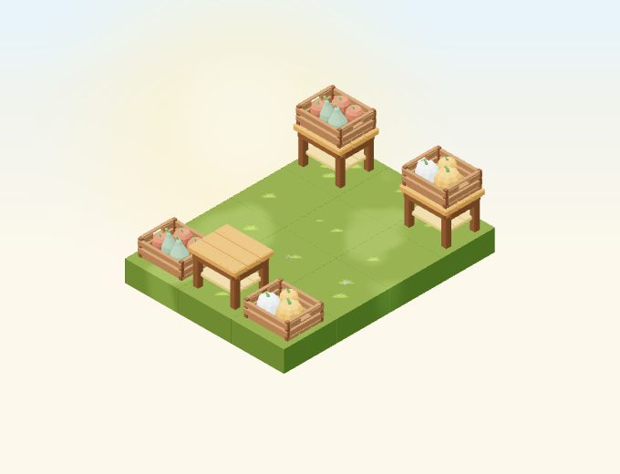
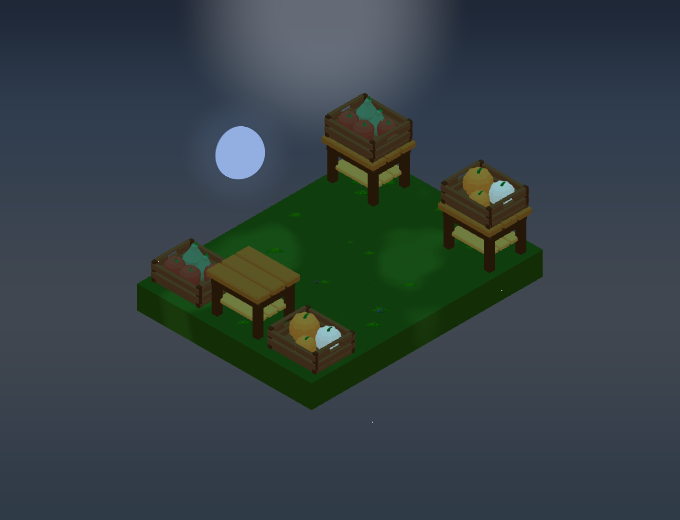
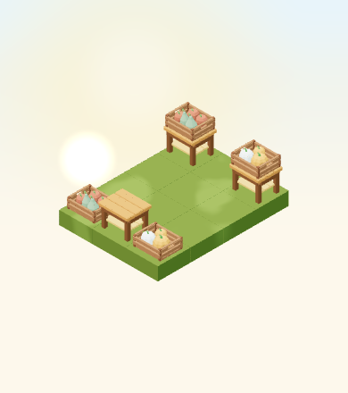

# Decorative harvest crates

Implementation for [#4950](https://github.com/gredice/gredice/issues/4950),
following the [autumn art direction](autumn-art-direction-2026.md).
Both variants are fixed decorations. Their contents do not represent real
harvest quantities, stock or availability. Publication remains with #5000.



## Design and catalogue

The shared crate has three floor planks, two broad side slats, corner battens
and open short-side handles. The pumpkin mix reuses the rounded, ribbed fruit
geometry from #4948. The orchard version has three broad apples and two taller
pears with narrow necks. Large fruit silhouettes and contrasting colour groups
carry the distinction at normal garden zoom; there are no labels or textures.
Each asset has its own editable Blender source, with mesh islands joined by
material role and a base-centered origin.

First-party references inspected before modeling:

- [Display table](../apps/www/public/assets/blocks/OutletDisplayTable.webp):
  broad planks, chunky framing and the support used in the review scene.
- [Pumpkin group](../apps/www/public/assets/blocks/HarvestPumpkinGroupOrange.webp):
  faceted ribs and squat silhouettes, reused through the source generator.
- [Wooden bench](../apps/www/public/assets/blocks/WoodenBench.webp): warm timber,
  restrained bevels and matte material response. No external assets were copied.

| Contract | Pumpkin mix | Orchard mix |
| --- | --- | --- |
| Name | `HarvestCrate` | `HarvestCrateOrchard` |
| Croatian label | Ukrasni sanduk s bundevama | Ukrasni sanduk s jabukama i kruškama |
| Measured width × depth × height | 0.841 × 0.715 × 0.4362 | 0.841 × 0.715 × 0.4943 |
| Declared hitbox | 0.86 × 0.74 × 0.44 | 0.86 × 0.74 × 0.50 |
| Proposed price | 60 sunflowers | 60 sunflowers |
| Catalogue state / ID | Unpublished / null | Unpublished / null |

Each occupies one tile at all four rotations. The existing stacking rules allow
solid supports, walkways and the display table. Neither crate supports another
block or floats on water. The local sandbox is free. There is no harvest,
inventory, yield, lighting, particle or sound behaviour.

Croatian copy and attributes live in `@gredice/js/harvestCrates`, shared by the
sandbox, HUD fixtures and draft importer. Items are in **Dekoracija** and stay
hidden in the normal picker while their catalogue rows are absent. Runtime
registration also supports already-owned instances.

## Materials and cost

| Role | sRGB albedo |
| --- | --- |
| Timber / frame | `#905935` / `#764024` |
| Orange / cream pumpkins | `#E08A3C` / `#EEE3CB` |
| Apples / pears | `#AA563D` / `#7D8F68` |
| Stems and leaves | `#4E7F35` |

All materials use roughness 0.86, metalness 0 and no emission. Each lazy GLB
contains five meshes and five materials, with no textures or animation clips.
The pumpkin crate is **192,772 bytes / 3,204 triangles**; the orchard crate is
**146,048 bytes / 2,132 triangles**. Five base-pass draws are supplemented by
existing shadow and weather passes. `WeatheredEntityPart` provides rain and
snow without mutating cached geometry or materials. These are structural
costs, not physical-device frame-rate measurements.

The [release manifest](harvest-crates-2026/release-manifest.json) records both
source hashes, versioned model URLs, model cost and ten image hashes per item,
alongside the exact unpublished catalogue specifications.

| Night, reverse view | Small canvas, low quality |
| --- | --- |
|  |  |

The review fixture places both crates beside an empty table and on separate
tables in a 3×4 garden. All four object rotations are captured at noon and
22:30 on September 23, Europe/Zagreb. The default camera direction is
`[-100,100,-100]`, zoom 82, 680×520, DPR 1; the low-quality view is 390×440 at
zoom 52. Clear, calm weather and fixture-only frozen time keep the comparisons
repeatable. Night comparisons allow 20 pixels for existing random stars.

## Reproduction and release gate

```bash
/Applications/Blender.app/Contents/MacOS/Blender --background --python-exit-code 1 --python assets/scripts/generate-harvest-crates.py
pnpm generate:game-assets
/Applications/Blender.app/Contents/MacOS/Blender --background --python-exit-code 1 --python assets/scripts/generate-harvest-crates.py -- --check

pnpm --dir apps/garden exec playwright test --config playwright.harvest-crates.config.ts
pnpm --filter @gredice/game exec tsx --import ./scripts/register-test-assets.mjs --test src/data/harvestCrateAssets.unit.ts

# Offline plan: no database credentials or writes.
pnpm --filter @gredice/storage exec tsx scripts/upsertHarvestCrateDrafts.ts
```

After exporting changed bytes, set each asset manifest version to the first 12
characters of the GLB SHA-256 and regenerate model types. Restore unrelated
GLBs rewritten by a different Blender exporter version. The pumpkin generator
now has a main guard so importing its mesh helpers cannot rewrite its sources.

For catalogue images, put the two shared definitions in the ignored
`apps/www/generate/test-cases.json`, with each `name` inside `information` and
`prices.sunflowers` set from `sunflowers`, then run:

```bash
pnpm --dir apps/www exec playwright test --config playwright-generate.config.ts generate/blocks-snapshots.specgen.tsx -g HarvestCrate --workers=1
pnpm --dir apps/www exec playwright test --config playwright-generate.config.ts generate/blocks-top-down-snapshots.specgen.tsx -g HarvestCrate --workers=1
cp apps/garden/public/assets/blocks/top-down/HarvestCrate_1.webp apps/garden/public/assets/blocks/top-down/HarvestCrate.webp
cp apps/garden/public/assets/blocks/top-down/HarvestCrateOrchard_1.webp apps/garden/public/assets/blocks/top-down/HarvestCrateOrchard.webp
pnpm --filter @gredice/game exec tsx scripts/build-harvest-crates-release.ts
```

The shared importer supports `--dry-run` and `--apply-drafts` with an explicitly
configured storage environment. It rejects duplicate names and non-draft rows,
preserves revisions/cache/search updates and checks readback. Neither database
mode was run here; the importer has no publication mode.

For #5000, deploy Garden and WWW on the reviewed SHA, verify the recorded bytes,
review pricing, create/read back the drafts and publish through the normal CMS
workflow. Refresh caches and record actual catalogue IDs. Verify customer
purchase, placement, rotation and persistence after reload after publication.

## Validation recorded

- Blender source audits and the standard asset pipeline pass. The existing
  pumpkin source audit still passes after extracting its reusable entry point.
- Eight cover renders and eight top-down renders pass; top-down transparency
  was checked. All review rotations, day/night and small-canvas images were
  inspected for silhouette, ground contact and table clearance.
- All 1,878 game unit tests pass, including release hashes, rotated GLB bounds,
  static material/cost contracts and stacking compatibility for both crates.
- Fifteen browser checks cover rendered ground/table placement, all rotations,
  mesh ray selection, small-canvas rendering, catalogue gating, displayed
  prices, sandbox uniqueness and drag identity. These are local component
  checks, not a live purchase or authenticated persistence test.
- Game/JS lint, changed app/storage-file lint, Game/Garden/WWW typechecks and
  the targeted draft-importer storage typecheck pass. Game lint retains an
  existing unused suppression warning in `RaisedBedFieldRelationshipIndicator`.
- Garden production build passes. WWW compiles and typechecks, then fails page
  collection for `/biljke/[alias]` because local `POSTGRES_URL` is absent.
- The offline importer produces exactly two drafts. Deployment, catalogue
  publication and live acceptance remain gated by #5000.
