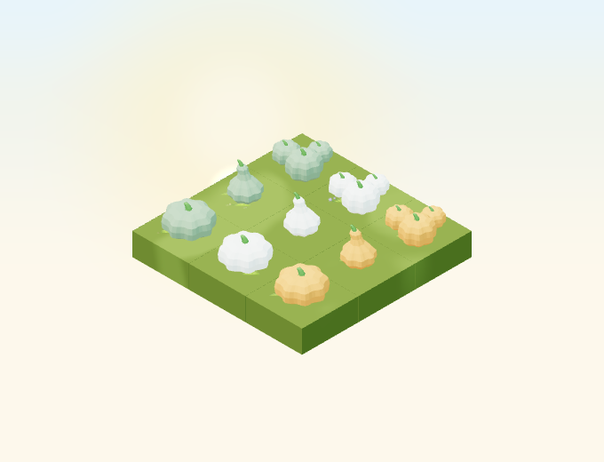
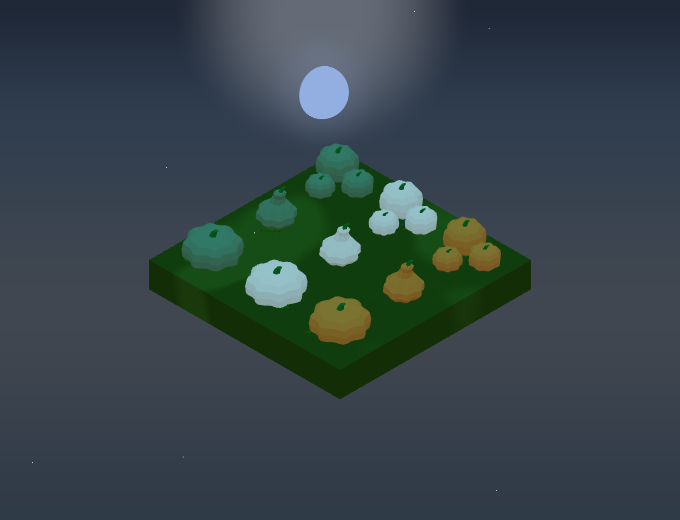
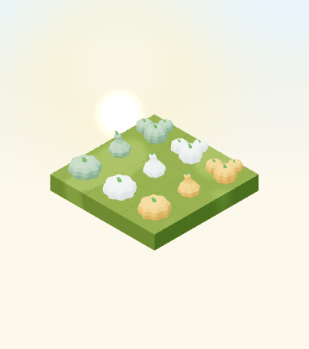

# Decorative pumpkins and gourds

Implementation of [#4948](https://github.com/gredice/gredice/issues/4948), using
the [autumn art brief](autumn-art-direction-2026.md). Publication remains with
[#5000](https://github.com/gredice/gredice/issues/5000). No live catalogue writes,
customer purchases or production deployment were performed for this change.



## Identity and placement

Three original Blender sources each supply orange (`#E08A3C`), cream
(`#EEE3CB`) and muted green (`#7D8F68`) catalogue identities. Every colour has
its own saved block name and matching image. A group contains three pumpkins
of the selected colour; it is one item, with no randomized companions.
The common stem uses the brief's `#4E7F35`. Fruit and stem are matte,
nonmetallic, unlit surfaces with roughness 0.86 and weather overlays.

| Shape / model | Block name suffixes | Height / hitbox W×D | Draft price |
| --- | --- | --- | --- |
| `HarvestPumpkinSquat` | `Orange`, `Cream`, `Green` | 0.42 / 0.72×0.72 | 30 🌻 |
| `HarvestPumpkinGourd` | `Orange`, `Cream`, `Green` | 0.55 / 0.50×0.50 | 30 🌻 |
| `HarvestPumpkinGroup` | `Orange`, `Cream`, `Green` | 0.41 / 0.86×0.88 | 60 🌻 |

All occupy **one tile**, with base-centered origins and runtime scale 1. They
can sit on ordinary supporting terrain, paths and the display table. They do
not support other blocks and cannot be placed on water. Every quarter turn
fits the corresponding rotated hitbox, including stems. Displayed colours are
affected by the existing day/night lighting; no new light is allocated.

The picker is **Dekoracija → Ukrasne bundeve**. In customer gardens it appears
only when one or more matching published directory rows exist. Local sandbox
data offers the same geometry and footprint with its usual free placement.
The catalogue descriptions explicitly identify these as decorations without
a harvest. Proposed prices are draft metadata for the rollout review.

## References and reuse

First-party visual references were the brief's early sunny scene, its mid-autumn
dusk scene, and the existing `BaleHey` catalogue image: chunky forms, a low
harvest layer, broad facets and contrast with green terrain. No external assets
were copied. The crop's eight-rib lathe profile in
`generators/plant/parts/vegetables.tsx` informed the broad ribs; its runtime
growth geometry remains unchanged. The basket's pumpkin is a tiny 42-vertex
fruit with a separate 12-vertex stem. Its scale and reward lifecycle are not
suitable as a decorative SKU. Neither crop code nor `HarvestBasket.blend`/GLB
was changed. The three new sources reuse one authored fruit/stem construction
and two material roles; the group merges its parts into two meshes.

## Cost and release evidence

| Lazy GLB | Bytes | Triangles | Meshes / material roles |
| --- | ---: | ---: | ---: |
| Squat | 41,264 | 760 | 2 / 2 |
| Gourd | 41,264 | 760 | 2 / 2 |
| Group | 119,704 | 2,280 | 2 / 2 |

No textures, animation clips, particles or point lights. Each instance uses two
base-pass draws, plus the existing shadow/weather passes when active. The
three colours share cached geometry; fruit materials are local to each instance
so neighbouring variants cannot recolour each other. These are structural
costs, not a device frame-rate benchmark.

The [release manifest](harvest-pumpkins-2026/release-manifest.json) records all
nine catalogue definitions, model versions/full hashes, and SHA-256 for all 90
images (base plus four rotations, in both catalogue and top-down directories).
Catalogue IDs are deliberately null until the rollout creates the rows.

| Night, rotated | Small canvas, low quality |
| --- | --- |
|  |  |

The WebGL fixture freezes September 23 at noon or 22:30, Europe/Zagreb, with
zero rain/wind/snow. It uses the existing Environment, default camera direction
`[-100,100,-100]`, zoom 90 (small canvas 62), and all four object rotations.
Checks cover all nine simultaneous material colours, rendered rotation,
ground contact and mesh ray selection. The normal capture is 680×520; the
small one is 390×440, both DPR 1. Night screenshot comparisons allow 20 pixels
for the existing randomly positioned stars; object assertions stay exact.
This is local Chromium evidence, not a live purchase or physical-device test.

## Reproduce and publish later

```bash
# Recreate editable sources, then use the standard export/type pipeline.
/Applications/Blender.app/Contents/MacOS/Blender --background --python-exit-code 1 --python assets/scripts/generate-harvest-pumpkins.py
pnpm generate:game-assets
# Audit saved sources without rewriting them.
/Applications/Blender.app/Contents/MacOS/Blender --background --python-exit-code 1 --python assets/scripts/generate-harvest-pumpkins.py -- --check

pnpm --dir apps/garden exec playwright test --config playwright.harvest-pumpkins.config.ts
pnpm --filter @gredice/game exec tsx --import ./scripts/register-test-assets.mjs --test src/data/harvestPumpkinAssets.unit.ts

# Offline catalogue plan; no database credentials needed, no writes.
pnpm --filter @gredice/storage exec tsx scripts/upsertHarvestPumpkinDrafts.ts
```

Use `--update-snapshots` only when intentionally replacing the reviewed captures.
For catalogue image regeneration, create the ignored
`apps/www/generate/test-cases.json` from `harvestPumpkins` in `@gredice/js`,
mapping `name` into `information.name`, retaining `information`/`attributes`,
and setting `prices.sunflowers`. Run the standard WWW generator with
`-g HarvestPumpkin`. For plan views, run the dedicated
`generate/blocks-top-down-snapshots.specgen.tsx` with the same config and grep.
Copy each generated `_1.webp` to its base `.webp` in the top-down directory.
The orthographic option on the standard generator creates side elevations,
so it is not the garden plan-view renderer.
Refresh the release manifest hashes if any exported bytes change.

With an explicitly configured storage environment, the importer also accepts
`--dry-run` or `--apply-drafts` (run `tsx --conditions=react-server --env-file=.env`).
It preflights required definitions, duplicate names and non-draft rows. Draft
writes use the existing revision/cache/search helpers and verify readback.
There is **no publication option**. A partially written draft can be retried by
its durable name. The database modes have not been run against a live database.

For #5000: deploy Garden and WWW on the reviewed SHA; verify the manifest model
and image bytes; review pricing; create/read back drafts; then publish through
the normal CMS workflow and refresh affected caches. Record the actual IDs in
the launch manifest and verify customer purchase, placement and reload. If the
sale is disabled later, retain runtime registrations/assets for owned items.

## Validation recorded

- Standard asset generation, saved-source audit, catalogue and top-down renders.
- Game/JS lint and changed app/storage-file lint (one existing unused
  suppression warning in `RaisedBedFieldRelationshipIndicator.tsx`).
- Game unit suite, focused asset/placement/hash checks, and 21 browser checks
  across model views, picker publication gating, prices and exact drag identity.
- Game, Garden and WWW typechecks; targeted catalogue importer typecheck.
- Garden production build passes. WWW compiles and typechecks, but its build
  stops collecting `/biljke/[alias]` because `POSTGRES_URL` is absent.
- The optional storage-wide `tsc` check reports unrelated script/test errors
  (including missing `pg` declarations and stale fixture fields); the new
  importer and its transitive source pass the targeted check.

The type-generation postprocessor now supplements the combined Blender types
with actual shipped split-GLB mesh names. This preserves multi-material children
such as `Bucket_1` and `Block_Grass_1_2` when the installed Blender exporter uses
different names in its combined bundle. Unrelated rewritten GLBs were restored.
