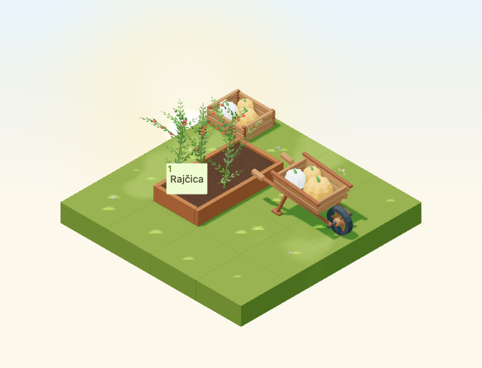
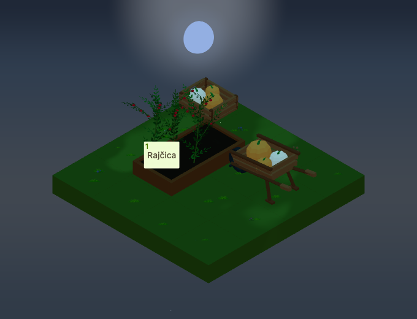
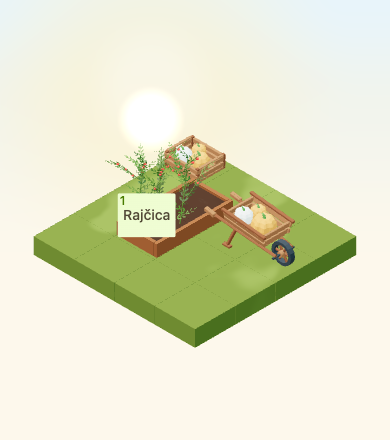

# Loaded harvest wheelbarrow

Implementation for [#4951](https://github.com/gredice/gredice/issues/4951),
following the [autumn art direction](autumn-art-direction-2026.md).
`HarvestWheelbarrow` is a static decoration for the larger harvest collection.
The pumpkins do not represent actual harvested quantities or availability.
Deployment and catalogue publication remain with #5000.



## Design and placement

An open timber wheel, two splayed handles, diagonal rear legs and a slatted
tray make the silhouette. The tray pitches six degrees toward the wheel and
holds two orange pumpkins and one cream pumpkin. The wheel and both feet
touch the support plane; handles remain inside the two-cell footprint.
The original Blender source has editable mesh islands joined by material role,
with a base-centered origin and no animation. The pumpkin generator from
#4948 supplies the shared ribbed fruit geometry.

First-party references inspected before modeling:

- [Harvest crate](../apps/www/public/assets/blocks/HarvestCrate.webp): broad
  timber slats and contrasting chunky fruit, extended into a tilted open tray.
- [Wooden bench](../apps/www/public/assets/blocks/WoodenBench.webp): warm matte
  timber and softened edges; the new handles and legs use a splayed frame.
- [Small bridge](../apps/www/public/assets/blocks/SmallWoodenBridge.webp):
  simple structural members and readable plank proportions. No external assets
  were copied.

| Contract | Value |
| --- | --- |
| Name / Croatian label | `HarvestWheelbarrow` / **Ukrasna kolica s bundevama** |
| Footprint | 2×1; 1×2 on odd quarter-turns |
| Measured width × depth × height | 1.8531 × 0.7770 × 0.8831 tiles |
| Declared hitbox | 1.88 × 0.80 × 0.89 |
| Placement | Two compatible, level cells; no water; cannot support another block |
| Proposed price | 120 sunflowers; local sandbox is free |
| Behaviour | Static decoration; no hauling, inventory, crop or harvest effect |
| Catalogue state / ID | Unpublished / null |

Occupancy extends from the anchor in positive grid coordinates. Runtime places
the centered model at `anchor + ((rotatedWidth - 1)/2, (rotatedDepth - 1)/2)`
before applying its Y rotation. Bounds, wheel, handles and footprint therefore
agree at all four orientations. The **Dekoracija** picker includes a **2 × 1**
label and resolves the item from catalogue data, keeping it hidden before
publication. Shared Croatian copy and attributes live in
`@gredice/js/harvestWheelbarrow`.

The existing pickup resolver checks both destination cells. A wheelbarrow
rotation guard now runs before optimistic changes or local persistence in
`useBlockRotate`, using that same resolver. Occupied, uneven or incompatible
support leaves the old rotation unchanged. Other block rotations keep their
existing behaviour; the API's authoritative rotation validator is unchanged.

## Materials and cost

| Role | sRGB albedo |
| --- | --- |
| Timber / frame | `#905935` / `#764024` |
| Wheel band and axle | `#313536` |
| Pumpkins / cream pumpkin | `#E08A3C` / `#EEE3CB` |
| Stems | `#4E7F35` |

All six materials have roughness 0.86, metalness 0 and no emission. The lazy
GLB is **248,256 bytes, 3,984 triangles, six meshes and six materials**, with no
textures, animation clips, particles, sounds or lights. Six base-pass draws
are supplemented by existing shadow and weather passes. `WeatheredEntityPart`
provides rain and snow without mutating cached geometry/materials. These are
structural costs, not physical-device frame-rate measurements.

The [release manifest](harvest-wheelbarrow-2026/release-manifest.json) records
source/model/image hashes, the versioned model URL and the unpublished
catalogue specification. The standard cover starts at quarter-turn 1 to show
the wheel and handles together. Dedicated top-down images retain runtime
rotation numbering and transparent backgrounds.

| Night, reverse view | Small canvas, low quality |
| --- | --- |
|  |  |

The review scene is a 4×4 garden with the wheelbarrow at the perimeter, a
planted bed beside it and one crate at the far corner. A production
`RaisedBedFieldItemButton` at a representative crop anchor remains separate
from the wheelbarrow's projected bounds and clickable in all four rotations.
This verifies composition and the control component, not the full authenticated
close-up HUD or a live purchase.

Day/night captures use September 23 at noon and 22:30, Europe/Zagreb, clear calm
weather, camera direction `[-100,100,-100]`, zoom 90, 680×520, DPR 1. The small
low-quality view is 390×440 at zoom 57. Fixture time is frozen; night comparisons
allow 20 pixels for existing random stars.

## Reproduction and release gate

```bash
/Applications/Blender.app/Contents/MacOS/Blender --background --python-exit-code 1 --python assets/scripts/generate-harvest-wheelbarrow.py
pnpm generate:game-assets
/Applications/Blender.app/Contents/MacOS/Blender --background --python-exit-code 1 --python assets/scripts/generate-harvest-wheelbarrow.py -- --check

pnpm --dir apps/garden exec playwright test --config playwright.harvest-wheelbarrow.config.ts
pnpm --filter @gredice/game exec tsx --import ./scripts/register-test-assets.mjs --test src/data/harvestWheelbarrowAssets.unit.ts src/entities/harvestWheelbarrowPlacement.unit.ts

# Offline plan: no credentials or database writes.
pnpm --filter @gredice/storage exec tsx scripts/upsertHarvestWheelbarrowDraft.ts
```

After exporting changed bytes, update the manifest version to the first 12
characters of the GLB SHA-256 and regenerate model types. Restore unrelated
GLBs rewritten by a different Blender exporter version.

For images, put the shared definition in ignored
`apps/www/generate/test-cases.json`, with `name` inside `information` and
`prices.sunflowers` set from `sunflowers`, then run:

```bash
pnpm --dir apps/www exec playwright test --config playwright-generate.config.ts generate/blocks-snapshots.specgen.tsx -g HarvestWheelbarrow --workers=1
pnpm --dir apps/www exec playwright test --config playwright-generate.config.ts generate/blocks-top-down-snapshots.specgen.tsx -g HarvestWheelbarrow --workers=1
cp apps/garden/public/assets/blocks/top-down/HarvestWheelbarrow_1.webp apps/garden/public/assets/blocks/top-down/HarvestWheelbarrow.webp
pnpm --filter @gredice/game exec tsx scripts/build-harvest-wheelbarrow-release.ts
```

The shared importer supports `--dry-run` and `--apply-drafts` with an explicitly
configured storage environment. It rejects duplicate names and non-draft rows,
preserves revisions/cache/search updates and checks readback. Neither database
mode was run here; the importer has no publication mode.

For #5000, deploy Garden and WWW on the reviewed SHA, verify the recorded bytes,
review the price, create/read back the draft and publish through the normal CMS
workflow. Refresh caches and record the actual catalogue ID. Verify customer
purchase, all quarter-turn placements, blocked rotation and reload persistence
after publication.

## Validation recorded

- Saved Blender source audit and the standard asset-generation pipeline pass.
  Only the new GLB and expected generated metadata are included.
- Four catalogue and four top-down renders pass; top-down alpha was checked.
  All day/night rotations and the small-canvas composition were inspected.
- All 1,886 game unit tests pass, including eight wheelbarrow asset and
  placement checks. The existing seven API rotation-validation tests also pass.
- Sixteen browser checks pass: rendered footprint/height, ray selection, crop
  control separation/clicks, small-canvas view, all four local quarter-turns
  persisted to storage, rejected occupied/uneven rotations without state writes,
  catalogue gating, price, sandbox uniqueness and HUD drag identity.
- The art fixture reports actual loaded geometry rather than waiting for an
  arbitrary frame count. The dedicated capture config allows cold software
  WebGL compilation time; the ordinary CI suite includes the mutation/HUD tests.
- Game/JS lint, changed app/storage-file lint, Game/Garden/WWW typechecks and
  the targeted draft-importer storage typecheck pass. Game lint retains the
  existing unused suppression warning in `RaisedBedFieldRelationshipIndicator`.
- Garden production build passes. WWW compiles and typechecks, then page-data
  collection for `/blokovi/[alias]` fails because local `POSTGRES_URL` is absent.
- The offline importer produces one draft. Database writes, publication and
  live customer purchase/reload acceptance remain gated by #5000.
