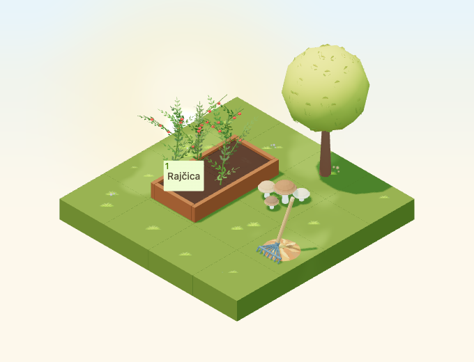

# Rake and leaf-pile arrangement

Implementation for [#4957](https://github.com/gredice/gredice/issues/4957), release
**B / complete garden**. `LeafRake` is one static, one-tile decoration. It adds a
readable garden tool beside the owned leaf pile without requesting farm work.
The later cosmetic raking action remains #4995; publication remains #5000.



## Design and source

A thick wooden handle leans into a small leaf mound, with a dark blue-grey metal
ferrule, a broad head brace and seven spread tines. The hooked tine tips and pale
handle end retain the tool silhouette at normal zoom. No thin texture-dependent
veins or reflective-metal effects are used.

First-party references inspected before modeling:

- [ShovelSmall](../apps/www/public/assets/blocks/ShovelSmall.webp): long chunky
  wooden handle and muted metal tool head; the new fan separates the rake shape.
- [PaintRoller](../apps/www/public/assets/blocks/PaintRoller.webp): simplified
  tool proportions and readable handle/head contrast.
- [AutumnLeafPileMound](../apps/www/public/assets/blocks/AutumnLeafPileMound.webp):
  reuse the newly authored first-party leaf mass at 82% scale for this composed
  asset. It remains a separate catalogue identity from the standalone pile.

`LeafRake.blend` appends the local mound source without editing or resaving it.
The source contains one mesh with the original `PileBase`/`Leaf_*` vertex groups
plus editable `Handle`, `HandleTip`, `Ferrule`, `HeadBrace`, seven `Tine_*` and
seven `TineTip_*` groups. All geometry is base-centred with identity transforms.
Bounds are **0.656 × 0.6334 × 1.0557 tiles**, inside the declared
**0.9 × 0.9 × 1.1** hitbox in all rotations.

The baked corner palette combines wood `#AF814E`/`#C49A65`, metal `#536367`/
`#45575D` and the leaf pile's copper/gold tones. One roughness-0.92, nonmetallic,
nonemissive material renders the whole arrangement. The lazy GLB is **47,928
bytes**, **590 triangles**, one mesh/primitive/material and one base-pass draw.
Shared snow/rain/shadow passes add normal costs; no textures, embedded lights,
animations, sounds, particles or dedicated idle render leases are added.
Runtime instances reuse immutable cached material and geometry. These costs
are structural, not physical-device performance measurements.

## Catalogue and behavior

The Croatian label is **Grablje s hrpom lišća**, proposed price **45 sunflowers**.
The decoration occupies one tile, works on compatible ground, walkways and
display surfaces, cannot sit on water and cannot support another item.
Appearance persists through the year. Rain and a thin snow layer use shared
overlays, respecting global and per-entity weather disablement.

The item does not attach to other props or require a general surface-placement
system. Its pile, tool and handle always move together. Placement neither
requests nor claims completion of actual garden work; it has no operation,
crop-growth, harvest or reward integration. The picker hides it until catalogue
metadata is published. Sandbox and importer data share `@gredice/js/leafRake`.

A named `LeafRake:rake-anchor:<block-id>` group at model-local **[0,0.08,0]**
provides a stable origin in the pile for #4995. It rotates/translates with the
entity and creates no interaction on its own. Future animation and sound must
remain cosmetic and preserve dragging and farm-operation boundaries.

## Visual and interaction review

The 4×4 fixture places the rake with existing mushrooms and tree in a 2×3 corner,
leaving a connected one-cell approach to the planted bed. All day/night rotations,
overcast, dusk, rain, snow, small low-quality canvas and four raised-support
rotations are covered. In the raised-support fixture the mushrooms move one cell
forward so the elevated handle does not overlap their ray target in projection.
Geometry rays select the rake and both neighboring props;
the production crop button works at a representative anchor. The capture harness
also asserts zero mutating HTTP requests during these interactions.

Captures use September 23, 2026, Europe/Zagreb, noon or 22:30; dusk is the shared
0.8 time-of-day value. Animation time is frozen at 12 seconds. Camera direction
is `[-100,100,-100]`, zoom 90, 680×520, DPR 1. Small view is 390×440 at zoom 57.
Rain/snow images are reviewed instead of compared as fixed particle baselines;
night comparisons allow 20 pixels for existing stars. This is component
acceptance, not an authenticated purchase or the full close-up HUD.

## Reproduction and release

```bash
/Applications/Blender.app/Contents/MacOS/Blender --background --python-exit-code 1 --python assets/scripts/generate-leaf-rake.py
pnpm generate:game-assets
/Applications/Blender.app/Contents/MacOS/Blender --background --python-exit-code 1 --python assets/scripts/generate-leaf-rake.py -- --check
pnpm --dir apps/garden exec playwright test --config playwright.leaf-rake.config.ts
pnpm --filter @gredice/game test
pnpm --filter @gredice/storage exec tsx scripts/upsertLeafRakeDraft.ts
```

Set the manifest version to the first twelve GLB SHA-256 characters. Restore
unrelated exporter rewrites before regenerating final model types. For catalogue
images, write the shared spec to ignored `apps/www/generate/test-cases.json` and
run both existing image generators filtered to `LeafRake`, using
`BLOCK_SNAPSHOT_FREEZE_TIME=2026-10-22T12:00:00+02:00`. Copy top-down `_1.webp` to
the unnumbered preview, then run
`pnpm --filter @gredice/game exec tsx scripts/build-leaf-rake-release.ts`.

The [release manifest](leaf-rake-2026/release-manifest.json) records source/model
hashes, the versioned URL, exact costs, unpublished metadata and ten image
hashes. The importer defaults to an offline plan and offers only explicit draft
modes. Under #5000, deploy Garden and WWW at the reviewed SHA, verify asset bytes
and price, create/read back the draft and publish through normal CMS workflows.
Record the catalogue ID and verify real purchase, placement, rotation and reload.
No database writes or publication have occurred here.

## Validation

- Saved-source audit and standard asset generation pass; unrelated exporter rewrites were restored and the reused standalone mound source stays unchanged.
- All 1,916 game unit tests pass, including exact release hashes, palette preservation, rotated hitboxes, compatible supports and decorative metadata.
- All 21 focused browser cases pass across the scene run and raised-support/picker follow-up: eight day/night rotations, four weather/light conditions, small canvas, four raised-support rotations and four picker checks. All thirteen review captures were inspected; scene interactions issue no mutating HTTP requests.
- Four cover and four top-down render cases pass. All ten image files are transparent and covers are 640×640.
- Game/JS lint, changed app/storage-file lint, Game/Garden/WWW typechecks and targeted importer typecheck pass. Game lint retains the existing unused suppression warning in `RaisedBedFieldRelationshipIndicator`.
- Garden production build passes. WWW compiles/typechecks, then page-data collection fails because local `POSTGRES_URL` is absent.
- Offline importer returns one draft row. No live data writes or publication occurred; real customer purchase/reload acceptance remains #5000.
