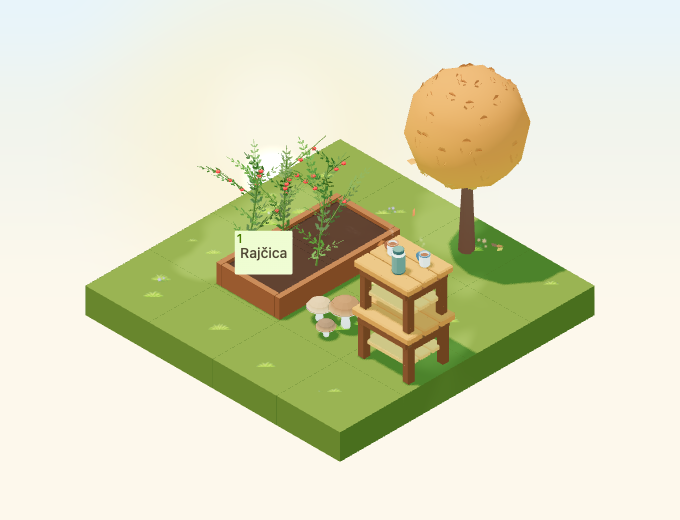
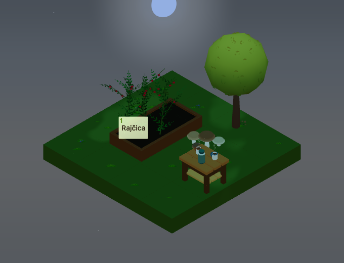

# Localized tea steam validation

Issue #4972, stacked on tea-table PR #5041. The shared emitter contract is ready
for a future chestnut cart; this change integrates only the available tea table.

The [validation record](localized-steam-2026/validation.json) identifies the
tested source commit, source hashes, capture hashes, tooling and exact fixture.
The implementation passed 78 targeted unit tests, 10 WebGL tests, game/Garden/WWW
typechecks, changed-file lint and a Garden production build. The parent's
daytime and small low-quality static snapshots also pass unchanged. The steam
suite is included in the regular Garden CI WebGL project.

The WebGL suite verifies all four raised-table rotations and real selections of
the table, neighboring props and the crop button. It also checks repeatable
frozen dates/times, quality changes, rain/snow and reduced-motion fallbacks,
muted ambience, emitter removal, hidden/resumed scenes, frustum culling, resource
disposal and separate Canvas roots with identical source IDs.

## Matched autumn workload

The scene contains 225 ground tiles, 25 deciduous trees, 50 autumn props and four
tea tables at October 22 with strong wind. Both sides retain the same scene;
only the steam anchors' visibility changes. Each state warms for 60 rendered
frames and samples the next 120. Falling, ground and entity leaves are populated
on every tier. Steam stays within one draw call and the configured particle cap.

| Tier | Steam particles | Draw calls/frame off → on | Triangles/frame off → on | p95 frame off → on |
| --- | ---: | ---: | ---: | ---: |
| Low | 0 | 196 → 196 | 159,850 → 159,850 | 83.8 → 84.0 ms |
| Medium | 24 | 214 → 215 | 163,132 → 163,180 | 114.5 → 122.2 ms |
| High | 48 | 214 → 215 | 163,974 → 164,070 | 107.9 → 134.5 ms |

These are headless Chromium SwiftShader measurements on a shared macOS host,
not physical-device frame budgets. The timing samples include the whole autumn
scene; the recorded p95 increased on medium and high. The deterministic geometry
and draw-call increments are 0/48/96 triangles and 0/1/1 calls. Hardware frame
timing remains a separate release check.

## Captures

Steam is intentionally faint and confined to the mug area. Both captures use
the shared fixed animation time of 12 seconds; the day view demonstrates a
raised support, while the night view uses the ground-level table.

