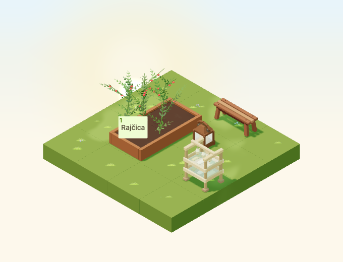

# Decorative seed-drying rack

Implementation for [#4964](https://github.com/gredice/gredice/issues/4964), release C / garden expansion. `SeedDryingRack` is a static decoration; publication remains with #5000.



## Design and source

Inspected first-party references: [StackedFirewood](../apps/www/public/assets/blocks/StackedFirewood.webp) for broad pale timber, [OutletDisplayTable](../apps/www/public/assets/blocks/OutletDisplayTable.webp) for chunky framing and [AutumnSeedHeads](../apps/www/public/assets/blocks/AutumnSeedHeads.webp) for readable dry-head shapes. This original rack has four grounded feet, two broad shallow trays, a hanging rail and three suspended seed heads. Six tray bundles are composed into the asset, without tiny labels or loose scatter. The open sides and pale frame retain a distinct silhouette at normal zoom.

The editable Blender source preserves named part vertex groups. One joined mesh uses one matte vertex-colour material (roughness 0.93), with warm timber, pale trays and dry heads. Bounds **0.74 × 0.60 × 0.935**, hitbox **0.9 × 0.9 × 1**, footprint **1×1**. It supports ordinary ground/path/display placement, cannot be placed on water and cannot support other blocks. Shared rain/snow overlays obey weather disablement; the model stays static at all quality settings. No cached materials or geometry are mutated.

Cost: **1,452 triangles**, one mesh/primitive/material, one base-pass draw and **145,780 GLB bytes**. No textures, animations, particles, lights, sound or dedicated idle render leases. These are structural counts, not device frame-rate measurements.

## Catalogue and inventory boundary

**Ukrasni stalak za sušenje sjemena**, proposed **60 sunflowers**, uses shared metadata in the picker, sandbox and offline importer. Copy explicitly states that it does not store, dry or produce seeds, change seed inventory or grant rewards. Missing catalogue entries stay hidden.

Runtime only renders geometry. Placement uses the existing ordinary block purchase service: create block, update stack and debit sunflowers. The focused service test asserts this exact dependency sequence and verifies no raised-bed projection. The service has no seed-inventory write dependency; this change adds none. Browser scene checks reject network mutation requests. Authenticated purchase after deployment is still part of #5000.

## Review and reproduction

The 4×4 scene keeps the rack, bench and lantern in a 2×3 corner with a connected approach to a real planted bed. Four day/night rotations, cloudy/dusk/rain/snow, small low-quality view and four raised rotations exercise geometry picking, neighboring prop selection, crop access and support height. All 13 scene captures, cover and top-down views were visually inspected. The solid top rail is the geometry ray target.

Scene date: September 23, 2026, Europe/Zagreb, noon/22:30 or shared dusk 0.8; fixed animation time 12 seconds; camera `[-100,100,-100]`, zoom 90, 680×520/DPR 1. Small view: 390×440/zoom 57. Night snapshots tolerate 20 star pixels; precipitation receives visual review. Catalogue renders use October 22 noon.

```bash
/Applications/Blender.app/Contents/MacOS/Blender --background --python-exit-code 1 --python assets/scripts/generate-seed-drying-rack.py
pnpm generate:game-assets
pnpm --dir apps/garden exec playwright test --config playwright.seed-drying-rack.config.ts
pnpm --filter @gredice/game test
pnpm --dir apps/api exec node --import tsx --test --conditions=react-server lib/garden/purchaseGardenBlockService.node.spec.ts
pnpm --filter @gredice/storage exec tsx scripts/upsertSeedDryingRackDraft.ts
```

Use the first twelve GLB SHA-256 characters for the version, restore unrelated exporter rewrites before final generated types, generate the four covers and four top-downs from shared metadata with `BLOCK_SNAPSHOT_FREEZE_TIME=2026-10-22T12:00:00+02:00`, copy top-down `_1.webp` to the unnumbered image, then run `packages/game/scripts/build-seed-drying-rack-release.ts` using game-package `tsx`.

The [release manifest](seed-drying-rack-2026/release-manifest.json) contains source/model/image hashes, versioned URL, cost and unpublished catalogue data. Importer defaults offline; explicit writes are draft-only. #5000 requires matching-SHA Garden/WWW deployments, asset byte/price readback, draft creation/readback, publication, catalogue ID and real purchase/place/rotate/reload acceptance. No live writes occurred.

## Validation

Source audit, full pipeline, eight preview renders, ten-image transparency and release hashes pass. All 1,948 game unit tests and 15 purchase-service tests pass. Game/JS/changed-app-file lint, game/Garden/WWW and scoped importer typechecks pass; Garden production build passes. All 21 browser cases pass. WWW compilation/types pass, but page-data collection requires unavailable `POSTGRES_URL`; the full WWW build remains unverified. Offline draft plan and diff checks pass. No live catalogue write, deployment or authenticated purchase occurred.
