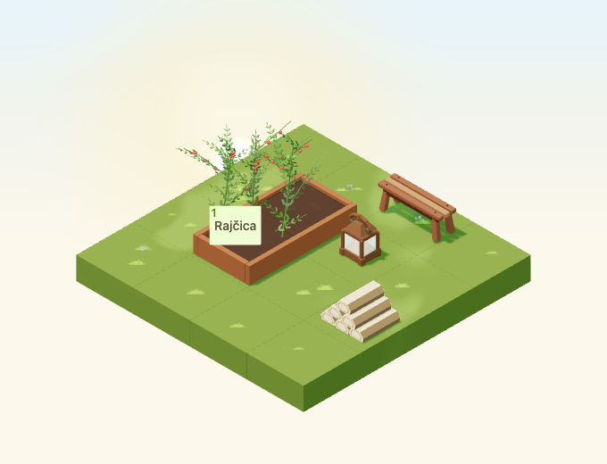

# Stacked firewood

Implementation for [#4961](https://github.com/gredice/gredice/issues/4961), release **C / cozy expansion**. `StackedFirewood` is a static one-tile decoration. Publication is gated by #5000.



## Design and source

First-party references inspected: [FallenLog](../apps/www/public/assets/blocks/FallenLog.webp) for the bark/cut-end palette, [WoodenBench](../apps/www/public/assets/blocks/WoodenBench.webp) for nearby seating scale and [WoodenHandLantern](../apps/www/public/assets/blocks/WoodenHandLantern.webp) for dusk/night context. This original arrangement uses six short split logs in three-two-one layers. Flat split planes and broad end-grain rings replace detailed bark textures. Differing lengths and offsets keep the silhouette natural while the flat bases remain grounded.

`StackedFirewood.blend` contains one mesh with six named `SplitLog` vertex groups and a corner `Color` palette. Bounds are **0.760 × 0.705 × 0.425 tiles**, inside a **0.9 × 0.9 × 0.45** hitbox. Footprint **1×1**, nonstackable, not placeable on water. It can sit on compatible ground, walkways or display surfaces; nothing can be stacked above it.

The lazy GLB is **21,788 bytes**, **408 triangles**, one mesh/primitive/material and one base-pass draw. The material is nonmetallic, nonemissive, roughness 0.93. Geometry/materials are shared immutably; there are no textures, lights, particles, animations, sounds or dedicated idle render leases. Shared rain/snow overlays respect global and per-entity weather disablement. Structural cost is recorded; no device frame-rate claim is made.

## Catalogue and review

**Složena drva za ogrjev**, proposed **35 sunflowers**, is a decoration that provides no fuel inventory, resources or crop effects. Shared metadata drives the picker, sandbox and draft importer. A missing catalogue row stays hidden until publication.

A 4×4 fixture places the stack beside existing bench/lantern assets in a 2×3 corner, with an open approach to a real planted bed. Captures cover four day/night rotations, cloudy/dusk/rain/snow and a small low-quality canvas. Four additional raised-support cases verify stack height and selection. Geometry rays select the wood and neighbours, and a production crop button remains usable. No network mutation is permitted in these static component tests. Existing lantern lighting supplies the night context; the wood adds none.

The scene uses September 23, 2026, Europe/Zagreb, noon/22:30 or shared dusk 0.8, fixed animation time 12 seconds, camera `[-100,100,-100]`, zoom 90, 680×520/DPR 1. Small view: 390×440, zoom 57. Night comparison allows 20 pixels for stars; rain/snow captures are visual reviews. Preview date is October 22 noon.

## Reproduction and publication

```bash
/Applications/Blender.app/Contents/MacOS/Blender --background --python-exit-code 1 --python assets/scripts/generate-stacked-firewood.py
pnpm generate:game-assets
pnpm --dir apps/garden exec playwright test --config playwright.stacked-firewood.config.ts
pnpm --filter @gredice/game test
pnpm --filter @gredice/storage exec tsx scripts/upsertStackedFirewoodDraft.ts
```

Use the first twelve GLB SHA-256 characters as its manifest version; restore unrelated exporter rewrites before final generated types. Feed shared metadata to ignored `apps/www/generate/test-cases.json`, run cover/top-down generators filtered to `StackedFirewood` with `BLOCK_SNAPSHOT_FREEZE_TIME=2026-10-22T12:00:00+02:00`, copy top-down `_1.webp` to the unnumbered preview, then run `pnpm --filter @gredice/game exec tsx scripts/build-stacked-firewood-release.ts`.

The [release manifest](stacked-firewood-2026/release-manifest.json) records hashes, cost, versioned URL and unpublished metadata. The importer defaults to an offline plan; explicit write modes create/update drafts only. #5000 owns matching-SHA Garden/WWW deployments, deployed byte/price checks, draft creation/readback, CMS publication, catalogue ID recording and real purchase/placement/rotation/reload acceptance. No live writes occurred here.

## Validation

- Source audit, full pipeline, eight preview renders, transparency checks and release hashes pass.
- All 1,938 game unit tests and 21 dedicated browser cases pass.
- Game/JS/app-file lint, game/Garden/WWW typechecks and scoped importer typecheck pass.
- Garden production build passes. WWW compiles and typechecks, then stops during page-data collection because `POSTGRES_URL` is unavailable; full WWW build remains unverified.
- Offline draft plan and whitespace checks pass. Deployment, publication and authenticated purchase acceptance remain under #5000.
