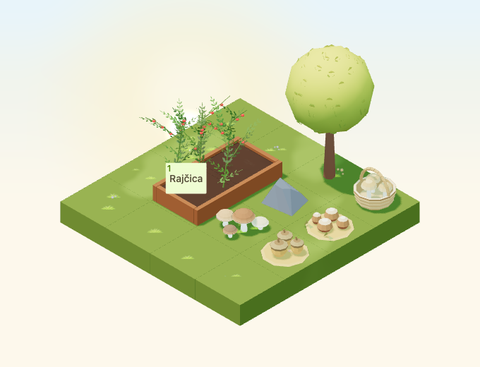

# Woodland arrangements

Implementation for [#4965](https://github.com/gredice/gredice/issues/4965), release C / woodland expansion. Three composed decorations reserve observation anchors without adding activities. #5000 owns publication.



## Art and source

Inspected first-party references: [WoodlandMushrooms](../apps/www/public/assets/blocks/WoodlandMushrooms.webp) for broad caps, [ChestnutRoastingCart](../apps/www/public/assets/blocks/ChestnutRoastingCart.webp) for stylized nuts and [AutumnLeafPileMound](../apps/www/public/assets/blocks/AutumnLeafPileMound.webp) for bounded warm ground arrangements. Each model is original: three oversized capped acorns, four round conkers with pale marks and two open husks, or a low basket containing three stylized mushrooms. Broad shapes and a hollow basket handle keep the objects readable at garden zoom. There is no unbounded scatter or real-species identification.

Each asset has one editable Blender source, a joined mesh with named part vertex groups and an `Observation` empty. One shared material role `Material.Woodland.Arrangement` uses matte roughness 0.92 and baked corner colours. The runtime reuses immutable cached geometry/materials and adds shared outdoor snow/rain overlays with global/per-entity disablement. All three stay static and retain their intended appearance year round.

| Asset | Bounds (width × depth × height) | Hitbox height | GLB triangles | GLB bytes | Price |
| --- | --- | --- | --- | --- | --- |
| WoodlandAcorns | 0.78 × 0.7419 × 0.3347 | 0.35 | 620 | 46,356 | 25 sunflowers |
| WoodlandConkers | 0.78 × 0.7419 × 0.223 | 0.25 | 486 | 38,444 | 25 sunflowers |
| WoodlandMushroomBasket | 0.6961 × 0.6961 × 0.6273 | 0.65 | 960 | 69,732 | 45 sunflowers |

Each uses one mesh/material/primitive and one base-pass draw, with no textures, animations, particles, lights, sounds or dedicated render leases. The conker source audit counts 492 triangles; export removes six duplicate husk back-face triangles. Recorded runtime costs and assertions use the exported 486. These are structural costs, not device frame-rate measurements. Footprints are 1×1 with 0.9×0.9 horizontal hitboxes; compatible ground/path/display supports are allowed, water and stacking on these props are not.

## Catalogue and observation boundary

Croatian labels are **Šumski ukras – žirevi**, **Šumski ukras – divlji kesteni**, and **Šumski ukras – košarica s gljivama**. Shared metadata drives the picker, sandbox and offline draft importer. Copy explicitly states that these are decorations, not edible-species guidance or advice for gathering, and grant no nuts, mushrooms or other resources. Missing catalogue rows remain hidden.

Source empties match shared Y-up observation origins and runtime groups `WoodlandArrangement:observation:<id>`:

- Acorns: `[0,0.34,-0.13]`.
- Conkers: `[-0.02,0.235,-0.13]`.
- Basket: `[0,0.49,-0.13]`.

These distinct anchors inherit placement height and rotation. They register no action, reward or inventory mutation. Separate stable geometry-selection points target the low bed (`[0,0.027,0]`) or basket handle (`[0,0.62,0]`), so future observation UI does not determine picking.

## Review and reproduction

The 4×4 fixture contains all three arrangements beside existing mushrooms, stone and tree in a 2×3 corner. A connected approach to a real crop bed remains available. Four day/night rotations, cloudy/dusk/rain/snow, small low-quality view and four raised rotations test exact exported geometry, material sharing, support height, ray selection and crop-button access. Camera `[-100,100,-100]`, zoom 90, 680×520/DPR 1; small 390×440/zoom 57. September 23, 2026 Europe/Zagreb at noon/22:30 or shared dusk 0.8, fixed animation time 12 seconds. Night snapshots allow 20 star pixels; precipitation receives visual review. Catalogue previews use October 22 noon.

```bash
/Applications/Blender.app/Contents/MacOS/Blender --background --python-exit-code 1 --python assets/scripts/generate-woodland-arrangements.py
pnpm generate:game-assets
pnpm --dir apps/garden exec playwright test --config playwright.woodland-arrangements.config.ts
pnpm --filter @gredice/game test
pnpm --filter @gredice/storage exec tsx scripts/upsertWoodlandArrangementsDraft.ts
```

Set versions from the first twelve model SHA-256 characters, restore unrelated full-export rewrites before final generated types, render each name from shared metadata with `BLOCK_SNAPSHOT_FREEZE_TIME=2026-10-22T12:00:00+02:00`, copy top-down `_1.webp` to the unnumbered preview and run `packages/game/scripts/build-woodland-arrangements-release.ts` using game-package `tsx`.

The [release manifest](woodland-arrangements-2026/release-manifest.json) records source/model/image hashes, versioned URLs, costs and unpublished metadata. The importer defaults offline; explicit writes only prepare drafts. #5000 requires matching-SHA Garden/WWW deployments, asset byte/price readback, draft creation/readback, publication, catalogue IDs and real purchase/place/rotate/reload acceptance. No live writes occurred.

## Validation

Source audits, full generation, 24 preview renders, thirty-image transparency and release hashes pass. All 1,953 game unit tests and 23 browser cases pass; three representative scene checks also pass after correcting Blender observation coordinates. All 13 scene captures and the cover/top-down previews were visually reviewed. Game/JS/app-file lint, game/Garden/WWW and scoped importer types pass. Garden production build passes; WWW compiles/types but page-data collection requires unavailable `POSTGRES_URL`, so its full build remains unverified. Offline draft plan and diff checks pass. No live writes, deployment or authenticated purchase occurred.
