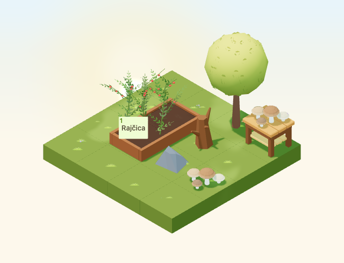
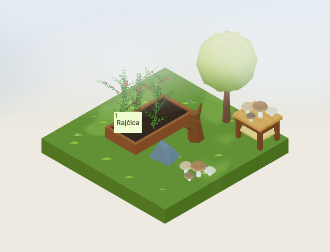
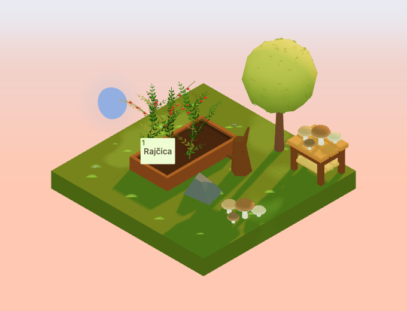
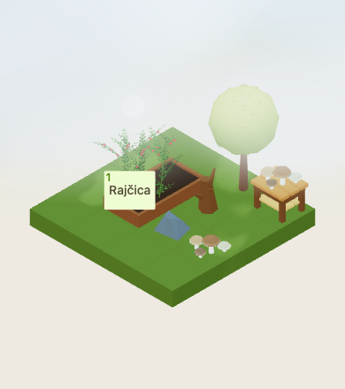

# Woodland mushroom clusters

Implementation for [#4954](https://github.com/gredice/gredice/issues/4954),
part of release **A / core six** in the [autumn art direction](autumn-art-direction-2026.md).
`WoodlandMushrooms` is one new decoration identity. Deployment and catalogue
publication remain with #5000.



## Design

Five chunky mushrooms form a low asymmetric cluster. Broad, flattened domes,
thick cream rims and short tapered stems stay readable from the garden camera.
A taller chestnut cap anchors the group; smaller brown and cream caps sit around
it at staggered heights. There are no texture-dependent gills or tiny spots.
The geometry is original and does not represent an edible species.

First-party references inspected before modeling:

- [Tree](../apps/www/public/assets/blocks/Tree.webp): borrow broad faceted natural
  masses, with low domes and thick stems giving the mushrooms their own shape.
- [Dead tree stump](../apps/www/public/assets/blocks/DeadTreeStump.webp): match the
  warm woodland browns and simple angular shading, without modifying its asset.
- [Medium stone](../apps/www/public/assets/blocks/StoneMedium.webp): keep the
  cluster near existing ground-detail scale and contrast warm caps with cool stone.

One editable `WoodlandMushrooms.blend` contains a joined mesh with ten named
vertex groups, `Cap_1..5` and `Stem_1..5`, so individual parts remain selectable.
Every stem touches the support plane. The base-centred model measures about
**0.7385 × 0.7500 × 0.3800 tiles** and fits the declared **0.9 × 0.9 × 0.4**
hitbox at all four rotations. Its footprint is one tile.

## Catalogue and behavior

The Croatian label is **Ukrasne šumske gljive**, at a proposed **35 sunflowers**.
Copy identifies it as decoration, with no harvest or plant-growth effects and no
edibility claim. It is not a crop and does not join plant lifecycle, inventory,
operation or harvesting systems. Appearance stays the same throughout the year;
shared rain and snow overlays follow the weather. Per-entity or global weather
disablement suppresses those overlays. There are no seasonal leaf sources,
lights, sound, particles or intrinsic animation.

The item can sit on compatible ground, walkways and display tables. It cannot
sit on water or support another block. The **Dekoracija** picker hides it while
the catalogue row is absent. Sandbox data and the draft importer use the same
specification from `@gredice/js/woodlandMushrooms`.

## Palette and rendering cost

Cap colours range from chestnut `#895735` and russet `#965D30` to muted cream
`#BCA578`, with lighter rims. Stems use warm cream `#EEE3CB` and darker bases.
The palette is baked into the mesh's `Color` attribute and exported as `COLOR_0`.
All five mushrooms share **one mesh, one primitive and one material** at
roughness 0.92, metallic 0 and zero emission. Colour variation adds no material
slots or draw calls. Runtime instances share the immutable cached geometry and
material; no per-instance recolouring is performed.

The lazy GLB is **85,928 bytes** with **1,160 triangles** and **one base-pass draw**
per cluster. Shared shadow/rain/snow passes add their usual cost. There are no
textures, imported animations, embedded lights or dedicated idle render leases.
These are structural costs, not physical-device frame-rate measurements.

The [release manifest](woodland-mushrooms-2026/release-manifest.json) records
source/model/image hashes, the versioned model URL, exact geometry counts and
unpublished catalogue metadata. Five covers and five true top-down previews
accompany the item.

## Visual and interaction review

The 4×4 fixture places two mushroom clusters, one on the ground and one on a
display table, beside the existing tree, stump and stone. These five decorative
cells fit a 2×3 corner. The adjacent planted bed retains a connected one-tile
approach. Existing assets remain unchanged; no future log asset is assumed.

The browser checks actual model bounds, the shared material identity and baked
vertex colours, all quarter-turns in day/night, selection via real geometry rays,
and the production crop button at a representative anchor. Overcast, dusk,
rain, snow and a small low-quality canvas are also reviewed. This is component
and composition acceptance, not a live purchase or the full authenticated
close-up HUD.

| Overcast | Dusk | Small canvas |
| --- | --- | --- |
|  |  |  |

Captures use September 23, 2026, Europe/Zagreb, noon or 22:30; dusk uses the
shared time-of-day value 0.8. Calendar and animation time are frozen, with
`fixedTimeSeconds=12`. Camera direction is `[-100,100,-100]`, zoom 90, 680×520,
DPR 1. The small view uses zoom 57 at 390×440. Rain/snow readiness requires actual
overlays; their animated precipitation images are reviewed rather than used as
pixel-comparison baselines. Night comparisons allow 20 pixels for existing stars.

## Reproduction and publication gate

```bash
/Applications/Blender.app/Contents/MacOS/Blender --background --python-exit-code 1 --python assets/scripts/generate-woodland-mushrooms.py
pnpm generate:game-assets
/Applications/Blender.app/Contents/MacOS/Blender --background --python-exit-code 1 --python assets/scripts/generate-woodland-mushrooms.py -- --check

pnpm --dir apps/garden exec playwright test --config playwright.woodland-mushrooms.config.ts
pnpm --filter @gredice/game test

# Offline plan; no credentials or database writes.
pnpm --filter @gredice/storage exec tsx scripts/upsertWoodlandMushroomsDraft.ts
```

After export, set the manifest version to the first 12 characters of the GLB
SHA-256 and regenerate model types. Restore unrelated GLBs rewritten by another
Blender exporter version. For images, put the shared specification into ignored
`apps/www/generate/test-cases.json`, with `name` inside `information` and
`prices.sunflowers` from `sunflowers`, then run both generators:

```bash
BLOCK_SNAPSHOT_FREEZE_TIME='2026-10-22T12:00:00+02:00' pnpm --dir apps/www exec playwright test --config playwright-generate.config.ts generate/blocks-snapshots.specgen.tsx -g WoodlandMushrooms --workers=1 --timeout=60000
BLOCK_SNAPSHOT_FREEZE_TIME='2026-10-22T12:00:00+02:00' pnpm --dir apps/www exec playwright test --config playwright-generate.config.ts generate/blocks-top-down-snapshots.specgen.tsx -g WoodlandMushrooms --workers=1 --timeout=60000
# Copy top-down _1.webp to the unnumbered preview before rebuilding the manifest.
pnpm --filter @gredice/game exec tsx scripts/build-woodland-mushrooms-release.ts
```

The shared importer exposes `--dry-run` and `--apply-drafts` against an explicitly
configured environment, rejects duplicates and non-draft rows, preserves
revision/cache/search behavior and verifies readback. It has no publish mode.
For #5000, deploy Garden and WWW at the reviewed SHA, verify the recorded bytes,
review the price, create/read back the draft and publish via the normal CMS
workflow. Record the catalogue ID, refresh caches and verify real customer
purchase, placement, rotations and reload persistence.

## Validation recorded

- Saved Blender audit and the standard asset pipeline pass. The audit verifies
  five grounded stems, editable part groups, bounds and one material; unrelated
  exporter rewrites were restored.
- All 1,900 game unit tests pass. The new asset checks cover source/model/image
  hashes, one exported primitive/material, baked palette preservation, all rotated
  hitboxes, compatible supports and the decorative catalogue contract.
- All 17 focused browser cases pass: eight day/night rotations, overcast, dusk,
  rain, snow, a small canvas and four picker checks. All 13 review images were
  inspected; ground/table selection and the adjacent crop button work.
- Four cover and four top-down render cases pass. All ten image files have
  transparent backgrounds; the five covers are 640×640.
- Game/JS lint, changed app/storage-file lint, Game/Garden/WWW typechecks and the
  targeted importer typecheck pass. Game lint retains the existing unused
  suppression warning in `RaisedBedFieldRelationshipIndicator`.
- Garden production build passes. WWW compiles and typechecks, then collecting
  page data for `/blokovi/[alias]` fails because local `POSTGRES_URL` is absent.
- The offline importer returns one draft row. No database writes or publication
  occurred; live customer purchase/reload acceptance remains with #5000.
