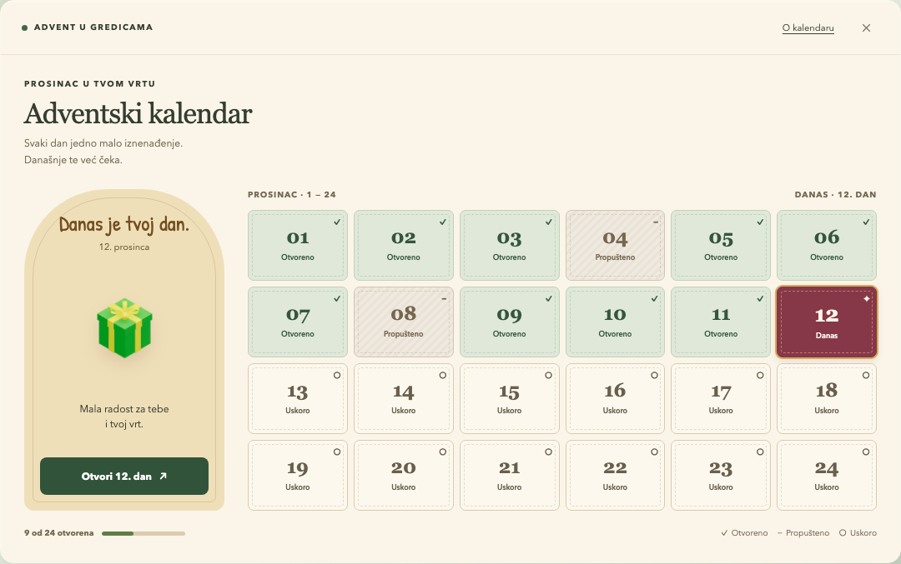
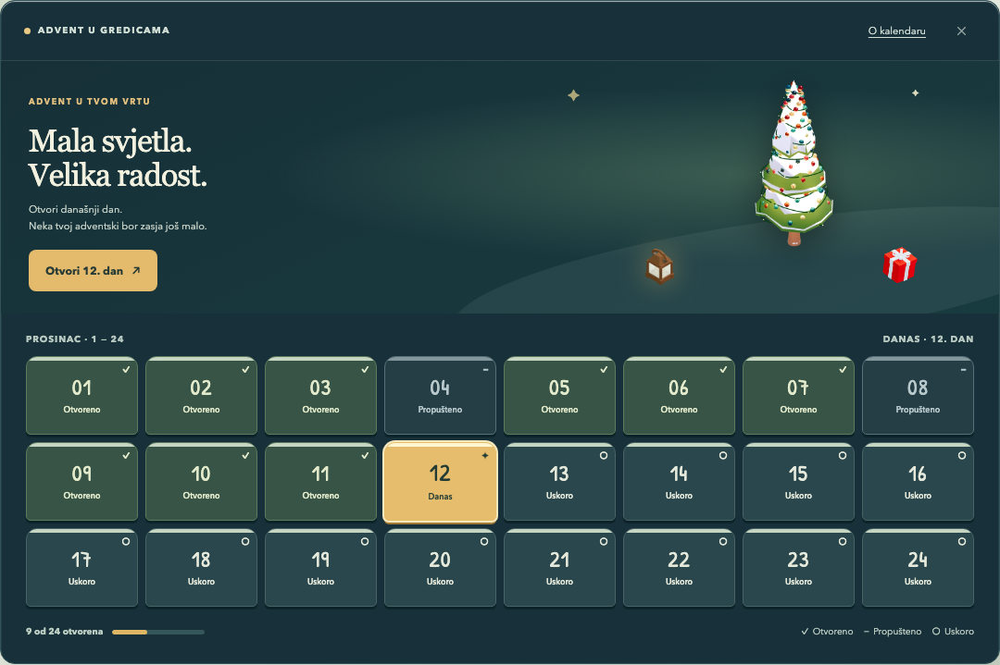
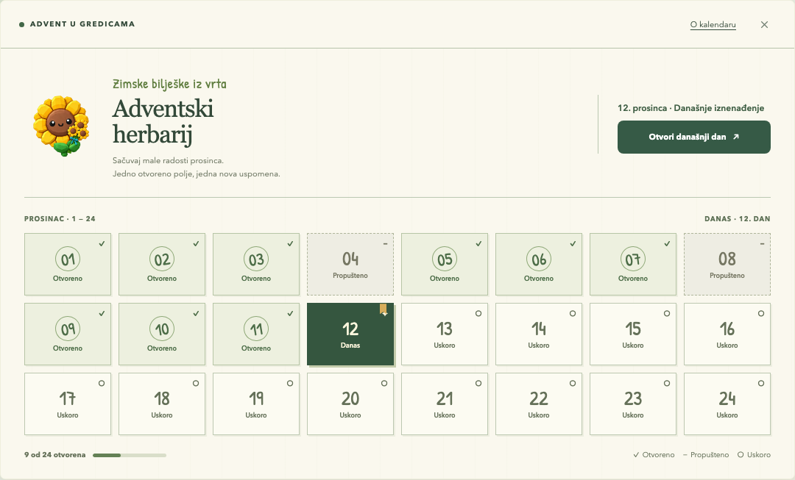

# Adventski kalendar — tri prijedloga dizajna

Datum pripreme: 4. listopada 2026. · Uredan: `2828593d-1403-45a6-b9bb-0ce555906f2b`

**Preporuka: Vrtna škrinjica.** Najbolje čuva prepoznatljivost postojećeg kalendara i postiže najvažnije poboljšanje: današnji dan i sljedeća radnja vidljivi su odmah. Zimski vrt je dobar izbor ako želimo snažnije povezati kalendar s igrom, a Adventski herbarij ako želimo mirniji botanički smjer.

[Otvori interaktivnu usporedbu](./index.html). Na vrhu se mijenjaju smjer, širina prikaza i ogledno stanje. Klik na bilo koji dan pokazuje pripadajući detalj. Otvaranje današnjeg dana simulira čekanje i uspjeh. „Vrati ogledne podatke” vraća početni prikaz.

Ovo je prijedlog za pregled, bez produkcijskih izmjena ili objave kampanje. Prikazani 12. prosinca 2026., devet otvorenih dana i nagrada od 50 suncokreta **ogledni su podaci**. Postojeća implementacija kampanje vezana je uz 2025.; buduća kampanja zahtijeva zasebno dogovorene datume, sadržaj i uvjete. Nijedan koncept ne najavljuje fizički poklon ili pravo na dostavu.

## 1. Vrtna škrinjica — preporučeno

Topla krem podloga, papirnata vratašca, šumskozelena otvorena polja i bordo današnji dan. Zeleni poklon iz postojećeg kataloga dobiva izdvojeno mjesto uz kalendar. Tanki rubovi, kontrolirana sjena i rukopisni detalj zadržavaju taktilan blagdanski karakter bez potrebe za novim 3D modelom.

**Konkretna poboljšanja prikaza:** naslov i jedna kratka rečenica vode do današnjeg poklona; svih 24 dana prikazano je kronološki; svaki dan nosi broj, status i simbol. Otvorena polja ne nalikuju zaključanima, a propušteni dan ima diskretnu teksturu i neutralnu poruku. Napredak je prikazan kao „9 od 24 otvorena”.

- **Desktop:** izdvojena ploha današnjeg iznenađenja lijevo; mreža 6 × 4 desno. Širina modala raste do raspoloživog prostora umjesto današnjeg uskog `md:max-w-sm`.
- **Mobitel:** kompaktna današnja radnja iznad mreže 4 × 6; bez horizontalnog pomicanja. Vertikalno pomicanje zadržava dovoljno velika polja.
- **Otvaranje:** kratko čekanje na postojećoj radnji, zatim potvrda već dodijeljene nagrade. Povratak ostavlja vidljiv otvoren 12. dan.
- **Zahvat:** mali do srednji za vizualni dio; mijenjaju se raspored, stilovi i povratne informacije. Obnovu kampanje i pouzdanost API-ja treba procijeniti odvojeno.
- **Ponovna uporaba:** `GameModal`, `AdventCalendarScreen`, `AdventDayCell`, `AdventAwardScreen`, `Button`, `BlockImage`, `SunflowerVisuals`; postojeći blagdanski serif može ostati naslovni font u produkciji.
- **Kompromis:** kronološka mreža ima manje igre traženja brojeva od trenutačno izmiješanog rasporeda. To je namjerna odluka radi čitljivosti i brzog povratka.

## 2. Zimski vrt — najjača veza s igrom

Tamnoplava i zelena zimska scena, postojeći adventski bor, lampion i poklon. Zlatni današnji dan daje jasan kontrast, a svako polje izgleda kao mali vrtni prozor sa snježnim rubom. Ovo je vrtni, blagdanski prikaz, bez dekoracije preko brojeva ili radnji.

**Konkretna poboljšanja prikaza:** bor postaje vidljiv u samom kalendaru i povezuje današnje otvaranje s postojećom progresijom ukrasa. `PineAdvent` već dodaje ukrase/svjetla prema broju otvorenih dana; ta povezanost nije nova funkcija. U prototipu je ugrađena postojeća statična slika bora, a produkcijski prikaz mora odražavati stvarni napredak.

- **Desktop:** plitka scena i današnja radnja u zaglavlju; ispod je mreža 8 × 3. Bor je dio zaglavlja, dok svih 24 dana ostaje u pravilnoj mreži.
- **Mobitel:** smanjena ilustracija desno od poruke i radnje; mreža 4 × 6. Brojevi i statusi ostaju tekst, ne dio slike.
- **Otvaranje:** nakon potvrđenog API uspjeha osvježiti postojeći napredak bora; eventualni jednokratni bljesak ograničiti na ukras, uz poštivanje `prefers-reduced-motion`.
- **Zahvat:** srednji za prikaz; dodatni rizik ovisi o tome koristi li modal statičnu ilustraciju ili pravi prikaz aktualnog stanja bora. Prvo je jeftinije, drugo treba mjeriti na slabijim mobitelima.
- **Ponovna uporaba:** `PineAdvent`, `BlockImage`, postojeći `PineAdvent.webp`, `WoodenHandLantern.webp`, `GiftBox_RedWhite.webp`, `GameModal` i ista dnevna logika kao u škrinjici.
- **Kompromis:** tamna scena traži pažljiviju provjeru kontrasta i može vizualno konkurirati vrtu u pozadini. Prvi korak može biti statična slika bez dodatnog WebGL canvasa.

## 3. Adventski herbarij — miran botanički smjer

Papirnati listovi, boja kadulje, rukopisni brojevi i otvoreni dani označeni poput otiska pečata. Postojeća maskota s buketom unosi toplinu. Tanka zlatna vrpca označava današnji dan. Odnos zelenih, krem i zlatnih tonova usklađen je s vrtnim karakterom proizvoda.

**Konkretna poboljšanja prikaza:** dnevna radnja djeluje kao bilješka u vrtnoj knjižici; otvorene nagrade ostaju pregledive, a status se vidi kroz tekst, simbol i oblik. Kalendar izgleda mirnije i manje nalik zbirci promotivnih kupona.

- **Desktop:** vodoravno zaglavlje s ilustracijom i današnjom radnjom; ispod mreža 8 × 3 s tankim razmacima.
- **Mobitel:** naslov i maskota na vrhu, puna širina današnje radnje ispod, zatim mreža 4 × 6.
- **Otvaranje:** jednostavna potvrda nagrade; otvoreni dan dobiva „pečat”. Pokret nije potreban da bi se razumjelo stanje.
- **Zahvat:** srednji jer je potrebna dosljedna prilagodba tipografije, rubova i dijaloga tom smjeru.
- **Ponovna uporaba:** vizualni jezik i lokalni font `PaperNote`, `SunflowerVisuals`, `GameModal`, `AdventDayCell` i postojeće komponente za nagrade.
- **Kompromis:** manje je klasično božićan od prva dva smjera. Rukopisni font treba ograničiti na naslove/brojeve; pomoćni tekst i radnje ostaju u uobičajenom sans serifu.

## Zajednička stanja i pristupačnost

| Stanje | Prikaz i radnja |
| --- | --- |
| Današnji dan | Naglašena boja, status „Danas”, `aria-current="date"` i izravna radnja iznad/uz kalendar. |
| Otvoreno | Kvačica, riječ „Otvoreno”, drugačija pozadina; klik prikazuje već dodanu nagradu. |
| Propušteno | Crtica i „Propušteno”; neutralan dijalog objašnjava istek i vraća fokus na današnji dan. Pravilo nije promijenjeno. |
| Budući dan | Krug i „Uskoro”; klik/Enter daje datum dostupnosti. Nije potreban wobble kao jedina povratna informacija. |
| Učitavanje / otvaranje | Radnja i polja privremeno su onemogućeni, raspored se ne pomiče, vidljiva je poruka i `role="status"`. Učitavanje cijelog kalendara u izvedbi treba koristiti stabilan prostor ili skelet iste geometrije; mock simulira postojeći kalendar tijekom otvaranja. |
| Pogreška | Trajna poruka uz kalendar, `role="alert"` i „Pokušaj ponovno”; postojeći napredak ostaje vidljiv. |
| Nagrada | Konkretan sadržaj, jasno „Dodano”, zatim „Povratak na kalendar”. Potvrda ne stvara privid druge dodjele. |
| Nakon današnjeg otvaranja | Ažuriran broj otvorenih dana, današnje polje označeno kao otvoreno i točan datum sljedećeg iznenađenja. |

Brojevi su pravi tekst. Dnevne tipke imaju puni naziv s datumom i stanjem, a razlika između stanja ne oslanja se samo na boju. Sva dnevna polja i glavne radnje ostaju široki i visoki barem 44 px. Fokus je vidljiv; dijalozi koriste native `dialog` s povratkom fokusa; Escape zatvara detalje. Kartice smjerova podržavaju lijevu/desnu strelicu te Home/End. `prefers-reduced-motion` uklanja prijelaze i rotaciju indikatora; tekst i dalje jasno prenosi stanje.

Produkcijska izvedba treba koristiti postojeći `Modal`/`GameModal` sustav, dogovorene token boje i font aplikacije Montserrat. Samostalni HTML koristi lokalne sistemske zamjene za Montserrat/serif kako ne bi tražio mrežu, a rukopisni `PaperNote` font ugrađen je kao data URI. To su koncepti rasporeda i ugođaja, ne novi neovisni dizajnerski sustav.

## Što je isporučeno i provjereno

- `index.html`: samostalni interaktivni prototip s tri smjera, ugrađenim slikama/fontom i bez vanjskih mrežnih ovisnosti.
- `*-desktop-calendar.png`: čisti prikaz pojedinog desktop kalendara; `*-desktop.png`: puna stranica usporedbe s objašnjenjem.
- `*-mobile.png`: sva 24 dana u uskom prikazu; `*-reward.png`: primjer dijaloga uspjeha.
- `comparison-desktop.png`: zajednički pregled triju smjerova u mobilnom rasporedu, za brzu usporedbu.
- `verification.json`: izlaz automatizirane provjere samog prototipa. Nije potvrda produkcijskog API-ja ili kalendara.

Playwright provjerava tri smjera, svih 24 dana, uske širine 320 i 390 px, tablet 768 px, desktop, tipkovničku promjenu smjera, smanjeni pokret, otvorene/propuštene/buduće dane, učitavanje, pogrešku, ponovni pokušaj i potvrdu nagrade. Vizualno su pregledane desktop i mobilne snimke. Konačne produkcijske provjere kontrasta, screen readera i fizičkih uređaja slijede tek pri implementaciji odabranog smjera.

## Uporišta u postojećem projektu

- [AdventCalendarScreen — raspored i postojeća uvodna poruka](../../../packages/game/src/modals/advent/AdventCalendarScreen.tsx)
- [AdventDayCell — postojeće boje, oznaka otvorenog dana i animacija budućeg dana](../../../packages/game/src/modals/advent/AdventDayCell.tsx)
- [AdventModal — tok otvaranja i prikazi nagrada](../../../packages/game/src/modals/advent/AdventModal.tsx)
- [AdventAwardScreen — stvarni artwork nagrada i postojeći „Preuzmi”](../../../packages/game/src/modals/advent/AdventAwardScreen.tsx)
- [PineAdvent — postojeća progresija bora](../../../packages/game/src/entities/PineAdvent.tsx)
- [GameModal — zajednički modal igre](../../../packages/game/src/shared-ui/game-modal/GameModal.tsx)
- [PaperNote — font i papirnati vizualni jezik](../../../packages/ui/src/PaperNote/PaperNote.css)
- [SunflowerVisuals — postojeći artwork maskote](../../../packages/ui/src/SunflowerVisuals/index.ts)
- [DESIGN.md](../../../DESIGN.md), [PRODUCT_SENSE.md](../../../PRODUCT_SENSE.md)

Svi korišteni bitmap asseti potječu iz repozitorija: `packages/ui/src/SunflowerVisuals/assets/mascot-gift-3d.webp`, `mascot-3d.webp` te `apps/www/public/assets/blocks/GiftBox_GreenGold.webp`, `GiftBox_RedWhite.webp`, `PineAdvent.webp` i `WoodenHandLantern.webp`.
